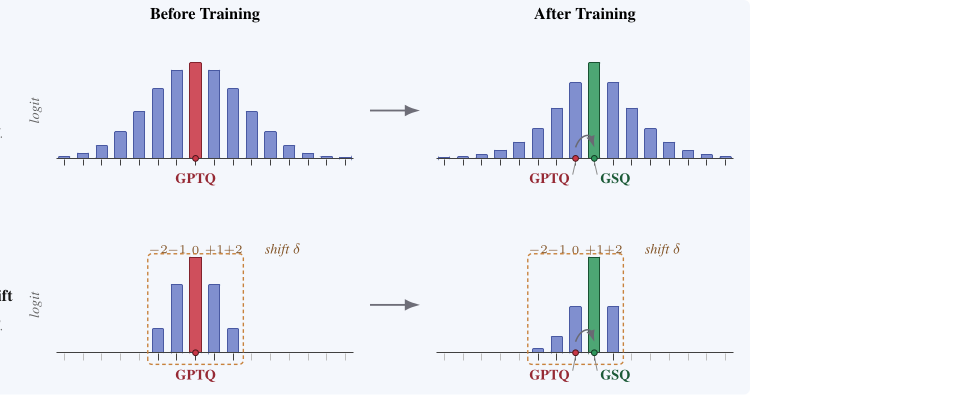

# GSQ 逐节中文详解：用 Gumbel-Softmax 采样做高精度低比特标量量化

> GSQ: Highly-Accurate Low-Precision Scalar Quantization for LLMs via Gumbel-Softmax Sampling
>
> 本文件为逐节中文详解（复述性质，非逐句译文）。原文：https://arxiv.org/abs/2604.18556

日期：2026-07-03。作者：Alireza Dadgarnia, Soroush Tabesh, Mahdi Nikdan, Michael Helcig, Eldar Kurtic, Maximilian Kleinegger, Dan Alistarh。

本文件为逐节中文详解（复述性质，非逐句译文）。目的是让读者读完这份笔记即可把原文吃透：每节用笔者自己的话讲清楚该节要点，公式保留原始 LaTeX 记号并用中文解释含义，表格中的数值原样搬运、表头译成中文并保留原表号，图以中文概括图注。作者单位：ISTA、ETH Zürich、Red Hat AI、TU Wien。通讯作者邮箱 alirezadadgarnia1378@gmail.com、dan.alistarh@ist.ac.at。代码开源于 https://github.com/IST-DASLab/GSQ 。

## 摘要

量化已成为大模型高效部署（尤其是本地推理）的标准手段，如今模型常以每参数约 2--3 比特（原文写 22--33，疑为 2--3 的排版错误，译注：从上下文与后文一致性看应为 2--3 bpp）的规模提供服务。当前最好的方法分成两派：一派是简单的 scalar quantization（标量量化）技术，如 GPTQ、AWQ，部署广泛，但在每参数 3--4 比特（bpp, bits per parameter，每参数比特数）附近精度就到顶了；另一派是所谓"第二代"的 vector/trellis quantization（向量/网格量化）方法，如 QTIP、GPTVQ、AQLM，能把精度前沿继续往下推，但出了名地难实现、难扩展。

本文要问：这条鸿沟是本质性的，还是说一个精心优化的标量量化器就能把大部分差距补回来？作者给出肯定回答，提出 GSQ（Gumbel-Softmax Quantization，Gumbel-Softmax 量化），一种 post-training quantization（训练后量化）的标量方法，用 Gumbel-Softmax 对离散网格做松弛，联合学习 per-coordinate grid assignment（逐坐标格点分配）和 per-group scale（逐组 scale）。关键在于：GSQ 让松弛的基数（候选个数）与目标比特位宽下实际可用的少量格点数相匹配（例如三值只有 3 个、3 bpp 只有 8 个），从而让优化在大模型规模上可行。

实验上，在标准的 Llama-3.1-8B/70B-Instruct 上，GSQ 在 2 比特和 3 比特下把标量量化与 QTIP 前沿之间的差距补掉大部分，且仅用对称标量网格加分组量化，因此仍兼容现有的标量推理 kernel。作者还展示同一套离散分配优化可以用在实际的 GGUF K-Quant 检查点上：从公开发布的 GGUF 模型出发，GSQ 提升精度并把结果投影回同一部署格式。最后，GSQ 能扩展到万亿规模的 MoE 模型（如 Kimi-K2.5），而向量量化方法在这类模型上难以施展。

## 1 引言

大模型推理的显存与带宽开销让量化成了高效部署的标配。在众多量化方向里，weight-only quantization（仅权重量化）已成为本地部署的主流，因为本地部署的瓶颈是显存而非算力；llama.cpp、Ollama 这样的引擎让模型广泛可及。如今把大型开放模型压到约 2--3 bpp 已很常见，围绕 Hugging Face 等仓库形成了一整个开源"quants"生态。实践中很多模型以面向部署的格式分发，例如 GGUF K-Quant，被本地推理引擎直接消费，因此任何改进的量化方法都受到很强的兼容性约束。

**现有技术。** 权重量化大致分两"波"。第一波是 scalar（一维）量化，代表有 llama.cpp、bitsandbytes、GPTQ、AWQ：把每个权重独立地舍入到一个小的均匀网格，实现简单、有高度优化的解包 kernel，因而被广泛采用。它们的主要短板是精度：标量量化在 3--4 bpp 附近撞上"误差墙"，再往下输出质量就崩。第二波转向表达力更强的向量量化或网格（trellis）表示，包括 AQLM、QuIP#、QTIP（其实现 exllamav3）、GPTVQ。通过在成组权重上联合最小化重构 MSE，这些方法在 2--3 bpp 显著减小精度损失；但代价是表示复杂、难实现、难扩展。Tseng 等人观察到，VQ 与 trellis 方法虽能大幅省显存，却因格式复杂，相对 BF16 只带来很小的解码加速。

于是精度与实用性之间有一条明显的鸿沟。本文核心问题是：**标量量化能否补上通往复杂向量/网格方法的大部分精度差距，同时仍是现有流行格式的即插即用替代（drop-in replacement）？**

**本文方法。** 作者给出肯定回答，提出 GSQ。主形式下，GSQ 产出对称、分组、$b$ 比特、取自小均匀网格的权重，因此直接兼容现有标量推理 kernel。精度上它在 2、3 比特显著超过 GPTQ、AWQ、QuIP、EfficientQAT 等以往标量方法，补回了通往最强基线的大部分差距。此外，同一"局部离散分配"视角可用来改进现成的 GGUF K-Quant 检查点：以 GGUF 模型为初始化，优化其分配，再投影回同一 K-Quant 格式，保持与 GGUF 推理栈兼容。GSQ 还能扩展到超大 MoE 模型，包括万亿参数级的 Kimi-K2，而第二波方法至今未在其上应用。

**方法概览。** 核心思想是把逐层重构重述成一个可微的离散分配问题。对每个权重坐标，引入一小组针对候选格点的可训练 logits，通过 Gumbel-Softmax 采样得到一个"软"量化权重。得到的重构损失对 per-group scale 和离散分配都完全可微，可用基于梯度的方法联合优化。随着温度退火，软分配逐渐坍缩到格点上，训练结束时得到完全离散的量化层。

关于网格大小的一个关键观察：Gumbel-Softmax 松弛天然契合低比特标量量化。在作者关心的区间（如三值、2 比特），逐坐标网格的基数很小，因此对整个网格做 Gumbel-Softmax 分布只给每个权重引入少数几个 logits，可在大模型规模端到端优化。而在更高位宽（如 3--4 bpp），网格随位宽指数增长，此时用一个新的 local-shift（局部平移）表述替代全局松弛：只考虑分配点附近的少数最近格点，把开销压小。这个组合让 GSQ 在整个低到中比特区间统一工作。

**精度结果。** GSQ 为低比特标量量化立下新的 state of the art。在 Llama-3.1-8B/70B-Instruct 上，2 bpp 时 GSQ 相比最好的标量基线（EfficientQAT）分别把平均 zero-shot 准确率提升 4.76 和 4.14 个点，与最强也最复杂的 QTIP 相比分别只差 1.33 和 1.68 点。3 比特时情形类似：GSQ 追平或超过所有标量基线，在 70B 上基本与 QTIP 持平。值得注意，这些结果是在对称分组量化、无任何 zero-point（零点）参数下取得的，而多数基线用了零点——这直接证明增益来自更好地优化离散分配，而非更灵活的量化器。同一模型上，三值（1.58 比特）GSQ 甚至超过在更高 2 比特精度下运行的所有标量基线。由于 GSQ 产出标准标量层，它天然支持跨层的非均匀比特分配。用 RCO 搜索 Llama-3.1-8B/70B 的逐层比特分配，混合 2/3 比特配置（平均 2.37 和 2.62 bpp）保住大部分 3 比特精度，同时大幅缩小模型。作者用 Humming kernel 给出加速结果。

作者还在流行的 GGUF K-Quant 设定下评测 GSQ。从 Qwen3-8B 的 Unsloth GGUF 检查点出发，GSQ 同时改进了 Q3_K_M 与 Q2_K 模型且保持格式不变；在激进的 Q2_K 下增益尤大，AIME25、GPQA Diamond、MMLU-Pro 三者平均分从 50.03 升到 56.28。

由于 GSQ 只需逐坐标离散优化加 per-group scale，其显存占用接近标准标量 PTQ。这使得可以直接把 GSQ 用到 Kimi-K2/2.5 这类巨型 MoE 上——在这类模型上，码本训练与逐块更新会贵到无法承受。据作者所知，GSQ 是首个用完全标量、kernel 兼容格式对万亿参数 MoE 做低比特、近无损量化的方法。

## 2 相关工作

早期 PTQ 方法如 LLM.int8() 表明：把 99.9% 的特征量化到 INT8、把离群值保留在 16 比特，可显著改善显存与运行时。Frantar 等人的 GPTQ 基于 Optimal Brain Surgeon 框架，用二阶信息最小化逐层量化误差；AWQ 用激活统计识别并保护一小部分权重。离群值感知格式建议把少量离群权重留在高精度。近来又出现基于旋转的方法，可对权重、激活、KV cache 做近无损 4 比特量化。如前所述，向量/码本方法瞄准 2 比特及以下压缩同时保留全精度执行，QuIP、QuIP#、QTIP、AQLM、PV-Tuning 是强基线。

Quantization-aware training（QAT，量化感知训练）在模拟低精度算术下微调模型。EfficientQAT 把逐块训练模型参数与最终端到端优化量化参数结合，使 QAT 对大模型标量量化变得实用。训练二值网络的早期工作确立了通用深度网络可用 1 比特权重。对大模型，BitNet 及后续工作论证三值（1.58 比特）训练可与全精度竞争。TernaryLLM 用可训练的 scale 与零点参数外加一个专门的信息论知识蒸馏目标。在训练后设定里，PT2-LLM 通过在细化网格与舍入之间交替迭代实现三值量化；Tequila 把陷在死区的权重重新引入为动态 bias 参数来"复活"它们；PTQTP 把权重分解成两个 trit-plane，实现免乘法的加性推理；PT-BitNet 先把权重变得量化友好，再逐块量化。二值 PTQ 方面：BiLLM 用二值残差近似压缩离群权重、对其余权重简单二值化；DB-LLM 把 2 比特预算拆成两个独立二值；ARB-LLM 用交替精化二值化逐步更新二值参数；PB-LLM 把显著权重留高精度、其余二值化；PTQ1.61 思路类似但显著权重是结构化的并量化到 4 比特；STBLLM 把 N:M 稀疏与非剪枝权重的二值化结合并提供系统支持。

MoE 量化必须同时保住专家与路由质量。QMoE 首次在万亿参数规模用定制的即时解码 kernel 实现亚 1 比特压缩。MoQa 依据每个专家的敏感度与 token 分布分配不同位宽。MoPEQ 用更严格的 Hessian 迹近似作为判据。EAQuant 引入专家平滑抑制激活离群、对齐路由 logit 分布以保留专家选择、并在专家间平衡校准数据。ExpertQuant 用 Jaccard 损失确保 top-k 选中的专家不变；MoEQuant 专门处理数据不平衡；EAC-MoE 不仅校准路由以保留专家选择，还建议剪掉不常用的专家。

因为量化与稀疏都引入离散选择（舍入、掩码），许多方法用可微代理。LSQ 用反向传播学习量化步长；DiffQ 用伪量化噪声以可微方式优化比特分配。Gumbel-Softmax 松弛可对离散决策做基于梯度的学习，已用于神经架构搜索；MaskLLM 用同一思想以 Gumbel-Softmax 采样端到端学习半结构化 N:M 掩码。

## 3 GSQ 方法

**记号与 Gumbel-Softmax 采样。** 设 $f(\cdot;\mathbf{w})$ 是由权重 $\mathbf{w}\in\mathbb{R}^{d}$ 参数化的函数（如一个线性层、一个子模块如 Transformer block、或整个网络），我们要压缩它。给定校准输入数据 $\mathbf{x}$，目标是找一组参数化 $\hat{\mathbf{w}}$，在满足约束集 $\mathcal{C}$ 的同时最小化输出重构误差（以 Frobenius 范数 $\left\|\cdot\right\|_{F}$ 度量）：

$$\hat{\mathbf{w}}=\arg\min_{\bar{\mathbf{w}}}~\left\| f(\mathbf{x};\bar{\mathbf{w}})-f(\mathbf{x};\mathbf{w})\right\|_{F}^{2}\quad\text{s.t.}\quad\bar{\mathbf{w}}\in\mathcal{C}.\qquad(1)$$

当约束集 $\mathcal{C}$ 含离散成分时，式 (1) 难以直接用标准梯度法优化。这个困难在模型压缩里很自然：量化要把权重映射到离散网格，稀疏要把某个子集置零。为此，GSQ 用 Gumbel-Softmax 采样让离散选择过程可微。

Gumbel-Softmax 采样（见算法 1）不严格地从离散集 $\mathcal{D}$ 里选单个值，而是把候选值加权求和得到一个"软"样本。具体地，$\mathcal{D}$ 的每个成员被赋一个可学习 logit $\ell$，加上随机噪声 $g_{\ell}$ 模拟采样，再归一化成概率 $p_{\ell}$。温度参数 $\tau$ 控制分布锐度：训练开始用较高 $\tau$ 让梯度能流经多个候选，随着 $\tau$ 退火趋近 0，加权和实际收敛到单个离散元素。这一优化引入 $|\mathcal{D}|$ 个可学习 logits。特例是 $\mathcal{D}$ 只含两元素时，不用两个独立 logits，而用单个 $\ell$ 并把 $-\ell$ 作为另一元素的 logit；此时 softmax 等价于以（带噪的）logit $2\ell$ 为输入的 sigmoid。这在二值情形把可训练参数减半，显著降低显存开销。

**算法 1（Gumbel-Softmax 采样）**

```
输入：有限集 D = {d_1, ..., d_n}，logits ℓ_1, ..., ℓ_n，温度 τ>0，噪声尺度 κ>0。
步骤：
  对每个 i，抽取 g_i ~ Gumbel(0,1)
  计算 p_i <- exp((κ*ℓ_i + g_i)/τ) / Σ_j exp((κ*ℓ_j + g_j)/τ)
  返回软样本 d~ <- Σ_i p_i * d_i
```

### 3.1 三值量化情形

先讲怎么用 Gumbel-Softmax 采样把参数压成三值格式。在式 (1) 里施加约束：

$$\mathcal{C}_{\text{ternary}}=\lbrace \bar{\mathbf{w}}\mid\bar{\mathbf{w}}=s\cdot\mathbf{m}\odot\mathbf{b};s\in\mathbb{R},\mathbf{m}\in\lbrace 0,1\rbrace ^{d},\mathbf{b}\in\lbrace -1,1\rbrace ^{d}\rbrace .\qquad(2)$$

即一个三值向量由三部分参数化：二值 mask $\mathbf{m}$（哪些项为零）、二值符号向量 $\mathbf{b}$（每个非零项取 $-1$ 还是 $+1$）、以及缩放因子 $s$。这引入 $2d$ 个二值决策，用 $2d$ 次二值 Gumbel-Softmax 采样来松弛。具体地，联合优化 scale $s$、mask logits $\boldsymbol{\ell}^{(m)}\in\mathbb{R}^{d}$、符号 logits $\boldsymbol{\ell}^{(b)}\in\mathbb{R}^{d}$。每个训练步，对 $\boldsymbol{\ell}^{(m)}$、$\boldsymbol{\ell}^{(b)}$ 各做 Gumbel-Softmax 采样得到 $\mathbf{m}$、$\mathbf{b}$（完整流程见算法 2）。虽然上面假设单一共享 scale（对称全局量化），同一框架稍作修改就能扩展到非对称和/或分组量化。

**算法 2（三值 GSQ）**

```
输入：权重 w ∈ R^d、校准数据 x、温度表 {τ_t}、噪声表 {κ_t}。
输出：三值权重 ŵ ∈ {-s, 0, s}^d。

初始化 scale s 与 logits ℓ^(m), ℓ^(b)
每步：
  对每坐标 i：
    m̃_i <- GS({0,1}, {-ℓ_i^(m), ℓ_i^(m)}, τ_t, κ_t)
    b̃_i <- GS({-1,1}, {-ℓ_i^(b), ℓ_i^(b)}, τ_t, κ_t)
  w̄ <- s * m̃ ⊙ b̃
  L <- || f(x; w̄) - f(x; w) ||_F^2
  用 ∇L 更新 s, ℓ^(m), ℓ^(b)

训练完成后硬阈值化：
  m̂_i <- 1{ℓ_i^(m) >= 0}
  b̂_i <- 2*1{ℓ_i^(b) >= 0} - 1
  返回 ŵ <- s * m̂ ⊙ b̂
```

**初始化。** 不随机初始化 logits，而是从 GPTQ 的三值解 $\mathbf{q}_{\text{GPTQ}}\in\lbrace -1,0,1\rbrace ^{d}$ 热启动。mask logit $\ell_i^{(m)}$ 控制权重 $i$ 是否非零（正值偏向 $\mathbf{m}_i=1$ 激活，负值偏向剪掉）；符号 logit $\ell_i^{(b)}$ 控制非零权重符号（正偏 $+1$，负偏 $-1$）。因此按 GPTQ 决策初始化每个 logit：

$$(\boldsymbol{\ell}^{(m)}_{\text{GPTQ}})_{i}=\begin{cases}+1.0,&(\mathbf{q}_{\text{GPTQ}})_i\neq0,\\-1.0,&(\mathbf{q}_{\text{GPTQ}})_i=0,\end{cases}\quad(\boldsymbol{\ell}^{(b)}_{\text{GPTQ}})_{i}=\begin{cases}+1.0,&(\mathbf{q}_{\text{GPTQ}})_i=+1,\\-1.0,&(\mathbf{q}_{\text{GPTQ}})_i=-1,\\0.0,&(\mathbf{q}_{\text{GPTQ}})_i=0.\end{cases}\qquad(3)$$

当 $(\mathbf{q}_{\text{GPTQ}})_i=0$ 时符号 logit 初始化为 0，因为此刻符号无关，但后续若 mask 翻成非零则符号可能变得重要。为避免卡住，训练前给 logits 注入各向同性高斯噪声：

$$\boldsymbol{\ell}=\sigma_{\mathrm{init}}(\boldsymbol{\epsilon}+\alpha\,\boldsymbol{\ell}_{\text{GPTQ}}),\qquad\boldsymbol{\epsilon}\sim\mathcal{N}(\mathbf{0},\mathbf{I}),\qquad(4)$$

其中 $\alpha$ 控制 GPTQ 热启动相对注入噪声的强度，$\sigma_{\mathrm{init}}$ 设定 logits 的整体尺度。scale $s$ 也初始化为 GPTQ 算出的 scale。

### 3.2 一般标量量化

现在把 GSQ 推广到一般标量量化。设目标是用对称量化、单一共享 scale 把参数量化到 $b$ 比特。式 (1) 的约束集写成：

$$\mathcal{C}_{b\text{-bit}}=\left\lbrace \bar{\mathbf{w}}\mid\bar{\mathbf{w}}=s\cdot\mathbf{q};\ s\in\mathbb{R},\ \mathbf{q}\in\mathcal{G}_{b}^{d}\right\rbrace ,\qquad(5)$$

其中 $\mathcal{G}_b$ 是有序量化网格，基数 $|\mathcal{G}_b|=2^b$，指定每个量化参数可取的值集合。此式对网格无结构限制，故均匀与非均匀量化都能容纳。为可微优化，对 $d$ 个坐标各独立做一次 Gumbel-Softmax 采样，每次引入 $2^b$ 个可训练 logits，拼成 $\boldsymbol{\ell}\in\mathbb{R}^{d\times2^b}$；联合优化 $\boldsymbol{\ell}$ 与 scale $s$。

**2 比特情形。** 直接应用：2 比特均匀量化取 $\mathcal{G}_2=\lbrace -2,-1,0,1\rbrace $，每坐标关联 4 个可训练 logits，加上共享 scale $s$，共 $4d+1$ 个可训练参数。网格本身偏向负值，但允许 $s$ 取负，从而消除对任一侧的固有偏置。

**更高位宽。** 位宽 $b$ 增大时 logits 数量与所需显存随 bpp 指数增长。为此当 $b>2$ 时改用 local-shift（局部平移）表述（见图 1）。关键观察：每个坐标通常仍靠近其初始化的量化值，跨网格的大跳很少发生（见附录 L.2）。于是不给 $\mathcal{G}_b$ 每个值都配 logit，只学一个小的相对平移。设给定初始量化向量 $\mathbf{q}^0\in\mathcal{G}_b^d$，对坐标 $i$ 记初始格点索引 $j_i^0$，即 $q_i^0=(\mathcal{G}_b)_{j_i^0}$。只引入 5 个 logits 对应离散平移 $\delta_i\in\lbrace -2,-1,0,1,2\rbrace $，logits 记为 $\boldsymbol{\ell}_\delta\in\mathbb{R}^{d\times5}$。每步对 $\boldsymbol{\ell}_\delta$ 第 $i$ 行做 Gumbel-Softmax 得 $\delta_i$，新索引 $j_i=\mathrm{clip}(j_i^0+\delta_i,1,2^b)$（clip 把值夹到有效范围），最终量化值 $q_i=(\mathcal{G}_b)_{j_i}$。等价约束集：

$$\mathcal{C}^{\mathrm{shift}}_{b\text{-bit}}=\left\lbrace \bar{\mathbf{w}}\mid\bar{\mathbf{w}}=s\cdot\mathbf{q},\;s\in\mathbb{R},\;q_i=(\mathcal{G}_b)_{\mathrm{clip}(j_i^0+\delta_i,1,2^b)},\;\delta_i\in\lbrace -2,-1,0,1,2\rbrace \right\rbrace .\qquad(6)$$

这样每坐标只需 5 个 logits 而非 $2^b$ 个，可训练参数总数从 $d\times2^b+1$ 降到 $5d+1$，使高位宽优化可行，同时每坐标仍能移到邻近格点。

**初始化。** 同三值情形，用 GPTQ 初始化，使每坐标的诱导分布在 GPTQ 解 $\mathbf{q}_{\text{GPTQ}}\in\mathcal{G}_b^d$ 附近呈类高斯先验，细节见附录 A。



图 1 说明：每行展示单个权重坐标训练前后在候选格点上的 logit 分布；红条/红点标 GPTQ 初始化的格点（用于热启动 logits），绿条/绿点标训练后 GSQ 选中的格点。上（naive）：给每个格点各放一个可训练 logit，每坐标要 $2^b$ 个，随 $b$ 增长迅速变得不可承受。下（local shift）：只给相对 GPTQ 初始索引的离散平移 $\delta_i\in\lbrace -2,-1,0,+1,+2\rbrace $（虚线窗口）配 logit，每坐标参数从 $2^b$ 降到 5。两种情形分布都初始化为以 GPTQ 解为中心的高斯。

### 3.3 实现细节

**目标函数。** 与多数 PTQ 不同，GSQ 不绑死在逐层二次目标上，原则上可直接对量化参数优化更丰富的目标，如 block 级重构损失或模型级任务感知损失。但这样更费显存，因为 GSQ 引入的辅助 logits 占用通常是被量化权重的 2--5 倍，所以对大 Transformer 与 MoE 而言联合优化整模型代价过高。实践中混用多种目标：例如三值设定下 GPTQ 初始化特别弱，先用更便宜的逐层二次目标（对每个线性层独立）热身 logits（由 GPTQ 初始化），再接 block 级或 expert 级优化阶段；具体流程视模型与设定而定（见第 4 节）。这不同于"先逐层独立量化、之后仅对 scale 等少量连续参数做有限 block 级微调"的做法——GSQ 里离散分配与其关联连续参数是联合优化的。

**优化器。** Gumbel-Softmax 松弛可能进入饱和区：因温度退火或 logit 间隙增大，松弛的类别分布几近 one-hot（见附录 B）。MaskLLM 用问题特定正则并把 AdamW 的 $\epsilon$ 调大（如 $10^{-5}$）来缓解；但梯度消失时 AdamW 实际会停滞。GSQ 换个思路，用 Lion 优化器，它对梯度消失远不敏感。

**梯度累积。** 在本设定里梯度累积不只省显存：因为每次前向都独立重采 Gumbel 噪声，跨 micro-batch 平均梯度可降低采样方差，使优化明显更稳。

## 4 实验

### 4.1 实验设置

**模型。** 在两个标准 dense 模型 Llama-3.1-8B-Instruct、Llama-3.1-70B-Instruct，以及 MoE 模型 Kimi-K2.5 上评测。对 Llama，量化所有非 embedding、非 head 的线性层，唯一例外：8B 模型中第二个 block 的 down_proj 在高压缩下不稳定，保留全精度。对 Kimi-K2.5，只量化非共享专家权重，共享专家不动；跳过视觉相关组件，只评语言模型。为验证与本地部署格式的兼容性，还把 GSQ 用到 Qwen3-8B 的公开 GGUF K-Quant 检查点上，以发布的量化模型为初始化、优化后保持同一 GGUF 格式。

**量化配置。** 标量实验聚焦 2、3 比特仅权重量化，group size 128。GSQ 用对称标量量化器，每组共享单个 scale。组按行方向在连续项上构成，沿用以往工作的标准打包布局。也含三值（1.58 比特）简短实验。此外评测非均匀比特分配，不同层给不同位宽以达成如 2.37 或 2.62 bpp 的分数平均码率。

**训练细节。** 对离散分配做 block 级优化加 Gumbel-Softmax 松弛，仅在 2 比特 Llama 实验后接 scale-only 微调，细节见附录 G.1。

**块内分阶段（within-block staging）。** 对 dense 模型，作者发现把一个 Transformer block 内所有量化层在 block 重构损失下联合优化并非最优（尽管这是以往工作的自然表述）。改用分阶段调度：query、key 投影先各自用线性重构损失独立优化；value、output 投影再在自注意力输出重构损失下联合优化；MLP 投影最后在完整 block 重构损失下优化。某块量化完即冻结，后续块用已量化前缀的输出作为输入优化，从而感知累积的量化误差。动机与细节见附录 C。

**校准数据与训练预算。** 校准数据：Llama 实验用 FineWeb-Edu，Kimi-K2.5 用 OpenThoughts。除非另述，用 4096 条长度 4096 的序列。block 级训练：Llama 跑 20 个 epoch，Kimi-K2.5 跑 10 个。Llama 的端到端 scale-only 微调在同样 4096 条序列上跑 1 个 epoch。

**标量量化基线。** 含 GPTQ、QuIP、EfficientQAT；这些方法允许用带 per-group 零点的非对称量化，比 GSQ 有严格更多的表示自由度。有发布检查点就直接在本文评测流水线里重评，否则用官方代码库配原作者推荐超参。GPTQ、QuIP 用标准的 512 校准样本，EfficientQAT 遵循作者建议设置。

**向量量化基线。** 对比 QTIP 和 PV-Tuning（后者在 AQLM 向量量化表示上优化），二者是低比特区间的两个 SOTA。VQ 不受小标量网格限制，同位宽下一般更有表达力，因此把与 VQ 的比较视为对 GSQ 特别苛刻的测试。

### 4.2 Llama-3.1 结果

表 1 报告 Llama-3.1-8B-Instruct 与 Llama-3.1-70B-Instruct 在三值、2 比特、3 比特及非均匀量化下的 zero-shot 准确率。bit/param（每参数比特）不计未量化张量。NU 表示非均匀（non-uniform）。

表 1：Llama-3.1 zero-shot 准确率

**Llama-3.1-8B-Instruct**

| 方法 | bit/param | ARC-C | ARC-E | Hella. | PIQA | Wino. | 平均 |
|---|---|---|---|---|---|---|---|
| FP16/BF16 | 16 | 55.12 | 79.63 | 79.16 | 80.85 | 73.80 | 73.71 |
| QTIP | 3.00 | 53.92 | 79.42 | 78.30 | 80.25 | 72.14 | 72.81 |
| GPTQ | 3.25 | 39.68 | 58.67 | 64.24 | 67.03 | 66.30 | 59.18 |
| QuIP | 3.25 | 52.30 | 76.68 | 75.37 | 78.84 | 71.90 | 71.02 |
| EfficientQAT | 3.25 | 52.99 | 78.91 | 76.85 | 79.76 | 71.59 | 72.02 |
| GSQ (ours) | 3.13 | 52.99 | 78.37 | 76.66 | 80.03 | 73.56 | 72.32 |
| GSQ (ours) | 2.37NU | 50.26 | 74.41 | 74.81 | 78.13 | 69.61 | 69.44 |
| QTIP | 2.00 | 50.68 | 75.42 | 75.02 | 78.18 | 70.09 | 69.88 |
| PV-Tuning | 2.27 | 50.26 | 73.91 | 75.28 | 79.16 | 70.56 | 69.83 |
| GPTQ | 2.25 | 24.91 | 27.61 | 30.50 | 52.83 | 51.78 | 37.53 |
| QuIP | 2.25 | 23.72 | 28.96 | 38.65 | 53.86 | 50.83 | 39.20 |
| EfficientQAT | 2.25 | 43.77 | 67.55 | 68.65 | 74.65 | 64.33 | 63.79 |
| GSQ (ours) | 2.13 | 48.12 | 72.35 | 73.42 | 78.07 | 70.80 | 68.55 |
| GSQ (ours) | 1.71 | 42.83 | 67.13 | 67.91 | 73.50 | 65.82 | 63.44 |

**Llama-3.1-70B-Instruct**

| 方法 | bit/param | ARC-C | ARC-E | Hella. | PIQA | Wino. | 平均 |
|---|---|---|---|---|---|---|---|
| FP16/BF16 | 16 | 63.48 | 83.92 | 84.58 | 83.95 | 79.01 | 78.99 |
| QTIP | 3.00 | 61.77 | 82.79 | 84.21 | 83.79 | 78.30 | 78.17 |
| GPTQ | 3.25 | 60.75 | 80.64 | 82.37 | 83.30 | 77.98 | 77.01 |
| QuIP | 3.25 | 62.12 | 82.45 | 82.83 | 82.10 | 78.06 | 77.51 |
| EfficientQAT | 3.25 | 61.86 | 83.88 | 82.79 | 82.48 | 76.01 | 77.40 |
| GSQ (ours) | 3.13 | 62.12 | 82.83 | 83.30 | 82.75 | 78.93 | 77.99 |
| GSQ (ours) | 2.62NU | 59.60 | 81.40 | 82.90 | 82.90 | 80.40 | 77.50 |
| GSQ (ours) | 2.37NU | 60.20 | 81.40 | 82.60 | 82.40 | 80.60 | 77.40 |
| QTIP | 2.00 | 61.69 | 81.69 | 82.95 | 82.43 | 77.51 | 77.25 |
| PV-Tuning | 2.07 | 58.62 | 80.72 | 82.72 | 81.56 | 77.74 | 76.27 |
| GPTQ | 2.25 | 38.23 | 58.63 | 60.11 | 72.80 | 57.14 | 57.38 |
| QuIP | 2.25 | 39.51 | 60.44 | 68.95 | 73.61 | 65.35 | 61.57 |
| EfficientQAT | 2.25 | 54.86 | 77.27 | 79.01 | 80.36 | 65.67 | 71.43 |
| GSQ (ours) | 2.13 | 58.87 | 79.55 | 82.11 | 81.07 | 76.24 | 75.57 |

两种规模下 GSQ 都是本比较中最强的标量量化方法，且与近期 VQ 方法保持竞争力。2 比特时 GSQ 尽管用无零点的对称量化，仍大幅超过 GPTQ、QuIP、EfficientQAT；在 70B 上比最好标量基线高 4.14 平均点，把与 VQ 的差距缩到对 QTIP 1.68 点、对 PV-Tuning 0.70 点。3 比特时 GSQ 又给出最好标量结果并逼近 VQ 前沿，说明收益不限于最极端的 2 比特。最后，8B 上的三值 GSQ 与在更高 2 比特下评测的标量基线相比有竞争力、常常更好。

**非均匀结果。** 因 GSQ 产出标准标量层，天然支持非均匀比特分配（部分层 3 比特、部分 2 比特）以达目标平均码率。动机是各层对量化敏感度不同：给敏感层多分比特、给鲁棒层少分，能得到比处处单一位宽更好的精度-压缩权衡。逐层比特分配由非均匀搜索得到。表 1 含 70B 在 2.62 和 2.37 平均 bpp 的非均匀结果，介于均匀 3 比特与 2 比特工作点之间；8B 也评了 2.37 平均 bpp。

**加速。** 标量量化相对向量/网格方法的关键优势是能直接用高度优化的低精度 GEMM kernel，把省显存转成成比例的吞吐提升。表 2 报告用 vLLM + Humming kernel 在 NVIDIA L40s 上对 GSQ 量化的 70B 的端到端吞吐；用每 GPU 每秒输出 token 数（TPS/GPU）归一化不同张量并行配置，负载为有代表性的 ShareGPT（短对话）工作负载。均匀 2 比特相对 BF16 达 6.2 倍加速，2.37/2.62 平均比特的非均匀配置达 4.99--5.46 倍，表明非均匀分配在单一 kernel 兼容标量格式内提供了实用的精度-吞吐权衡。

表 2：GSQ 量化 Llama-3.1-70B-Instruct 的端到端推理加速（NVIDIA L40s，vLLM + Humming kernel）。TPS/GPU = 每 GPU 每秒输出 token 数。

| 方法 | 平均 bit/param | ShareGPT TPS/GPU | 加速比 |
|---|---|---|---|
| BF16 (4 GPU) | 16.00 | 60.3 | 1.00x |
| 均匀 3 比特 | 3.13 | 289.6 | 4.80x |
| 非均匀 2.62 | 2.62 | 301.1 | 4.99x |
| 非均匀 2.37 | 2.37 | 329.2 | 5.46x |
| 均匀 2 比特 | 2.13 | 374.0 | 6.20x |

### 4.3 Kimi-K2.5 结果

在 Kimi-K2.5（1T 参数 MoE，原生以 4 比特存储）上进一步评测。只把非共享专家权重量化到 2 比特，共享专家与视觉组件不动，在同一评测流水线下与原模型比较。

表 3 显示 2 比特 GSQ 大体保住了 Kimi-K2.5 的推理与编码能力：AIME25 接近，LiveCodeBench-v6 与 MATH500 有提升，但 GPQA Diamond 下降。作者部分归因于校准数据：OpenThoughts 偏数学与代码，而 GPQA Diamond 侧重科学类问答。为进一步检验此假设，附录 D 用更多样的校准混合做了额外的 Kimi-K2.6 实验（非严格受控消融，因基座也变了），GPQA 差距明显更小，说明校准多样性的重要。表 3 还报告了长达 256k 的 OpenAI-MRCR 结果：GSQ 在 32k token 以内优于基座、更长时接近，超过 32k 有小幅退化，说明激进 2 比特量化保住了大部分长上下文能力，但最长上下文更敏感。作者对原始 Kimi-K2.5 的 LiveCodeBench 分低于 model card 数，可能因评测协议不同（协议未公开，故基座与量化都在同一流水线下报告）。agentic 基准结果见附录 K。

表 3：Kimi-K2.5 结果（原模型 vs 2 比特 GSQ）。OpenAI-MRCR 用 3 次重复、4 个 needle。

| 方法 | bpp | AIME25 | GPQA-D | LiveCodeBench | MATH500 |
|---|---|---|---|---|---|
| Base | 4.5 | 95.33 | 89.29 | 61.37 | 96.68 |
| GSQ (ours) | 2.13 | 93.00 | 76.57 | 69.37 | 97.32 |

OpenAI-MRCR（按上下文长度分桶）

| 方法 | 0-8k | 8k-16k | 16k-32k | 32k-64k | 64k-128k | 128k-256k |
|---|---|---|---|---|---|---|
| Base | 95.37 | 77.81 | 69.19 | 57.10 | 59.50 | 46.04 |
| GSQ (ours) | 97.81 | 85.75 | 74.41 | 53.73 | 59.03 | 44.91 |

### 4.4 扩展到 GGUF K-Quant 格式

最后评测 GSQ 能否改进已有的 GGUF K-Quant 检查点。这在实践上重要，因为 GGUF 格式广泛用于本地与边缘部署，且很多高质量量化检查点公开发布。此设定下 GSQ 把 GGUF 检查点当初始点，改进其离散分配，再投影回同一格式，故优化后的模型仍兼容标准 GGUF 推理栈。K-Quant 参数化与优化流程细节见附录 E。

表 4：Qwen3-8B 的 GGUF K-Quant 结果（Tokens 含文本与推理 token）。

| 方法 | AIME25 | Tokens | GPQA-D | Tokens | MMLU-Pro | Tokens | 平均 |
|---|---|---|---|---|---|---|---|
| BF16 | 64.67 | 0.52M | 58.38 | 1.48M | 72.42 | 32.07M | 65.16 |
| Unsloth-Q3_K_M | 56.67 | 0.58M | 54.65 | 1.67M | 70.23 | 35.11M | 60.52 |
| GSQ-Q3_K_M | 59.00 | 0.55M | 55.15 | 1.53M | 70.67 | 31.57M | 61.61 |
| Unsloth-Q2_K | 38.67 | 0.64M | 46.46 | 2.46M | 64.97 | 48.78M | 50.03 |
| GSQ-Q2_K | 52.00 | 0.58M | 50.91 | 1.80M | 65.94 | 39.69M | 56.28 |

**设置。** 用公开的 Unsloth GGUF 检查点作初始化，与对应 GSQ 优化后的检查点比较。评一个面向推理的 Qwen3-8B 在两种常见 K-Quant 格式 Q3_K_M、Q2_K 下的表现，含 AIME25、GPQA Diamond、MMLU-Pro。AIME25、GPQA Diamond 分别报 10 次、5 次重复评测的平均 pass@1。除任务准确率外还报生成 token 平均数（含可见文本与推理 token），因为低比特量化不仅影响正确性还影响推理效率——量化模型往往为得到最终答案生成更多 token。表 4 显示 GSQ 一致优于 Unsloth 初始化，在更激进的 Q2_K 下增益最大（平均 50.03→56.28），Q3_K_M 增益较小但一致。GSQ 还常减少总生成 token，说明更好的离散分配不仅提精度还能提推理效率。Qwen3-4B 的额外 GGUF 结果见附录 J，GSQ 有类似增益。

## 5 结论

作者提出一种基于采样的量化方法，表明"简单"标量量化与更有表达力的向量/网格方法之间看似的鸿沟比以往认为的要小。在低比特区间，大部分差距更像是优化差距，而非部署友好格式的本质局限。通过把逐权重格点分配变成可微离散优化问题，GSQ 在 2、3 比特显著提升标准对称分组标量量化的精度，同时完全兼容现有标量推理 kernel 与部署栈。同一思想还能扩展到 GGUF K-Quant 检查点，改进公开的本地部署模型。

虽然权重量化已被充分研究，本工作给出了精度、简单性、kernel 兼容性的新组合。在 dense Llama 上 GSQ 一致胜过以往标量基线并补上通往 SOTA VQ 方法的大部分差距；三值精度下已与若干更高比特的标量方案竞争或更优。同时因 GSQ 不依赖学习码本或专门解码方案，它在现代 MoE 规模上仍实用，而更有表达力的量化器在这类模型上难训难部署。更广地，结果说明只要认真对待离散优化问题，硬件友好的标量量化仍有很大空间。未来方向包括把此思想扩展到仅权重 PTQ 之外，如激活与 KV cache 量化、更丰富的块级或任务感知目标、以及针对更低比特或联合量化的更高效松弛。

**致谢。** 作者感谢 Verda Cloud 的算力支持（特别是 Paul Chang），感谢 Jinzhen Lin 与蚂蚁集团 Venus 团队开发的 Humming kernel。ISTA 团队部分由 FWF Bilateral AI Center of Excellence 及 NVIDIA 资助；本工作亦受 Swiss AI Initiative 项目 ID 40 支持，算力由 CSCS 的 Alps 基础设施提供。

## 附录 A 初始化细节

正文提到 2 比特及更高位宽用 GPTQ 解附近的类高斯先验初始化 logits，这里给细节。对每个坐标 $i$ 与候选 $k$，设

$$(\boldsymbol{\ell}_{\text{GPTQ}})_{i,k}\propto-\frac{(c_k-\mu_i)^2}{2},\qquad\mu_i=\begin{cases}(\mathbf{q}_{\text{GPTQ}})_i,&b=2,\\0,&b>2.\end{cases}$$

即离 $\mu_i$ 越近的候选初始 logit 越大，$c_k$ 是第 $k$ 个候选值。$b=2$ 时候选是网格点 $c_k\in\mathcal{G}_2$，以 $\mu_i=(\mathbf{q}_{\text{GPTQ}})_i$ 为中心直接偏向 GPTQ 选中的值。$b>2$ 时候选是离散索引平移 $c_k\in\lbrace -2,-1,0,1,2\rbrace $，GPTQ 解已由初始索引 $j_i^0$ 编码、$c_k=0$ 对应保持 GPTQ 格点，故以 $\mu_i=0$ 为中心偏向留在 GPTQ 解、同时给邻近平移非零概率。最后对每坐标减去均值 logit 并按式 (4) 注入噪声，得到集中在 GPTQ 解附近但仍允许探索的初始化。

## 附录 B 饱和 Gumbel-Softmax 松弛中的梯度消失

作者解释：当 logits 分得很开时，低温 softmax 松弛的梯度会指数级变小。设 logits $a\in\mathbb{R}^K$，$y=\mathrm{softmax}(a/\tau)$，$\tau>0$。设 $a$ 有唯一最大者 $i^\star$，定义 logit 间隙 $\Delta:=a_{i^\star}-\max_{j\ne i^\star}a_j>0$。$\tau$ 减小或 $\Delta$ 增大时 $y$ 越来越接近 one-hot $e_{i^\star}$，这种饱和使 softmax 的 Jacobian 收缩。

**引理 B.1。** 在上述设定下，若 $\ell$ 在 $y$ 处可微且 $\|\nabla_y\ell(y)\|_1\le G$，则

$$\|\nabla_a\ell(y)\|_\infty\le\frac{G}{\tau}(1-y_{i^\star})\le\frac{(K-1)G}{\tau}e^{-\Delta/\tau}.$$

因此固定 $\Delta>0$ 时 $\tau\to0$ 使梯度趋 0；固定 $\tau>0$ 时 $\Delta\to\infty$ 也使梯度趋 0。

**证明要点。** 由 softmax Jacobian $\partial y_k/\partial a_i=\tau^{-1}y_k(\mathbf{1}_{k=i}-y_i)$ 得 $\partial\ell/\partial a_i=\tau^{-1}\sum_k g_k y_k(\mathbf{1}_{k=i}-y_i)$（$g=\nabla_y\ell$），取绝对值并逐项放缩得 $|\partial\ell/\partial a_i|\le \frac{G}{\tau}(1-y_{i^\star})$；再由 $1-y_{i^\star}\le\sum_{j\ne i^\star}e^{(a_j-a_{i^\star})/\tau}\le(K-1)e^{-\Delta/\tau}$ 得证。

该引理表明对 logits 的梯度受"非最大类别所占概率质量"控制；一旦松弛近 one-hot，这部分尾部质量在 $\Delta/\tau$ 上指数级小。因此即便下游损失对松弛变量 $y$ 梯度非零，回传到 logits 的梯度也可能可忽略。这与优化器选择相关：AdamW 用二阶矩估计缩放梯度、分母含加性常数 $\epsilon$；饱和区里原始梯度极小，有效更新对 $\epsilon$ 高度敏感、可能小到停滞。调大 $\epsilon$ 能部分抵消但引入额外调参且可能因问题而异。Lion 用基于动量的符号更新，方向不直接系于瞬时梯度绝对大小——这不消除饱和本身（梯度恰为 0 时任何一阶优化器都无信息），但梯度非零却指数级小时 Lion 对幅度坍缩远不如 AdamW 敏感，故是训练饱和 Gumbel-Softmax 松弛的自然之选。

**消融：AdamW vs. Lion。** 实证验证上述分析。此设定下给 AdamW 调学习率尤其难：小学习率（类似 Lion 所用）下 logits 在温度尚高时初期有进展，但几个 epoch 后温度降、梯度幅度缩，logits 趋于停滞、无法收敛到清晰离散选择，最终分配近乎随机。要缓解需给 logits 大得多的学习率让其在梯度变太小前早收敛，但这让优化更不稳、更难调。表 5 在 Llama-3.1-8B-Instruct 2 比特仅权重量化下比较二者：Lion 在所有基准上一致胜过 AdamW，平均从 61.84 提到 65.54（+3.70），WinoGrande 与 HellaSwag 提升最大（+4.73、+4.55）。

表 5：优化器选择消融（Llama-3.1-8B-Instruct，2 比特仅权重量化）。

| 优化器 | ARC-C | ARC-E | Hella. | PIQA | Wino. | 平均 |
|---|---|---|---|---|---|---|
| AdamW | 40.61 | 69.49 | 62.15 | 73.50 | 63.46 | 61.84 |
| Lion | 44.20 | 72.18 | 66.70 | 76.44 | 68.19 | 65.54 |

## 附录 C 块内分阶段细节

对 Llama 与 Qwen，每个 Transformer block 内的量化层用分阶段流程优化，而非在单一 block 重构损失下联合优化所有层。联合优化最直接、以往工作用过，但作者发现其在本设定次优。一个原因是 block 重构只是最终量化模型质量的代理：它度量浮点 block 与量化 block 的输出差异，但该信号对 block 内各层信息量不等。计算图靠前的层（如 query/key/value 投影）对 block 输出的影响经由后续注意力、残差、MLP 中介，block 级损失对它们是相对间接的信号；靠后的层（如 MLP 投影）更直接暴露于 block 输出损失。这种不平衡使全联合优化不如"用更接近各层直接输出的重构损失优化小组层"。这与 Tseng 等人分块、逐组优化的分阶段策略一致。因此 GSQ 按 Transformer 计算结构分块：理想上 query 与 key 应联合优化（注意力关心的是二者经注意力 logit 的交互而非各自孤立重构），但大模型上联合优化太贵，故作为更便宜的近似，先各自用线性重构损失独立优化 query、key；冻结后在自注意力输出重构损失下联合优化 value、output；再冻结注意力投影后在完整 block 重构损失下优化 MLP 投影。

## 附录 D 校准数据影响的讨论

表 3 中 Kimi-K2.5 在 GPQA Diamond 上的下降明显大于数学与编码基准。一个合理解释是校准数据：Kimi-K2.5 仅在偏数学与代码的 OpenThoughts 上校准，这有助保住 MATH500 与 LiveCodeBench，却对 GPQA Diamond 这类含生物、化学、物理的科学重域覆盖较弱。故作者把 GPQA 退化解读为"校准数据构成对大型指令模型低比特量化很重要"的证据。为进一步检验，用更多样的校准混合（OpenThoughts + OpenPlatypus + FineWeb-Edu）在 Kimi-K2.6 上评 GSQ，目标是保留数学推理覆盖同时加入更广知识与科学文本。因 Kimi-K2.6 较新，某些任务评测不稳（无法确定归因于检查点还是 vLLM 执行栈），故只报评测稳定的 AIME25、GPQA Diamond、MATH500。表 6 显示 2 比特下 GSQ 仍强：AIME25、GPQA Diamond 分别只掉 2.22、4.05 点，MATH500 从 92.67 微升到 93.67；与 Kimi-K2.5 相比 GPQA 差距大幅缩小。虽非受控消融（基座也变），结果与"更多样校准数据有助在激进量化下保住更广推理与科学问答能力"的假设一致。

表 6：更多样校准混合下的 Kimi-K2.6 补充结果。

| 方法 | bit/param | AIME25 | GPQA-Diamond | MATH500 |
|---|---|---|---|---|
| Base | 4.5 | 90.00 | 87.21 | 92.67 |
| GSQ (ours) | 2.13 | 87.78 | 83.16 | 93.67 |

## 附录 E GGUF K-Quant 扩展细节

核心思想是把现有 GGUF 检查点当离散优化的初始点。给定预训练 K-Quant 模型，先把每个量化权重与其当前 GGUF 码/格点索引关联。当对应离散选择至多 4 个可能值（如三值或 2 比特），直接用完整 Gumbel-Softmax 松弛在所有可能结果上优化；离散集更大时改用前述 local-shift 表述——不给所有码值配 logit，而在初始 GGUF 索引附近引入小的离散平移。优化中 Gumbel-Softmax 采样按离散集大小选取松弛码值或松弛局部平移，最终模型投影回同一 GGUF K-Quant 格式。因此 GSQ 无需改变部署表示：输出仍是标准 K-Quant 模型，可用同一 GGUF 兼容推理栈服务。此意义上 GSQ 是现有 GGUF 检查点的后处理优化器：改进离散分配同时保留原存储与执行格式。

## 附录 F 局限

GSQ 提升低比特标量量化精度并保留部署友好格式，但有几点局限。其一，优化中引入辅助 logits，显存开销正比于每权重考虑的候选格点数；虽是临时的、不影响最终部署模型，但使大模型全模型端到端优化不切实际，因而需要 block 级、expert 级、local-shift 训练流程。其二，GSQ 依赖好的初始化：实验从 GPTQ 或现有 GGUF 检查点热启动，local-shift 假设多数有用的分配变化仍在初始格点附近；此假设实证有效，但初始化差或需要全局不同分配时可能限制恢复能力，更自适应的平移范围或多阶段再初始化或可改进鲁棒性。其三，结果不意味标量量化普遍追平向量/网格方法——后者在固定位宽下仍更有表达力，在可接受码本查找或专门 kernel 的场景可能保有优势；本文只是表明精心优化的标量量化器能补上大部分差距，同时保留更简单、更可移植的部署格式。

## 附录 G 额外实验细节

### G.1 完整训练超参

表 7、8、9 汇总 block 级优化实验的训练超参。dense 的 Llama/Qwen 用 20 个 epoch，Kimi 只用 10 个：Kimi 虽整体大得多，但优化问题被拆到 384 个专家上独立求解，每个子问题比 dense Llama 小得多，故更少 epoch 即足。基于附录 D 讨论，Qwen 用 OpenThoughts + OpenPlatypus + FineWeb-Edu 的校准混合。另有一处稳定化细节：仅对 Llama-3.1-70B 训练中做梯度裁剪，且只裁离散参数的 logits、不裁 group scale，2 比特阈值 $10^{-6}$、3 比特阈值 $10^{-8}$。

表 7：Llama 实验训练超参。

| 位宽 | Logits lr | Scale lr | 权重衰减 | Betas | Epochs | #序列 | 序列长 | 批大小 | 组大小 | tau 表 | kappa 表 | alpha | std |
|---|---|---|---|---|---|---|---|---|---|---|---|---|---|
| 1.58 比特 | 1e-4 | 5e-5 | 1.0 | (0.9,0.95) | 20 | 4096 | 4096 | 64 | 128 | linear 2->0.05 | linear 100->500 | 3 | 0.01 |
| 2/3 比特 | 1e-4 | 5e-5 | 1.0 | (0.9,0.95) | 20 | 4096 | 4096 | 64 | 128 | linear 2->0.05 | linear 100->500 | 6 | 0.01 |

表 8：Kimi 实验训练超参。

| 位宽 | Logits lr | Scale lr | 权重衰减 | Betas | Epochs | #序列 | 序列长 | 批大小 | 组大小 | tau 表 | kappa 表 | alpha | std |
|---|---|---|---|---|---|---|---|---|---|---|---|---|---|
| 2 比特 | 2e-4 | 1e-5 | 1.0 | (0.9,0.95) | 10 | 4096 | 4096 | 64 | 128 | linear 2->0.05 | linear 100->500 | 6 | 0.01 |

表 9：Qwen 实验训练超参。

| 格式 | Logits lr | Scale lr | 权重衰减 | Betas | Epochs | #序列 | 序列长 | 批大小 | 组大小 | tau 表 | kappa 表 | alpha | std |
|---|---|---|---|---|---|---|---|---|---|---|---|---|---|
| Q2_K | 1e-4 | 2e-5 | 1.0 | (0.9,0.95) | 20 | 4096 | 4096 | 64 | 128 | linear 2->0.05 | linear 100->500 | 6 | 0.01 |
| Q3/4/5_K | 1e-4 | 0 | 1.0 | (0.9,0.95) | 20 | 4096 | 4096 | 64 | 128 | linear 2->0.05 | linear 100->500 | 6 | 0.01 |

### G.2 评测

所有模型用 lm-eval-harness 做 zero-shot 评测，最大序列长 4096。Llama 报 ARC-Easy、ARC-Challenge、HellaSwag、WinoGrande、PIQA，覆盖多选科学推理、常识补全、物理推理。Kimi-K2.5 另重长上下文与推理：长上下文用 OpenAI-MRCR，覆盖 0 到 256k（模型最大支持长度）所有分桶，每桶报 5 次重复平均 pass@1；推理用 AIME25、GPQA:Diamond、MATH500、LiveCodeBench-v6，AIME25 与 LiveCodeBench-v6 报 10 次、GPQA:Diamond 与 MATH500 报 5 次重复平均 pass@1。两类评测都用 Kimi 建议采样参数 temperature=1.0、top_p=0.95。

### G.3 随机性与可复现

GSQ 因 Gumbel-Softmax 采样而随机。但早期层 block 级重构的重复运行显示优化损失方差很低，鉴于 70B 与 MoE 规模量化的成本，每个配置只报单次运行。实验主要在 8×H200 节点上进行。

### G.4 端到端压缩运行时

表 10 汇总 GSQ 在不同模型上用 8×H200 的端到端运行时。运行时随模型增大而增长：8B 需 10 小时，70B 需 68 小时。有趣的是 Kimi-K2.5 虽远大于 70B 却只需 24 小时，主因两点：Kimi-K2.5 不量化注意力层（降算力），且训练 epoch 更少。总体 GSQ 在不同规模仍实用，但大模型带来明显更高的运行时开销。

表 10：GSQ 在不同模型上的总运行时（8×H200）。

| 模型 | 运行时 |
|---|---|
| Llama-3.1-8B-Instruct | 10 小时 |
| Llama-3.1-70B-Instruct | 68 小时 |
| Kimi-K2.5 | 24 小时 |

## 附录 H 端到端 scale-only 微调的影响

表 11 分离出 2 比特 Llama 上端到端 scale-only 微调阶段的贡献。该阶段固定 block 级优化找到的离散分配，只用第 4.2 节的蒸馏目标更新 per-group scale，考察在 block 级离散搜索后轻量全局精修还能再捞回多少性能。

表 11：端到端 scale-only 微调对 2 比特 GSQ 模型的影响。

**Llama-3.1-8B-Instruct**

| 设置 | ARC-C | ARC-E | Hella. | PIQA | Wino. | 平均 |
|---|---|---|---|---|---|---|
| GSQ, 仅 block 级 | 44.20 | 72.18 | 66.70 | 76.44 | 68.19 | 65.54 |
| GSQ, + scale 微调 | 48.12 | 72.35 | 73.42 | 78.07 | 70.80 | 68.55 |
| Delta | +3.92 | +0.17 | +6.72 | +1.63 | +2.61 | +3.01 |

**Llama-3.1-70B-Instruct**

| 设置 | ARC-C | ARC-E | Hella. | PIQA | Wino. | 平均 |
|---|---|---|---|---|---|---|
| GSQ, 仅 block 级 | 57.25 | 79.71 | 78.08 | 80.09 | 77.11 | 74.45 |
| GSQ, + scale 微调 | 58.87 | 79.55 | 82.11 | 81.07 | 76.24 | 75.57 |
| Delta | +1.62 | -0.16 | +4.03 | +0.98 | -0.87 | +1.12 |

结果表明 block 级阶段已捕获离散优化的主要收益，而只更新 scale 的单次端到端 pass 能在不重访离散分配的前提下提供额外精修。

## 附录 I 与 MaskLLM 的联系：2:4 稀疏对比

GSQ 直接受 MaskLLM 启发，把同一离散优化视角从结构化稀疏扩展到低比特量化，并把优化粒度从端到端训练改为 block 级训练。后者便宜得多，于是自然要问：block 级表述在 MaskLLM 原设定里是否仍有竞争力。为此在 Llama-2-7B 上做 MaskLLM 原始 2:4 结构化稀疏实验，把优化策略与表示格式分离——不是比稀疏 vs 量化，而是在同一稀疏任务上比端到端 MaskLLM 训练 vs 本文 block 级表述。注意两者优化变量不完全相同：MaskLLM 只学二值稀疏掩码、底层 dense 权重固定为原预训练值；本文联合优化掩码与权重值。故这不是严格匹配的消融，而是证据表明本框架即便回到最初激励 MaskLLM 的结构化稀疏设定仍有效、实践中更强。表 12 显示 block 级变体在正文同样五个任务上平均 zero-shot 分更好。

表 12：在 Fang 等人的原始 2:4 结构化稀疏任务上与 MaskLLM 对比（Llama-2-7B）。

| 方法 | ARC-C | ARC-E | Hella. | PIQA | Wino. | 平均 |
|---|---|---|---|---|---|---|
| FP16/BF16 | 46.25 | 74.58 | 75.98 | 79.11 | 69.14 | 69.01 |
| MaskLLM (端到端, 仅掩码) | 37.97 | 64.98 | 68.27 | 76.22 | 65.19 | 62.53 |
| GSQ (block 级, 掩码+权重) | 40.02 | 68.18 | 65.31 | 75.35 | 65.43 | 62.86 |

## 附录 J Qwen3-4B GGUF 结果

表 13 报告 Qwen3-4B 的 GGUF K-Quant 结果。主要为完整性而列，但在 Q3_K_M、Q2_K 两级上 GSQ 都一致胜过 Unsloth 基线，在更激进的 Q2_K 下增益尤显著：GSQ 在所有基准上大幅恢复精度，同时在 GPQA Diamond 与 MMLU-Pro 上用相当或更少的 token。

表 13：Qwen3-4B 的 GGUF K-Quant 结果（Tokens 含文本与推理 token）。

| 方法 | AIME25 | Tokens | GPQA-D | Tokens | MMLU-Pro | Tokens | 平均 |
|---|---|---|---|---|---|---|---|
| BF16 | 62.00 | 0.48M | 53.74 | 1.29M | 67.69 | 30.02M | 61.14 |
| Unsloth-Q3_K_M | 55.00 | 0.60M | 47.98 | 1.32M | 64.11 | 34.00M | 55.70 |
| GSQ-Q3_K_M | 55.67 | 0.51M | 52.53 | 1.32M | 65.28 | 31.69M | 57.83 |
| Unsloth-Q2_K | 23.00 | 0.51M | 28.59 | 2.17M | 53.43 | 45.97M | 35.01 |
| GSQ-Q2_K | 45.33 | 0.60M | 40.10 | 1.93M | 59.60 | 44.69M | 48.34 |

## 附录 K Kimi-K2.5 补充结果

因 Kimi-K2.5 按 model card 是"原生多模态 agentic 模型"，作者想验证量化是否保住其 agentic 任务能力。为此在 AgentBench 上评 Kimi-K2.5、其 2 比特版本、以及规模与 bpw 相当的 Unsloth 模型，用 AgentRL 引入的最新版本，含 5 个 agentic 任务：操作系统（OS）、数据库（DB）、知识图谱（KG）、网购（WS）、以及文本冒险游戏 ALFWorld（Text Game / House-Holding, HH）。每基准 3 次运行报均值。表 14 显示在数据库、操作系统、网购（最广泛采用的设定）上与基座保持竞争力；知识图谱与文本游戏上更差，但这可能强烈依赖校准数据。此外在每个任务上都胜过 Unsloth 模型，且整体规模相当——不过 Unsloth 用非均匀量化并量化每一层，而本文只量化专家，故整体规模大致相当但本文在专家层内实际工作在更低平均位宽。

表 14：Kimi-K2.5 在 agentic 基准上的平均表现（越高越好），3 次运行均值。

| 方法 | OS | DB | KG | AlfWorld | WS |
|---|---|---|---|---|---|
| Base | 50 | 69 | 57 | 53 | 52 |
| Unsloth_UD-IQ1_M (2.4bit) | 40 | 61 | 39 | 41 | 47 |
| GSQ (2.37bit) | 43 | 63 | 45 | 42 | 49 |

**局限。** 评测 GGUF 模型时出现许多问题，使更难的评测不可行：模板化常失败，评 Kimi-K2.5 极慢、不实际。故只聚焦最实用的评测，跳过其余。

## 附录 L 消融

### L.1 朴素 block 优化

正文不把 Transformer block 内所有量化张量在单一 block 重构损失下联合优化，而用第 4.1 节的块内分阶段调度。为验证此选择，在 Llama-3.1-8B-Instruct 2 比特仅权重量化下对比两个更简单的替代：Only-linear 完全跳过 block 级优化、每个线性层只用自身逐层重构损失优化；Block-all 做最直接的 block 优化、block 内所有量化张量在 block 输出重构损失下联合优化。为分离 block 级调度效果，本表所有数值都在最终端到端 scale-only 微调之前报告，故分阶段 GSQ 用表 11 的"GSQ, 仅 block 级"结果。

表 15：优化目标与块内调度消融（Llama-3.1-8B-Instruct，2 比特仅权重量化）。

| 方法 | ARC-C | ARC-E | Hella. | PIQA | Wino. | 平均 |
|---|---|---|---|---|---|---|
| Only-linear | 37.46 | 63.97 | 56.54 | 70.13 | 60.30 | 57.68 |
| Block-all | 41.64 | 66.88 | 64.69 | 72.47 | 64.40 | 62.02 |
| GSQ, 仅 block 级 | 44.20 | 72.18 | 66.70 | 76.44 | 68.19 | 65.54 |

结果表明 block 级信息有用但朴素使用不够：Only-linear→Block-all 平均从 57.68 升到 62.02，说明超越独立线性层的重构目标有助减少累积量化误差；但 Block-all 在任何端到端 scale-only 微调之前仍比分阶段 GSQ 低 3.52 点，且各任务一致（分阶段 GSQ 在 ARC-Challenge/ARC-Easy/HellaSwag/PIQA/WinoGrande 分别高 2.56/5.30/2.01/3.97/3.79 点）。

### L.2 验证 local-shift 参数化

位宽高于 2 时 GSQ 用 local-shift 而非在所有网格值上优化。3 比特时完整 Gumbel-Softmax 松弛会给 8 个标量网格值各配 logit，而 local-shift 只在 GPTQ 初始分配附近考虑平移 $\lbrace -2,-1,0,1,2\rbrace $，把每权重 logits 从 8 降到 5 同时保留最相关的局部移动。为检验此限制是否排除了重要分配，在 Llama-3.1-8B-Instruct 上做消融：用完整 8 路 Gumbel-Softmax 松弛优化 3 比特量化器，训练后比较每权重最终硬格点索引与初始 GPTQ 索引，统计绝对索引位移。表 16 报告各投影类型的分布。

表 16：验证 local-shift 参数化的消融。

| 张量 | Δ=0 | Δ=1 | Δ=2 | Δ=3 |
|---|---|---|---|---|
| q_proj | 86.261% | 13.662% | 0.076% | 0.00004% |
| k_proj | 84.933% | 14.957% | 0.110% | 0.00005% |
| v_proj | 78.711% | 21.289% | 0.000% | 0.00000% |
| o_proj | 85.660% | 14.340% | 0.000% | 0.00000% |
| gate_proj | 82.671% | 17.329% | 0.000% | 0.00000% |
| up_proj | 83.925% | 16.075% | 0.000% | 0.00000% |
| down_proj | 86.954% | 13.046% | 0.000% | 0.00000% |
| Total | 84.635% | 15.357% | 0.008% | 0.000004% |

结果强烈支持 local-shift 设计：84.64% 的权重恰留在初始格点，15.36% 只移一位，仅 0.008% 移两位、0.000004% 移三位。等价地，99.999996% 的完整松弛分配都落在 local-shift 所用的 $\lbrace -2,-1,0,1,2\rbrace $ 邻域内。

## 参考文献

[参考文献从略]

（原文另含 NeurIPS Paper Checklist 与 arXiv 网站页脚，均非论文正文内容，此处从略。）
