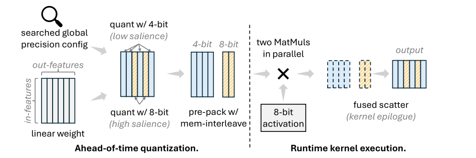

# MixLLM 中文翻译：输出特征间的全局混合精度 LLM 量化
> MixLLM 全文中文翻译（为版权计以复述方式呈现，非逐字直译；覆盖全部章节与附录）。原文：https://arxiv.org/abs/2412.14590 ｜ 作者：Zhen Zheng, Xiaonan Song, Chuanjie Liu (Microsoft, AAAI'25)

本文是对该论文的逐节复述性讲解，力求忠实覆盖每一节的核心内容、公式与实验数据，但表达方式为作者自己的转述，非逐句翻译。

## 摘要

量化（quantization）已成为压缩大语言模型（LLM）最有效的手段之一，但现有的量化方案要么精度损失不可忽视，要么系统效率低下。本文提出 MixLLM，探索了一个此前较少被挖掘的优化空间——在**输出特征（output feature）之间**做混合精度（mixed-precision）量化，其出发点是：模型中不同的神经元对最终输出的贡献并不相同。MixLLM 从**全局视角**（而不是逐层局部视角）识别哪些输出特征更重要，从而把更大的比特宽度分配给最需要它的输出特征，在保证高精度的同时把内存占用控制得很低。论文给出了一套算法与系统协同设计（algorithm-system co-design）后的"甜点"（sweet spot）量化配置，兼顾精度和系统效率。为了解决系统实现上的难题，作者设计了 two-step dequantization（两步反量化）方案，使得计算可以方便地利用 int8 Tensor Core，并配合快速的数据类型转换降低反量化（dequantization）开销；同时提出了一套软件流水线（software pipeline），尽可能地把访存、反量化和矩阵乘（MatMul）计算重叠起来。大量实验表明：在仅多用约 10% 比特的情况下，Llama 3.1 70B 的困惑度（perplexity）增幅可以从当前最优方法（SOTA）的约 0.5 降到 0.2 以内，MMLU-Pro 指标上的损失也能从三个常用模型 SOTA 的 1.92 降到 0.99。除了精度上的优势，MixLLM 同时也实现了业界最优的系统效率。代码已在 https://github.com/microsoft/MixLLM 开源。

## 1 引言

大语言模型在各类任务上展现出了惊人的能力，但其庞大的内存占用和计算开销给高效部署带来了障碍。量化通过用更小的比特宽度表示权重或激活值，成为压缩 LLM 最有效的方案之一。然而现有量化方案仍然存在精度损失明显或系统效率不足这两类问题之一。

作者指出 LLM 量化中存在一个"精度—内存—系统效率"的三角关系，现有方案在这个三角中各有侧重和取舍：

1. **仅量化权重（weight-only）**的方法主要针对内存占用问题，能够加速受"内存墙"（memory-wall）限制的小 batch 解码场景。但 4-bit 量化带来的精度损失，对于精度敏感的生产场景是一个挑战，近期多项研究已指出这一点。此外，对于大 batch 场景，weight-only 方法反而会因为反量化开销导致系统性能下降。
2. **权重-激活量化（weight-activation quantization）**同时把激活值也量化为低比特，从而有可能进一步提升系统效率，但由于激活值通常比权重更难量化，其精度损失往往比 weight-only 方法更大；同时激活量化也会引入更多反量化开销，反而可能损害系统效率。

（此处原文插入 Figure 1，示意输出特征间的混合精度量化与 kernel 执行方式。）



**本文贡献。** 作者对量化的一般性原则做了较为全面的分析，并提出 MixLLM，贡献点如下：

- **高精度、低内存占用：权重上输出特征间的混合精度 + 全局重要性（salience）识别。** 由于不同神经元对模型输出的贡献不同，MixLLM 对权重量化时按不同的输出特征（即输出通道，output channel）分配不同的比特宽度（见图 1）。与以往工作（如 Atom、SliM-LLM）按每一层局部估计的重要性来选取固定数量离群点（outlier）不同，MixLLM 是根据对**模型最终输出损失**的估计，在全局范围内识别不同输出特征的重要性，因为不同层对模型整体的重要性本身就不一样。此外，在输出特征维度上做混合精度，比在输入特征（input feature）维度上做混合精度更利于系统实现，因为不同输出特征的计算在 MatMul 中天然是互不相关的独立子问题。
- **高精度、高系统效率：量化配置与 GPU kernel 优化的协同设计。** 作者发现了若干量化决策上的"甜点"，能同时兼顾精度和系统效率：MixLLM 对激活量化使用 8-bit，因为它能保持较好的精度；而且 MatMul 的执行瓶颈更多取决于较大的权重张量而非较小的激活张量，这就削弱了把激活进一步压到更低比特的必要性（详见 3.1 节）。MixLLM 对 8-bit 使用对称（symmetric）量化，对 4-bit 使用非对称（asymmetric）量化，二者均按分组（group-wise）方式进行，这样精度更好，但同时也让系统效率的实现变得更具挑战性。为此作者设计了 two-step dequantization，使这种配置也能利用高速的 int8 Tensor Core，并配合快速的整数-浮点转换以降低反量化开销；还专门设计了软件流水线来应对分组量化和 4-bit 非对称量化带来的系统挑战，给出了当前最优的、支持 4-bit 非对称与 8-bit 对称权重的分组 int8 量化 GPU kernel。论文还给出了量化感知的 Roofline（屋顶线）分析。

大量实验表明，采用 10% 的 8-bit 与 90% 的 4-bit 组合（记为 W4.4A8）时，MixLLM 在精度上显著优于 SOTA 量化算法，同时在 A100 与 H100 GPU 上都达到了业界最优的系统效率。

## 2 背景、相关工作与讨论

量化把张量 `X` 映射到比特宽度更小的目标范围，公式为：

```math
X_{q}=clamp(\lfloor\frac{X}{s}\rceil+z,\ range)
```

其中 `s` 是缩放因子（scale），`z` 是零点（zero point）。缩放因子和零点既可以按整个通道/token 向量计算，也可以按更小的分组（group）计算。分组方式精度更高，但需要更复杂的 GPU kernel 设计。对称量化把零点固定为 0，从而简化了计算，也使许多工作能够设计出按通道/按 token 量化的 kernel（在 MatMul 的最后阶段统一乘上 scale 完成反量化）。但对称量化通常损失更大，尤其是在 4-bit 这样的低比特场景下。

### 2.1 相关工作与讨论

本文关注纯粹的训练后量化（post-training quantization, PTQ），既不涉及对权重的训练（即量化感知训练 QAT），也不涉及对量化参数本身的训练（比如 SpinQuant 中训练旋转矩阵那种做法）。

**影响量化需求的系统技术。** 连续批处理（continuous batching）技术使得可以把来自不同请求的解码任务打包在一起，从而扩大 MatMul 的 batch 维度；分块预填充（chunked-prefill）方法进一步把预填充（prefill）和解码（decoding）任务合并进同一个 batch，使 MatMul 形状进一步增大。这些技术把许多 LLM 任务推向计算受限（compute-bound），从而催生了减少计算量的需求。

**仅权重量化及其局限。** 已有大量工作提升 weight-only 量化的精度：GPTQ 在 OBC（继承自 OBS 的权重补偿方法）基础上加入了分块更新与重排序；AWQ 提出根据激活值特性对权重进行缩放；OmniQuant 提出可学习的缩放和裁剪因子；SpQR、SqueezeLLM、OWQ 把离群值从量化中单独分离出来并保留半精度；QuIP 与 QuIP# 借助非相干处理（incoherence processing）实现极低比特量化，QTIP 也利用了非相干处理；AQLM 和 PV-Tuning 同样面向极低比特量化；SliM-LLM 用层内混合精度处理极低比特场景；ZeroQuant(4+2) 和 Quant-LLM 则借助 FP6 提升精度。

weight-only 量化本身并不减少计算量，反而引入了额外的反量化操作（因为执行时需要把权重反量化回 float16）。当前 weight-only 量化面临两个挑战：一是精度层面，4-bit 量化和 float16 模型之间仍存在差距，对精度敏感的业务场景尤其棘手；二是系统效率层面，繁忙的服务器上通常会把不同请求打包成大的 MatMul，这类大 MatMul 是计算受限的，会因反量化开销而受损。

**权重-激活量化及其挑战。** 这类方法有助于利用低比特计算单元：LLM.int8() 发现了激活值的离群点问题，把离群点单独用半精度处理；ZeroQuant 提出按 token 量化激活、按分组量化权重；SmoothQuant 通过"平滑"（smoothing）处理激活离群点问题；AffineQuant 提出通用仿射变换用于量化；RPTQ 通过重排通道把数值相近的通道聚在一起；SpinQuant 和 QuaRot 利用矩阵旋转的性质缓解离群点现象；Atom 在输入特征间使用混合精度以提升 4-bit 激活量化的精度；QServe 是一套完整的 W4A8 量化方案。

尽管权重-激活量化的优势是能减少 MatMul 计算量（更小比特宽度、更高吞吐），但它面临激活量化带来的精度损失挑战：即便是 SOTA 的低比特权重-激活方案（如 QuaRot、SpinQuant、QServe），相比 4-bit weight-only 量化仍有差距。除精度外，激活量化比 weight-only 引入更多的反量化开销，也让高效 GPU kernel 的设计更具挑战性。

当启用非对称量化时，`(X_q - z)` 的结果可能超出 `X_q` 比特宽度所能表示的范围，导致难以直接利用对应的 Tensor Core 计算。因此像 Atom 这样的系统选择避免使用非对称量化，代价是精度损失更大。整数量化还需要整数到浮点（integer-to-float, I2F）转换来施加 scale，而 I2F 指令在现代 GPU 上比常见运算更昂贵，对分组量化而言会造成显著的系统性能下降（作者实践中观察到大于 10% 的性能下降）。此外，Tensor Core 的吞吐远高于 SIMT Core：A100 GPU 上 int8 Tensor Core 可达 624 TOPS，而 FP32/INT32 SIMT Core 仅 19.5 TFLOPS/TOPS。目前还缺少一个设计良好的软件流水线，能够针对分组、非对称的权重-激活量化，把 Tensor Core 的计算和 SIMT Core 的反量化很好地重叠起来。

**float16 离群点分离方案的性能挑战。** 离群点分离方案通过对高重要性的权重使用半精度、对不敏感权重使用小比特宽度来提升精度，做法是把离群点单独放进一个稀疏张量中用 float16 表示。但由于稀疏计算在 GPU 上效率低下，尤其当 batch 较大、线性层变为计算受限时，很难达到峰值性能（正如 Flash-LLM 中讨论的，稀疏 MatMul 的硬件利用率可能低于 10%，而稠密对应版本通常能达到 60% 以上）。这是因为非结构化的张量计算无法方便地利用高速 Tensor Core，只能退回到用 SIMT Core 做 float16 计算、float32 累加（Flash-LLM 优化了非结构化稀疏 MatMul，但只能加速小 batch 场景）。此外，稀疏计算由于访存不连续及额外的索引计算，也更难充分利用硬件。

## 3 方法

### 3.1 MixLLM 中的量化设计与决策

作者从算法和系统两方面做了以下设计与决策，来优化量化。

#### 3.1.1 全局混合精度

权重中不同元素在被量化时，对网络损失的重要性并不相同。离群点分离方法通过对高重要性元素用 float16 来提升精度，但会遭受稀疏 MatMul 效率低下的问题。作者观察到：在许多 LLM 的大多数线性层中，高重要性元素往往沿着输出通道方向分布。基于这一观察，可以给高重要性的输出通道分配更大的比特宽度，给其余通道分配较小的比特宽度。实验也验证了与已有工作相同的结论：只有一小部分元素具有高重要性，因此只需要给一小部分输出通道分配大比特宽度，就能在保持较小内存占用的同时取得良好精度。

按输出通道做结构化混合精度，天然对系统效率和 kernel 开发友好，因为不同输出特征在 MatMul 中是互不相关的，它们的计算属于不同的子问题。图 1 展示了 MixLLM 中混合精度量化和执行的方式：它把一个线性层拆分成若干互相独立的子问题，最后再把这些子问题的输出汇总拼接成结果。这一优化维度与已有的量化方法是正交的，可以叠加使用。

（原文插入 Figure 2：Llama 3.1 8B 模型中，按对最终损失贡献估计出的高重要性输出特征，在全局 10% 高重要性比例下，各线性层内高重要性特征所占百分比的分布。每个 decoder 层依次包含 q_proj、k_proj、v_proj、o_proj、gate_proj、up_proj 和 down_proj。图注：分布在各层间差异巨大（原图略）。）

现在的关键问题是：如何在模型中识别出高重要性的输出通道？以往工作中使用固定阈值或固定数量/比例（按每层局部损失计算）的做法，对端到端模型而言可能不是最优的，因为不同层对模型最终输出的重要性本身就不一样——某一层内的高重要性通道未必是对整个端到端模型而言的高重要性通道。MixLLM 的做法是：根据各通道对**模型最终损失**的影响，在全局范围内计算高重要性通道（详见 3.2 节）。因此，不同层最终会得到数量不同的高重要性通道。图 2 展示了 Llama 3.1 8B 中排名前 10% 的高重要性输出特征的分布情况，各层之间差异巨大。

需要指出，这一设计与 Atom 的混合精度方案有两点不同：1）MixLLM 首先解决的是"全局而非局部"识别高重要性通道的问题；2）MixLLM 在输出特征间而非输入特征间做混合精度，这在系统/算法层面更灵活，因为输出特征天然是互不相关的。该设计也不同于 SliM-LLM——后者同样只考虑局部损失来确定混合精度，并且不关注系统性能问题。

#### 3.1.2 量化决策

在激活量化上，MixLLM 与 QServe 做出了相同的决策——使用 8-bit，原因是 4-bit 激活量化会带来较大的精度损失，却不会带来显著的系统效率提升。这是因为根据算术强度（compute intensity）公式：

```math
I=\frac{2MNK}{MKB_{act}+KNB_{weight}}
```

（其中 `M` 是 token 数量，`K`/`N` 分别是输入/输出特征数，`B_act` 和 `B_weight` 分别是激活和权重每个元素所占字节数），MatMul 的执行瓶颈更多取决于较大的权重张量，而非较小的激活张量。

MixLLM 没有采用逐 token（per-token）激活量化，而是使用分组的 RTN（round-to-nearest）方法。一方面，表 1 表明简单的分组 RTN 量化优于按 token 平滑（token-wise smoothing）方法；另一方面，MixLLM 中权重本身已经是分组量化的，激活也采用分组方式不会带来明显更多的反量化开销。作者观察到：对 8-bit 激活而言对称量化就已经足够（参见表 1 中的 MixLLM W8A8），而对 4-bit 权重而言非对称量化则是必需的。分组方式加上非对称量化会让 kernel 难以利用 int8 Tensor Core，为此作者设计了一种利用"对称与非对称混合"这一性质的 two-step dequantization 方法（见 3.3 节）。

### 3.2 全局精度搜索算法

MixLLM 从全局角度确定所有层中所有输出特征的精度：先根据各特征对模型最终损失的影响估计其重要性（salience），再把更大的比特宽度分配给会导致更大损失的特征。具体地，通道 `c` 的重要性 `S_c` 定义为：

```math
S_{c}=|l(c_{q})-l(c_{0})|
```
(公式 1)

即量化该通道前后，模型损失之间的差距。这里 `l(·)` 是关于单个通道的模型损失函数，`c_q` 是该通道量化后的权重，`c_0` 是原始权重。

作者用泰勒展开（Taylor Expansion）来估计损失函数 `l(c)`，忽略高阶项：

```math
l(c)\approx l(c_{0})+g^{T}(c-c_{0})+\frac{1}{2}(c-c_{0})^{T}H(c-c_{0})
```
(公式 2)

其中 `g = E[∂l(c)/∂c]` 是损失对通道的梯度，`H = E[∂²l(c)/∂c²]` 是二阶梯度（即 Hessian 矩阵）。由于 Hessian 矩阵不可行直接计算，作者用校准数据集 `D` 上的（经验）Fisher 信息矩阵（Fisher Information Matrix, FIM）`F` 来近似：

```math
H\approx F=\frac{1}{|\mathcal{D}|}\sum_{d\in\mathcal{D}}{g_{d}g_{d}^{T}}
```
(公式 3)

需要注意，这里的 `F` 是针对单个通道的，这与近期一些工作（忽略跨神经元交互项的对角 FIM 近似）不同。

基于该近似，二阶损失项 `1/2·(c-c_0)^T·(g_d g_d^T)·(c-c_0)` 可以进一步化简为 `1/2·(g_d^T(c-c_0))^2`，从而把复杂的链式矩阵乘法简化成简单的向量内积。最终，重要性可以计算为：

```math
S_{c}=\frac{1}{|D|}\sum_{d\in D}\left|g_{d}^{T}(c_{q}-c_{0})+\frac{1}{2}(g_{d}^{T}(c_{q}-c_{0}))^{2}\right|
```
(公式 4)

与近期一些量化工作（GPTQ、SpQR、SqueezeLLM 等）不同，MixLLM 并没有在计算中忽略一阶项。因为这里所需要的是"损失本身"，而不是"损失函数的自变量"，所以没有必要为了简化自变量的计算而丢掉一阶信息。

**算法 1：全局精度搜索流程**

输入：所有线性层的权重和梯度（`W_i ∈ R^{O×I}`，`G_i ∈ R^{O×I}`，层数 `i ∈ [1..L]`）；分配大比特宽度的总输出通道数 `T`。

输出：大、小比特宽度对应的通道索引集合 `C^lg` 和 `C^sm`。

1. `C^global ← ()`（全局通道信息）
2. for `i = 1` to `L` do
3. &emsp;`W_i^delta ← quantize(W_i) - W_i`
4. &emsp;`S^1st ← sum(G_i ⊙ W_i^delta, dim=1)`
5. &emsp;`S^2nd ← 0.5 * (S^1st)^2`
6. &emsp;`S ← |S^1st + S^2nd|`（`O` 个通道的重要性，属于 `R^O`）
7. &emsp;for `cid = 1` to `O` do
8. &emsp;&emsp;`C^global ← C^global ∪ (tuple(i, cid, S_cid))`
9. &emsp;end for
10. end for
11. 将 `C^global` 按重要性降序排序
12. `C^lg, C^sm ← C^global[:T], C^global[T:]`

算法 1 描述了全局精度搜索的流程：先计算所有线性层中所有输出通道的重要性并按降序排列，给定全局阈值 `T`（即分配大比特宽度的通道数量），排在前 `T` 位的通道量化为 8-bit，其余通道量化为更小的比特宽度（本文中为 4-bit）。

### 3.3 高效量化计算系统

（原文插入 Figure 3：group-wise W4A8/W8A8 量化 MatMul 的 GPU kernel 软件流水线示意，假设完美重叠。图中缩写：G2S = 全局内存到共享内存的加载；S2R = 共享内存到寄存器的加载；MMA = 矩阵乘累加；I2F = 整数到浮点转换；deq = 反量化；acc = 累加。该流水线以 NVIDIA A100 架构为基础建模，但其基本原理同样适用于后续架构（如 Hopper、Blackwell），只需做少量架构相关调整——例如更新架构可以利用 Tensor Memory Accelerator (TMA) 直接加载激活张量到 Tensor Core 而绕过寄存器，还支持用于内存加载的 warp 特化机制，作为统一执行方案的替代。原图略。）

**利用 int8 Tensor Core 的 two-step dequantization。** 对 W4A8 计算而言，反量化后的权重和激活分别是 `(W_q - z)·s_w` 和 `A_q·s_a`，其中 `W_q` 和 `z` 是 uint4 数据类型（4-bit 无符号整数），`A_q` 是 int8 数据类型，`s_w` 和 `s_a` 是 float16 数据类型。如果在 MatMul 计算前直接把张量整体反量化为 float16，就无法利用 GPU 上高速的 8-bit Tensor Core。MixLLM 转而在每个分组内使用两步反量化：第一步先把权重部分反量化为 `(W_q - z)`，然后用 8-bit Tensor Core 与 `A_q` 相乘；第二步再把 MatMul 结果乘以组内的两个 scale。这里 `(W_q - z)` 使用 int8 数据类型存储，从而不会出现溢出问题。

（原文插入 Figure 4：二进制串 `010010110xx...x` 所对应的浮点数值和整数数值，二者各自落在一段连续区间内。原图略。）

**通过部分融合进 Tensor Core 指令实现快速 I2F。** 在上述两步反量化中，第二步是整数张量与浮点张量的乘法，需要整数到浮点（I2F）转换。由于 I2F 指令在现代 GPU 上开销较大，作者利用一种"依赖数值范围"的快速 I2F 变换，把 I2F 指令转换成两条加/减指令。其原理是：存在某个数值范围，在该范围内整数的二进制表示与对应浮点数的二进制表示是一致的。如图 4 所示，前 9 位为 `010010110` 的二进制串代表了一系列连续的 int32 和 float32 数值。可以给一个整数值加上一个偏置（bias），使其落入这段一致的区间，然后在浮点域中减去对应的偏置，还原出浮点数值。作者选取该区间的中间值作为 bias，以最大化可安全转换的数据范围，其十六进制表示为 `mid=0x4b400000`（即剩余 23 位中第一位为 1，其余全为 0）。这样可以把 `2^23` 个连续的 int32 数值转换成 float32。`k` 个 int8 元素点积的取值范围在 `2^16·k` 以内，因此上述快速 I2F 转换允许 `k` 取到 128。MixLLM 使用的量化分组大小恰好是 128，因而可以安全地使用这一快速转换：

```
// bias_int = as_int(mid), bias_fp = as_float(mid);
int tmp = src_int + bias_int;
int dst_float = *((float*)&tmp) - bias_fp;
```

作者进一步把整数减法融合进 Tensor Core 的 mma（矩阵乘累加，`D = A·B + D`）指令中：在每个量化分组开始 MatMul 计算前，先把累加器 `D` 初始化为 `bias_int`，MatMul 结束后只需再减去 `bias_fp`。换句话说，昂贵的 I2F 操作被转换成了一次简单的浮点减法。在 A100 GPU 上，对 M/N/K 为 512/4096/4096 的量化 MatMul 计算，这项 I2F 简化带来了超过 20 TOPS 的性能提升。

**量化线性层 kernel 的端到端软件流水线。** 图 3 展示了该量化 kernel 的软件流水线。除了基本的 warp tile 和 block tile 之外，作者引入了"量化分组 tile"（quantization group tile）来支持按组量化的计算。该流水线在寄存器层面使用两个输出累加缓冲区：一个用于组内累加，一个用于全局累加，这样可以把组级别的 scale 应用在组级别的缓冲区上。组缓冲区在组 tile 开始时初始化为 `bias_int`，在组 tile 结束时减去 `bias_fp`。至于两步反量化，第一步发生在 warp tile 内部——每个输入元素在送入 MMA 前先减去零点；第二步发生在组 tile 结束时，乘以 scale。作者使用向量化的 intrinsic 指令（`vsub4`，借鉴自 QServe）在单条指令中完成四个 int8 元素的减法。此外，为了提升全局内存加载效率，作者预先（ahead-of-time）对权重张量的内存排布做了打包处理，避免运行时对输入元素做置换（permutation）。整体软件流水线尽可能地把内存加载、SIMT Core 上的反量化计算，以及 Tensor Core 上的 MatMul 计算重叠起来，把分组反量化带来的开销降到最低。

### 3.4 不同比特宽度子问题的并行执行

对于图 1 所示的执行方式，MixLLM 使用 CUDA Graph 在 GPU 上并行执行不同的子问题。最终，两部分的 MatMul 结果会以不同的通道索引写入同一个目标张量，形成最终输出。作者通过在 MatMul 的融合尾声（epilogue）中把输出散射（scatter）到对应索引位置来实现这一功能，这一步的开销基本可以忽略。

### 3.5 量化感知的 Roofline 分析

为了系统地分析 MixLLM 各量化方案的性能上限，作者把传统的 Roofline（屋顶线）模型进行了扩展，以刻画 NVIDIA GPU 上异构计算流水线的特点。以 NVIDIA A100（80GB SXM）为目标架构，评估系统相对硬件峰值的表现：HBM2e 显存带宽峰值 2039 GB/s，稠密 INT8 Tensor Core 算力峰值 624 TOPS，FP32 SIMT 算力峰值 19.5 TFLOPS。引入亚字节（sub-byte）量化和非对称零点从根本上改变了算术强度（每字节操作数），并在不同计算单元之间引入了多个相互竞争的算力上限。

**内存流量（Memory Traffic）。** 从内存带宽角度看，算术强度取决于量化后的数据体积以及相关元数据。以分组大小 `G=128` 为例，W8A8 对称方案需要读取 8-bit 权重、8-bit 激活和一个 16-bit scale，每个权重元素的有效字节数为 `1 + 2/G`。W4A8 非对称方案把权重压到 4-bit，同时需要一个 16-bit scale 和一个 4-bit 零点，每个权重的有效字节数为 `0.5 + 2.5/G`。因此 W4A8 大幅提高了内存受限区域的可达吞吐上限（即让内存受限的"屋顶线斜率"上移），在小 batch 解码这类带宽受限的场景中尤为有利，这也是 MixLLM 倾向于对权重使用更低比特的动机所在。

**算力上限：Tensor Core 与 SIMT 反量化的博弈。** 在计算受限区域，性能由 Tensor Core（负责 GEMM）和 SIMT Core（负责反量化）之间的相互配合决定。

对 W8A8 和 W4A8 而言，输出 scale 的施加都需要从 Tensor Core 的 int32 累加器切换到 SIMT Core 的 float32 流水线。对每个大小为 `G=128` 的分组，Tensor Core 需要执行 128 次 INT8 乘加（MAC）操作（共 256 次运算）才能得到一个 int32 部分和。在应用 FP32 的 `s_w` 和 `s_a` 之前，SIMT Core 必须先执行一次 int32 到 float32 的类型转换指令。因此，每组的后 GEMM 工作量由这一次显式类型转换加上 FP32 的 scale 乘法组成。即便算上这部分转换开销，该应用所需的运算比例（256 次 INT8 操作对应 3 条 SIMT 指令，即转换 + 乘法）也远低于 A100 硬件所提供的 32:1 比例（624 INT8 TOPS 对 19.5 FP32 TFLOPS），这要归功于 MixLLM 的快速 I2F 和部分融合方法。由于 SIMT 侧的需求非常轻量，这部分后 GEMM 的转换和缩放操作可以完全被 Tensor Core 的累加过程掩盖。这进一步说明了为什么分组 8-bit 量化优于按通道/按 token 的方案。

不过，W4A8 引入了更重的、位于 GEMM 之前的反量化步骤：

```math
Y=((W_{q}-z)\times A_{q})\cdot s_{w}\cdot s_{a}
```

在 Tensor Core 执行 INT8 乘加之前，必须先把 4-bit 权重解包并减去零点。借助 `vsub4` intrinsic，硬件可以在一条 SIMT 指令中完成 4 次 int8 减法，高度优化了 `(W_q - z)` 的计算。尽管有这种指令级并行，SIMT 整数流水线仍必须持续不断地为 Tensor Core"供料"。由于这部分前 GEMM 工作量的复杂度是 `O(N²)`，而 Tensor Core 的数学运算复杂度是 `O(N³)`，二者在指令取指和寄存器带宽上是并发竞争的，这就形成了一个额外的、更低的算力上限。因此，W4A8 的有效算力峰值严格低于 W8A8 所能达到的 624 TOPS 绝对值。

**交点（脊点，Ridge Point）分析。** 传统 Roofline 的脊点定义为内存带宽线与峰值算力线的交点，标志着工作负载从内存受限转变为计算受限的临界点。对纯 INT8 Tensor Core 执行而言，A100 上这一交点大约在 306 OPs/Byte 处（即 624 TOPS 除以 2039 GB/s）。由于 W4A8 方案受限于 SIMT `vsub4` 反量化这一算力上限，而非 Tensor Core 的峰值上限，其水平方向的 Roofline 上限会下移，导致 W4A8 内存流量线与其算力上限的交点向左偏移。这意味着 W4A8 工作负载会在更低的算术强度下就达到其可实现的最大算力，即由于 SIMT 指令开销的存在，更早地进入计算受限区域。

## 4 实验

（原文插入表 1：wikitext2/c4 上的困惑度评估，↓ 表示越低越好，灰色列代表 c4，序列长度 2048。NA 表示不支持；Abn 表示数值过大（大于 `10^5`）；对 MixLLM 而言 pn 表示 n% 的 8-bit 占比。）

**表 1：困惑度评估（wikitext2/c4，序列长度 2048）**

| 方法 | 配置 | Llama 3.2 1B | Llama 3.1 8B | Llama 3.1 70B | Qwen2.5 0.5B | Qwen2.5 1.5B | Qwen2.5 7B | Qwen2.5 32B | Mistral 7B v0.3 |
|---|---|---|---|---|---|---|---|---|---|
| float16 | - | 9.75/12.72 | 6.24/8.95 | 2.81/6.68 | 13.07/17.55 | 9.26/13.11 | 6.85/10.44 | 5.02/8.95 | 5.32/7.84 |
| Basic RTN | W4A16 | 11.72/15.56 | 6.82/9.72 | 3.55/7.43 | 15.54/20.55 | 10.35/14.35 | 7.23/10.88 | 5.27/9.14 | 5.51/8.04 |
| Basic RTN | W5A16 | 10.15/13.25 | 6.40/9.15 | 3.16/9.52 | 13.61/18.17 | 9.52/13.38 | 6.95/10.53 | 5.09/8.99 | 5.38/7.91 |
| SmoothQuant | W8A8 | 9.89/12.91 | 6.34/9.08 | 2.92/6.77 | 13.84/18.40 | 9.63/13.49 | 7.17/10.85 | 5.12/9.04 | 5.35/7.88 |
| QuaRot | W4A4 | Abn/Abn | 8.34/11.95 | 6.16/9.91 | NA/NA | Abn/Abn | 8.15/12.05 | 6.26/9.98 | 5.83/8.50 |
| QuaRot | W4A8 | Abn/Abn | 6.60/9.67 | 3.43/7.10 | NA/NA | Abn/Abn | 7.03/10.68 | 5.23/9.10 | 5.40/7.99 |
| QServe | W4A8 | Abn/Abn | 6.64/9.49 | 3.49/7.07 | Abn/Abn | Abn/Abn | 7.39/11.06 | 5.55/9.31 | 5.44/7.98 |
| MixLLM | W4A8 (p0) | 10.36/14.09 | 6.54/9.62 | 3.30/7.24 | 14.43/19.61 | 9.66/13.79 | 7.03/10.75 | 5.21/9.08 | 5.42/8.02 |
| MixLLM | W4.4A8 (p10) | 10.05/13.51 | 6.42/9.33 | 3.02/6.83 | 13.42/18.13 | 9.44/13.43 | 6.92/10.57 | 5.12/9.01 | 5.36/7.93 |
| MixLLM | W4.8A8 (p20) | 9.95/13.25 | 6.37/9.22 | 2.97/6.79 | 13.32/17.99 | 9.40/13.35 | 6.90/10.53 | 5.09/9.00 | 5.35/7.90 |
| MixLLM | W6A8 (p50) | 9.85/12.98 | 6.30/9.09 | 2.86/6.73 | 13.21/17.78 | 9.33/13.25 | 6.88/10.49 | 5.05/8.98 | 5.33/7.87 |
| MixLLM | W8A8 (p100) | 9.76/12.75 | 6.25/8.97 | 2.81/6.68 | 13.12/17.60 | 9.28/13.14 | 6.86/10.45 | 5.02/8.96 | 5.32/7.84 |

### 4.1 实验设置

对 MixLLM，作者分别评估了基于 4-bit 量化叠加 0%、10%、20%、50% 和 100% 的 8-bit 通道占比的配置，同时激活量化均使用 8-bit。权重和激活都按分组大小 128 进行分组量化：4-bit 部分为非对称量化，8-bit 部分（包括权重中的 8-bit 部分）为对称量化。与近期工作（QServe、SpinQuant）类似，MixLLM 也启用了 GPTQ 和裁剪（clipping）。

**基线与配置。** 在 4.2 节与 4.4 节中，作者与纯 PTQ 的权重-激活量化方法做比较，既不包括 QAT，也不包括训练量化参数的方法（如 SpinQuant 训练旋转矩阵）。具体比较对象包括使用最广泛的 SmoothQuant，以及近期 SOTA 方法 QuaRot（W4A4 和 W4A8 两种配置）与 QServe。所有基线中的 8-bit 张量均为对称量化。QuaRot 采用其论文中设置的对称、按通道/按 token 的量化方式；SmoothQuant 采用官方配置 alpha/beta = 0.85/0.15，QServe 采用 0.3/0.7。为公平比较，实验中禁用了 QuaRot 和 QServe 的 KV 量化。附录 4.6 节还与 GPTQ、AWQ、SqueezeLLM、OmniQuant、AffineQuant、Atom 和 SpinQuant 比较了困惑度。

**模型与数据集。** 评估对象包括 Llama 3.1 8B/70B、Llama 3.2 1B、Qwen2.5 0.5B/1.5B/7B/32B，以及 Mistral 7B v0.3。MixLLM 使用 wikitext2 作为校准集，SmoothQuant 和 QServe 使用默认的 pile 数据集。MixLLM 使用 128 个样本、序列长度 2048；SmoothQuant 和 QServe 使用 64 个样本、序列长度 1024（以防止显存溢出）。

**评价指标。** 在 wikitext2 和 C4 数据集上比较各方法的困惑度；此外通过 lm-eval 工具，在 Llama 3.1 8B、Qwen2.5 7B 和 Mixtral 7B v0.3 上评估一组常用下游任务，包括 BBH、GPQA、MMLU-Pro、MuSR、ARC challenge 和 HellaSwag。系统实验在 NVIDIA A100（80G）GPU、CUDA 12.1 环境下进行（4.3.2 节讨论 H100 上的性能），软件环境为 PyTorch 2.4.1 与 transformers 4.45.2。

### 4.2 困惑度评估

表 1 展示了不同基线方法在多个常用开源 LLM 上、wikitext2 与 C4 数据集上的困惑度。可以看出：

1. 使用 MixLLM 4.4-bit 权重可以达到与 5-bit RTN weight-only 量化相近的精度，即使 MixLLM 中还同时启用了 8-bit 激活量化。这主要是因为 MixLLM 把更大的比特宽度分配给了高重要性输出通道，而不是像均匀 5-bit 方案那样"一视同仁"。
2. 在权重-激活量化基线的对比中，MixLLM W4.4A8 在比特宽度只有 SmoothQuant 60% 的情况下取得了相当的精度；相比 QuaRot 和 QServe，MixLLM W4.4A8 仅多用 10% 的比特宽度就取得了更好的精度。这说明 MixLLM 在内存占用和精度之间取得了良好的平衡。
3. MixLLM W8A8 量化相比 float16 基线几乎无损；MixLLM W4A8 在很多情况下也优于 SOTA 的 QuaRot 和 QServe，这是因为 MixLLM 对激活采用了分组量化而不是 QuaRot、QServe 中的按 token 方案。这也是 MixLLM 选择对激活使用分组量化的部分动机所在。

（原文插入 Figure 5：两类单层线性层相对 torch FP16 基线在 A100 GPU 上的加速比，原图略。）

### 4.3 系统性能

#### 4.3.1 A100 GPU 上的性能

作者评估了 token 数从 1 到 1024、输入特征为 4096、输出特征为 4096/14336 的单个线性层的表现，并与 SOTA 的 W4A16（TRT-LLM）和 QServe 做了比较（见图 5）。图中同时展示了 MixLLM 在不同 8-bit 占比配置下的 kernel 性能（W4A8 为 0% 8-bit，W4.4A8 为 10% 8-bit，W8A8 为 100% 8-bit）。结果表明：

1. MixLLM 在所有 token 数下都优于 float16 版本：对输出特征为 4096 的情形，MixLLM W4A8、W8A8、W4.8A8 分别取得平均 1.96×、2.76×、1.88× 的加速；对输出特征为 14336 的情形，分别为 2.45×、2.15×、2.34×。
2. MixLLM 优于 SOTA 的 W4A16 方案：输出特征 4096 时分别取得平均 1.31×、1.80×、1.25× 的加速；输出特征 14336 时分别为 1.36×、1.31×、1.33×。
3. MixLLM 在相近比特宽度下优于 QServe：输出特征 4096 时分别取得平均 1.03×、1.41×、0.99× 的加速；输出特征 14336 时分别为 1.08×、1.04×、1.05×。

（原文插入 Figure 6：MixLLM W8A8 应用于 Qwen2.5 7B 时相对 float16 基线在 A100 GPU 上的加速比，原图略。）

作者还把 MixLLM 集成进 vLLM，在单张 A100 GPU 上，batch size 为 2、输入/输出长度为 1000/1000 的配置下，使用 W4.4A8 对 Mixtral-7B，输出 token 吞吐量相比 float16 基线取得 1.41× 加速。

图 6 展示了 Qwen2.5 7B 模型使用 MixLLM W8A8 量化、输入/输出长度 1000/1000、batch size 从 1 到 128 变化时相对 float16 基线的加速情况。

#### 4.3.2 H100 GPU 上的性能

（原文插入 Figure 7：两类单层线性层相对 W4A16 基线在 H100 GPU 上的加速比，原图略。）

作者在 NVIDIA H100 GPU 上评估了单层线性层的性能，把 MixLLM W4A8 kernel 与 W4A16 基线做比较（图 7）。据作者了解，目前尚无可用的 H100 优化版 QoQ（即 QServe 中的量化方案）实现。W4A16 基线是通过对官方 CUTLASS 分组、非对称量化 W4A16 示例进行详尽调优得到的最优配置。作者同时考虑了朴素的 4-bit 数据排布和进阶的"shuffled"4-bit 数据排布两种方案。结果显示 MixLLM 在所有配置下都优于 W4A16 方案：输出特征为 4096 时，MixLLM 相对朴素排布和 shuffled 排布分别取得平均 1.81× 和 1.39× 的加速；输出特征为 14336 时，分别为 1.91× 和 1.34×。

（原文插入表 2：Llama-3.1-8B/Qwen2.5-7B/Mistral-7B-v0.3 三个模型的下游任务评估（↑ 表示越高越好），表中为三个模型的平均结果。BBH 为 3-shot，MMLU-Pro 为 5-shot，其余为 zero-shot。表格中同时给出了三个模型各自的数值（以"/"分隔，顺序为 Llama-3.1-8B/Qwen2.5-7B/Mistral-7B-v0.3）。）

**表 2：下游任务评估（三模型平均值；括号内为各模型分项：Llama-3.1-8B / Qwen2.5-7B / Mistral-7B-v0.3）**

| 方法 | BBH（平均/分项） | GPQA（平均/分项） | MMLU-Pro（平均/分项） | MuSR（平均/分项） | ARCc（平均/分项） | HellaSwag（平均/分项） |
|---|---|---|---|---|---|---|
| float16 | 48.62（46.52/54.09/45.25） | 30.86（31.08/33.11/28.39） | 35.52（32.91/43.86/29.80） | 41.07（37.99/44.51/40.72） | 52.24（53.41/51.02/52.30） | 79.43（78.92/78.94/80.43） |
| SmoothQuant W8A8 | 47.82（46.37/52.57/44.52） | 30.90（31.40/33.94/27.36） | 35.04（32.61/42.98/29.52） | 42.06（39.05/46.39/40.73） | 51.74（53.33/50.00/51.88） | 79.20（78.88/78.48/80.24） |
| QuaRot W4A4 | 41.10（36.96/45.42/40.92） | 27.53（25.41/28.94/28.23） | 27.60（22.99/34.40/25.42） | 39.46（37.92/40.68/39.77） | 45.99（43.00/46.33/48.63） | 74.85（72.87/73.54/78.14） |
| QuaRot W4A8 | 46.95（44.95/52.98/42.92） | 30.28（30.96/30.71/29.18） | 33.60（29.95/42.45/28.41） | 41.65（39.05/45.58/40.32） | 51.39（50.00/52.30/51.88） | 78.55（77.83/77.84/79.98） |
| QServe W4A8 | 45.78（40.98/51.23/45.14） | 30.02（28.99/32.50/28.56） | 32.84（28.16/41.72/28.63） | 39.92（37.60/41.59/40.57） | 50.54（51.28/49.15/51.19） | 78.10（76.90/77.52/79.89） |
| MixLLM W4A8 | 46.92（43.44/44.75/52.59） | 29.90（29.58/28.26/31.87） | 33.75（30.18/29.59/41.49） | 41.70（38.81/43.11/43.19） | 51.82（51.71/51.88/51.88） | 78.61（77.94/79.71/78.17） |
| MixLLM W4.4A8 | 48.17（46.27/52.58/45.66） | 30.09（29.17/31.75/29.36） | 34.53（31.08/43.26/29.26） | 41.74（39.32/44.79/41.11） | 52.70（53.67/51.96/52.47） | 79.00（78.20/78.58/80.21） |
| MixLLM W8A8 | 48.84（46.84/54.35/45.34） | 30.93（30.51/33.21/29.07） | 35.54（33.00/43.80/29.83） | 40.94（37.32/44.91/40.59） | 52.10（53.24/50.94/52.13） | 79.42（78.98/78.88/80.40） |

（注：原表中 MixLLM W4A8/W4.4A8 的分项排列在部分列中顺序略有出入，此处按原文数值原样转录，供读者核对时以原论文表格为准。）

### 4.4 下游任务评估

作者首先在 Qwen2.5 7B 模型上评估了 GSM8K，以验证量化对长推理任务的影响：使用 MixLLM W4.4A8 量化，strict-match 指标仅从 float16 模型的 0.8 降到 0.792，只下降了 0.008。此外，作者在三个常用 LLM 上评估了大量下游任务（见表 2）。结果表明：

1. MixLLM W4.4A8 在仅多用 10% 比特宽度的情况下，优于所有 4-bit 权重量化方案。例如在 MMLU-Pro 任务上，MixLLM W4.4A8 的平均指标相比 QServe、QuaRot W4A4、QuaRot W4A8 分别提升了 1.69、6.93 和 0.93。
2. MixLLM W8A8 几乎无损，精度高于 SmoothQuant，这得益于 MixLLM 中激活采用了分组量化。

### 4.5 消融实验

（原文插入 Figure 8：Llama 3.1 8B 在不同配置下的困惑度（wikitext2），原图略。）

图 8 展示了 Llama 3.1 8B 在逐步加入不同优化项后困惑度的变化：从基础的 RTN 量化出发，采用 8-bit 激活、非对称且分组的权重量化，对精度提升贡献显著，这也验证了 3.1.2 节中所做决策的有效性；在此基础上，10% 的 8-bit 输出特征把精度提升到较高水平，其中使用分块 Fisher 信息以及保留一阶泰勒项也各自有贡献；最后，加入 GPTQ 和裁剪能进一步提升精度。

**表 3：与相关工作报告数值的困惑度（wikitext2）对比**

| 模型 | FP16 | GPTQ (W4A16) | AWQ (W4A16) | SqueezeLLM (W4A16 0.45%) | OmniQuant (W4A16/W4A4) | AffineQuant (W4A16/W4A4) | Atom (W4A4 128 outliers) | SpinQuant (W4A8) | MixLLM (W4.4A8) |
|---|---|---|---|---|---|---|---|---|---|
| LLaMA 2 7B | 5.47 | 5.59 | 5.60 | 5.57 | 5.58/14.26 | 5.58/12.69 | 6.03 | 5.7 | 5.55 |
| LLaMA 3 8B | 6.14 | 6.46 | 6.55 | - | - | - | 7.57 | 6.5 | 6.32 |

### 4.6 与更多相关工作的比较

**与 Atom 的比较。**

**表 4：Atom 与 MixLLM 在相近比特宽度下的困惑度**

| 模型 | Llama 2 7B | Llama 2 13B |
|---|---|---|
| Atom W4.4A8 | 5.64 | 5.03 |
| MixLLM W4.4A8 | 5.54 | 4.93 |

表 4 展示了 Atom 与 MixLLM 在相近比特宽度（即 W4.4A8）下的困惑度比较。作者按 Atom 开源代码（commit 7e3618b）使用 512 个离群点，使其权重平均比特宽度约为 4.4-bit。可以看出 MixLLM 的精度明显优于 Atom。作者还评估了 Atom 的 kernel 性能：在序列长度 1024 的线性层场景下，MixLLM 的 W4.4A8 kernel 相比 Atom 的 W4A8 kernel 取得 1.56× 加速，说明本文提出的访存与计算流水线，比相关的混合精度工作有更好的性能。

**与 SliM-LLM 的比较。**

**表 5：SliM-LLM 与 MixLLM 的困惑度（wikitext2）比较**

| 模型 | Llama 3.2 1B | Llama 3.1 8B | Qwen2.5 0.5B | Qwen2.5 1.5B | Qwen2.5 7B |
|---|---|---|---|---|---|
| SliM-LLM W4A16 | 10.80 | 6.55 | 14.85 | 9.68 | 7.02 |
| MixLLM W3.9A8 | 10.20 | 6.50 | 13.68 | 9.51 | 6.97 |
| MixLLM W4A8（均匀） | 10.36 | 6.54 | 14.43 | 9.66 | 7.03 |
| MixLLM W4.2A8 | 10.07 | 6.43 | 13.53 | 9.45 | 6.93 |
| MixLLM W4.4A8 | 10.05 | 6.42 | 13.42 | 9.44 | 6.92 |

表 5 展示了 SliM-LLM W4A16（该方法只支持 weight-only）与不同比特宽度配置下 MixLLM 的困惑度比较。SliM-LLM 使用开源代码评估，它在代码中实际是 3/4/5-bit 的混合，且精度搜索是在每层内局部完成的，而不是全局搜索。需要说明的是，MixLLM 可以支持任意比特宽度的混合：本表中评估了 MixLLM 4-bit/6-bit 混合（W4.2A8，90% 4-bit + 10% 6-bit，平均 4.2-bit）以及 3-bit/4-bit/6-bit 混合（W3.9A8，30% 3-bit + 60% 4-bit + 10% 6-bit，平均 3.9-bit）。可以看到，即便是 MixLLM W4A8（对权重统一使用 4-bit）也能击败 SliM-LLM W4A16，这是可以理解的，因为 SliM-LLM 本身聚焦于 2-bit 和 3-bit 场景的优化，其论文正文并未展示任何 4-bit 结果。相反，MixLLM W3.9A8 能够击败 MixLLM W4A8，这说明 MixLLM 的全局精度搜索能够更好地把比特宽度分配给重要的权重元素，从而取得接近无损的效果。需要指出的是，本表中不同比特宽度所占的百分比是凭直觉确定的，未必是取得最优精度的最优配比，如何确定不同比特宽度的最优占比可以作为一个新的研究问题。

作者还根据相关工作论文中报告的数值，与更多近期量化方法做了比较（表 3），显示 MixLLM 在相近的内存占用下，相对一大批相关工作都取得了更优的精度。

### 4.7 全局精度搜索的开销

**表 6：全局精度搜索的开销**

| 模型 | Llama 3.1 8B | Llama 3.1 70B | Mistral 7B v0.3 | Qwen2.5 1.5B | Qwen2.5 7B |
|---|---|---|---|---|---|
| 耗时（分钟） | 7 | 55 | 7 | 2 | 7 |

表 6 展示了 3.2 节所述全局精度搜索算法的开销。如 4.1 节所述，校准数据集为 128 个样本、序列长度 2048。对 1.5B、7B、8B 模型使用单张 A100 GPU，对 70B 模型使用 4 张 A100 GPU 进行搜索，其中多 GPU 执行借助 huggingface 的 device_map 实现（即不同层在不同设备上顺序执行）。7B/8B 模型的搜索大约需要 7 分钟，70B 模型需要不到 60 分钟。考虑到量化只需执行一次，该搜索算法对实际生产场景是可行的。相比之下，根据作者实验，SliM-LLM 确定 Llama 3.1 8B 精度分配需要超过 3 小时，Qwen2.5 7B 需要超过 4 小时。

### 4.8 高精度分布

图 2 展示了 Llama 3.1 8B 中每个线性层内 8-bit 输出特征的占比情况（全局搜索出 10% 的 8-bit 输出特征，即 W4.4A8 配置）。可以看到不同线性层中高重要性（即 8-bit）特征的分布差异很大，具体来说，v_proj 和 down_proj 层的高重要性特征占比明显高于其他层，表 7 给出了各类线性层的平均占比。

**表 7：Llama 3.1 8B 中七类线性层的平均 8-bit 输出特征占比（全局 10% 8-bit）**

| 层类别（xx_proj） | q | k | v | o | gate | up | down |
|---|---|---|---|---|---|---|---|
| 平均 8-bit 占比（%） | 3.93 | 12.36 | 71.22 | 18.70 | 0.73 | 1.46 | 53.82 |

### 4.9 一次性搜索 vs. 渐进式搜索

如 3.2 节所述，MixLLM 采用一次性（single-pass）搜索高重要性特征，而不是以更小的步长迭代地识别高重要性部分，因为作者观察到一次性搜索的效果与迭代式方法相近，却能节省大量计算开销。作者在 Llama 3.1 8B 和 Mistral 7B 模型上尝试了渐进式（progressive）搜索流程，即迭代地识别更小比例的高重要性特征。结果表明，精度与一次性方法在小数点后两位上完全一致，但渐进式方法由于反复执行搜索过程，耗时明显更长：一次性方法对每个模型只需 7 分钟即可搜索出 10% 的高重要性特征，而按每次 2% 迭代搜索、逐步逼近 10% 的渐进式方法则需要 30 分钟。

### 4.10 与 KV 量化的配合

**表 8：MixLLM 中启用 KV 量化的困惑度**

| 配置 | Llama 3.1 8B | Qwen2.5 7B |
|---|---|---|
| MixLLM W4.4A8（不启用 KV 量化） | 6.42 | 6.92 |
| MixLLM W4.4A8（KV8） | 6.42 | 6.96 |

由于 KV 量化与权重-激活量化是正交的，可以很直接地把任意 KV 量化技术与 MixLLM 结合使用。表 8 展示了 Llama 3.1 8B 和 Qwen2.5 7B 在启用/禁用 KV 量化时的困惑度（wikitext2），表明 8-bit KV 量化在 MixLLM 之上几乎无损。

### 4.11 重要性搜索的校准数据集

MixLLM 默认使用 128 个样本作为校准数据来搜索高重要性通道，这也是现有方案的常见配置。作者还发现更小的数据集同样能够识别出高重要性通道。

**表 9：MixLLM 重要性搜索使用不同样本数时的困惑度（wikitext2，W4.4A8 量化）**

| 样本数 | 128 | 64 | 32 | 16 |
|---|---|---|---|---|
| Llama 3.1 8B | 6.42 | 6.42 | 6.42 | 6.42 |
| Qwen2.5 7B | 6.92 | 6.92 | 6.92 | 6.93 |

结果表明，把重要性搜索的样本数从 128 减少到 16，对精度的影响可以忽略不计。

作者还评估了当重要性搜索与困惑度评估使用不同数据集家族时（即输入分布发生偏移）的效果：当使用 c4 数据集做重要性搜索、在 wikitext2 上评估困惑度（W4.4A8 量化）时，Llama 3.1 8B 和 Qwen2.5 7B 的困惑度与使用 wikitext2 做校准时完全一致。这说明更换校准数据集对同一任务的精度没有影响，换言之，即使校准数据集与真实输入的数据分布不同，MixLLM 的重要性搜索算法依然能很好地工作。

## 5 总结

本文提出了 MixLLM，利用此前较少被探索的"输出特征间混合精度量化"这一优化空间，实现了低内存占用、高精度与高系统效率三者兼顾。MixLLM 根据各输出特征对**全局模型**损失的影响（而非单层局部损失）来识别其重要性，通过把更大的比特宽度分配给最需要它的特征，MixLLM 在低内存占用的前提下取得了优于 SOTA 的精度。不同比特宽度对应的子问题彼此独立，可以在 GPU 上高效并行执行。作者找到了对精度和系统效率都友好的量化配置"甜点"；为解决系统效率上的挑战，设计了 two-step dequantization 以利用 int8 Tensor Core，并用快速的整数-浮点转换降低反量化开销；还设计了端到端的软件流水线，把内存访问、SIMT Core 上的反量化计算和 Tensor Core 上的 MatMul 计算尽可能地重叠起来。实验结果表明，MixLLM 相对已有工作取得了更优的精度，同时以较低的内存成本实现了业界最优的系统效率。

## 参考文献

[参考文献从略]

## 附录

原文正文（HTML 版本）中未见独立编号的附录章节；4.6～4.11 节（"与更多相关工作的比较""全局精度搜索的开销""高精度分布""一次性搜索 vs. 渐进式搜索""与 KV 量化的配合""重要性搜索的校准数据集"）在正文中以补充实验形式呈现，部分内容在正文引用中被称作"Appendix.4.6"等，已在上文 4.6～4.11 节中完整覆盖，此处不再重复。
