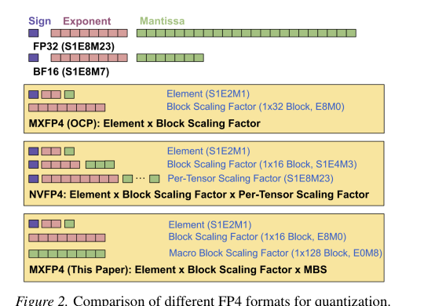
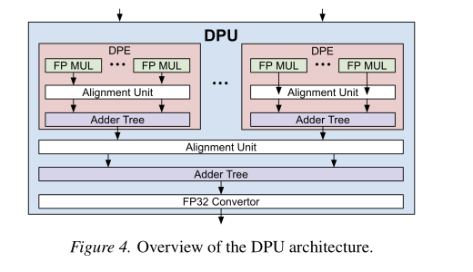
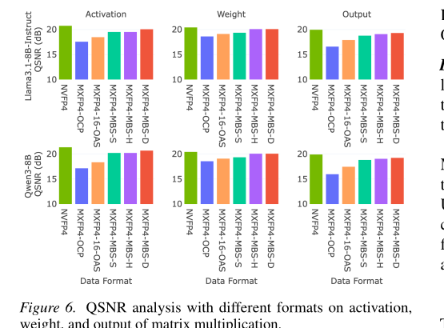

# Unveiling the Potential of Quantization with MXFP4 中文翻译（章节复述）

> 这是中文翻译（复述整理），非逐字/逐句翻译，因版权原因采用 section-by-section 的中文复述方式。

> 原文：Unveiling the Potential of Quantization with MXFP4: Strategies for Quantization Error Reduction
>
> arXiv:2603.08713。作者：Jatin Chhugani, Geonhwa Jeong, Bor-Yiing Su, Yunjie Pan, Hanmei Yang, Aayush Ankit, Jiecao Yu, Summer Deng, Yunqing Chen, Nadathur Satish, Changkyu Kim。

本文围绕一个核心问题展开：OCP 的 MXFP4 格式硬件效率好，但精度不如 NVIDIA 的 NVFP4；作者提出两种纯软件技术（不改硬件）来缩小这个精度差距，并给出详细的硬件面积代价分析与端到端评测。以下按原文章节顺序逐节复述，公式与表格数值照抄原文，说明文字为笔者自己的转述。

## 摘要

大模型对高效、大规模推理用的低精度格式需求越来越迫切。OCP 提出的 Microscaling（MX）标准因为硬件效率好而很有吸引力，但它的 4 比特版本 MXFP4 精度不如 NVIDIA 的 NVFP4，这限制了它的采用。作者提出两种纯软件技术：Overflow-Aware Scaling（OAS，溢出感知缩放）和 Macro Block Scaling（MBS，宏块缩放），在不改动硬件的前提下提升 MXFP4 的量化保真度。OAS 通过在 power-of-two（二的幂次）块缩放下扩大有效动态范围来降低总体误差；MBS 则用更粗粒度但更高精度的缩放来更好地保留离群值。在多个大模型和标准下游 benchmark 上，OAS 和 MBS 把 MXFP4 与 NVFP4 之间的端到端精度差距从约 10% 降到平均 1% 以内，同时只带来平均 6.2% 的 GEMM 开销。这些结果重新证明了 MXFP4 是 NVFP4 的一个实用替代方案：既能拿到接近 NVFP4 的精度，又保留了 MX 格式在硬件效率上的优势（比如在 tensor core 里能有 12% 的相对面积节省）。

## 1 引言

大模型正在快速推动人工智能的各类应用，但模型规模的膨胀带来了严峻的算力与资源压力，效率因此成为核心议题。量化通过降低模型参数精度来提升推理效率，是应对这一挑战的重要手段。在众多量化格式里，microscaling（MX）格式因为被 Microsoft、AMD、Arm、Intel、Meta、NVIDIA、Qualcomm 等多家公司通过 Open Compute Project（OCP）联合推动而逐渐成为一种事实标准。MX 提案覆盖从 8 比特、6 比特到 4 比特的一整族格式；8 比特和 6 比特版本已有成功案例，但 4 比特的 MXFP4 在保住模型质量方面仍是一个明显的难题。

正因如此，NVIDIA 提出了新的 4 比特格式 NVFP4，其表示保真度高于 MXFP4，也有多项研究证实 NVFP4 能更好地保住模型质量。这种保真度差距成为 MXFP4 在对精度要求高的场景中被广泛采用的一大障碍。但另一方面，支持 NVFP4 格式会给硬件设计带来额外的面积和功耗开销。本文对 MXFP4 与 NVFP4 在表示保真度和硬件成本两方面做了细致的对比分析，并在此基础上提出了在不改动硬件的前提下把 MXFP4 精度推到极限的方法（虽然本文聚焦 MXFP4，但方法本身也能推广到 MXFP6、MXFP8 等其他 MX 格式）。

本文的主要贡献有三点：

1. 指出 MXFP4 相对 NVFP4 精度差距的两个主要来源——更粗的块粒度（block granularity）和二的幂次缩放精度——并量化了它们各自在保真度和硬件面积上的权衡。
2. 提出 Overflow-Aware Scaling（OAS）和 Macro Block Scaling（MBS）两种软件技术，能在不修改硬件的前提下提升 MXFP4 的表示保真度，因此可以直接应用于所有兼容 MXFP4 的设备。
3. 证明增强后的 MXFP4 能达到接近 NVFP4 的保真度（QSNR 差距在 1 dB 以内）和下游精度（平均差距在 1% 以内），而 GEMM 开销只有平均 6.2%，从而真正释放了 MXFP4 在硬件效率上的优势。

## 2 背景

### 2.1 Transformer

包括 Llama 3、Llama 4、Qwen、DeepSeek、GPT-OSS 在内的现代大模型都建立在 Transformer 架构之上（原文此处有 Figure 1：decoder-only Transformer 架构图，展示了嵌入层、位置编码、由注意力和前馈网络组成的解码器块以及输出投影，因图片提取受限本次未嵌入，可参考 PDF 对应页第 2 页）。这些模型里最主要的计算量来自线性层：QKV 投影、输出投影，以及前馈网络（FFN）。本文聚焦于通过权重和激活量化来提升这些线性层的效率。

### 2.2 用 FP4 做量化

量化通过降低权重和激活的精度来提升大模型推理效率。常见方案在粒度上有区别（逐张量、逐通道、逐组），在缩放策略上也有区别（对称或非对称）。此外还可以配合量化感知训练（QAT）或训练后量化（PTQ）来进一步优化低精度下的模型表现。MXFP4 和 NVFP4 这类近期出现的低比特格式，则是在这一权衡空间里往更激进的方向探索，试图在大幅降低精度的同时仍保住模型准确率，是目前大模型部署里最具代表性的两种 4 比特量化方案。NVFP4 由 NVIDIA 提出，因为精度好、又兼容现有硬件而被广泛采用；MXFP4 由 OCP 标准化，因为硬件效率更高而受到关注。

这两种格式的关键差异体现在数值编码方案和硬件实现需求上（原文此处有 Figure 2：不同 FP4 格式对比图，因图片提取受限，本节末已裁剪出该图放在 `images/figure2_fp4_formats.png`，可参考下方嵌入图或 PDF 第 2 页）。标准浮点数由 1 个符号位、 $`E`$ 个指数位、 $`M`$ 个尾数位组成。

OCP 的 MXFP4 格式由两部分组成：E2M1 编码的 4 比特数据元素，加上每 32 个元素共享的一个 E8M0 块缩放因子。相比之下，NVFP4 由三部分组成：同样是 E2M1 的 4 比特数据元素，每 16 个元素共享一个 E4M3 格式的 FP8 块缩放因子，再加一个用于缓解范围限制的逐张量缩放因子。整体而言 NVFP4 保真度更高，但 MXFP4 能节省更多硬件资源，因此更适合大规模、能效优先的部署场景。

本文提出的增强版 MXFP4 格式同样定义为三部分的组合来提升保真度，细节见 §4.3。



### 2.3 MXFP4 GEMM 和 NVFP4 GEMM 的硬件

矩阵乘法（GEMM）是大模型推理中的核心运算。硬件对 MXFP4 和 NVFP4 格式 GEMM 的支持因架构而异（原文此处有 Figure 3：典型 tensor core 的硬件架构图，展示了 Memory for A/B/C 与多个 Dot Product Unit(DPU) 的组织方式，因图片提取受限本次未嵌入，可参考 PDF 对应页第 2 页）。A、B 矩阵的存储单元保存输入操作数，C 的存储单元保存部分和或最终输出；根据性能、功耗、面积约束实例化的多个 Dot Product Unit（DPU）负责执行目标 GEMM 运算所对应的硬件 tile。§3.4 会给出不同 FP4 格式硬件开销的详细对比。

## 3 理解 NVFP4 与 MXFP4 的差异

### 3.1 分析方法

本文用量化信噪比（Quantization Signal-to-Noise Ratio，QSNR，单位 dB）来评估表示保真度。之所以选 QSNR，是因为它与端到端推理质量指标高度相关，也被其他工作用来对格式选择做一阶分析。QSNR 分两个粒度计算：一是单个（输入）张量，二是运算后的结果（比如矩阵乘法的输出）。这样可以把量化张量相对高精度张量的均方误差（MSE）做归一化比较。QSNR 越高，量化引入的误差越小，保真度越高。

设 $`A^{\text{BF16}}`$ 表示原始高精度张量， $`A^{Q}`$ 表示量化后的张量。QSNR 定义为参考信号功率与量化噪声功率之比的对数：

```math
\text{QSNR}(A^{\text{BF16}},A^{Q})=10\log_{10}\left(\frac{\|A^{\text{BF16}}\|_{F}^{2}}{\|A^{\text{BF16}}-A^{Q}\|_{F}^{2}}\right)
\qquad(1)
```

```math
\text{QSNR}(AB)=10\log_{10}\left(\frac{\|A^{\text{BF16}}B^{\text{BF16}}\|_{F}^{2}}{\|A^{\text{BF16}}B^{\text{BF16}}-A^{Q}B^{Q}\|_{F}^{2}}\right)
\qquad(2)
```

本文在两个流行的大模型 Llama 3.1-8B-Instruct 和 Qwen3-8B 上做 QSNR 分析，使用推理过程中 dump 出来的张量，随机采样 1000 个张量并取平均值来衡量 QSNR。

### 3.2 细粒度块量化的影响：块大小从 32 降到 16

FP4 的指数位宽只有 $`E=2`$ ，这从根本上把可表示的动态范围限制在一个很小的比例上：12 倍（即 6.0/0.5）。因此，方差较大的块里，较小数值不可避免会更频繁地被 flush-to-zero（量化成 0）。以激活张量为例，把块大小从 32 降到 16，flush-to-zero 的比例从 20% 降到 13%，相对降幅达 35%。虽然像旋转矩阵这类技术能降低块内的动态范围，但 flush-to-zero 比例的相对降幅基本保持不变。因此，缩小块大小能带来约 1 dB 的 QSNR 净提升。

### 3.3 细粒度缩放因子格式的影响：E8M0 到 E4M3

两种格式的指数位宽不同（4 比特 vs 8 比特），但 MXFP4 里那额外的 8 比特指数所带来的更大范围其实大部分是冗余的：对几乎所有权重张量、超过 98% 的激活张量而言，4 比特指数就足够覆盖缩放因子的动态范围了。也就是说，MXFP4 缩放因子格式中有 4 个指数位对大多数张量是浪费的——本文的建议就是把指数从 E8 截断到 E4 来压缩存储。

但真正关键的功能性差异在于尾数位。由于系统性的张量离群值决定了量化的阈值，能否精确表示这些离群值对保真度至关重要。可是 MXFP4（E8M0）没有尾数位，缩放因子被严格限制为二的幂次，无法准确表示落在两个幂次之间的离群值：例如 4.0 到 6.0 之间的取值，表示误差可高达 20%。相比之下，NVFP4 使用的 E4M3 缩放格式保留了 3 个尾数位，能更精细地逼近这些关键离群值的最优缩放（与存储 FP32 缩放因子相比只差 0.2-0.3 dB）。也就是说，在同样 8 比特的预算下，E4M3 能有效降低大数值的误差，从而显著提升张量的 QSNR。

单纯由缩放因子尾数精度提升带来的增益就有 3-4 dB。下面进一步分析这部分保真度提升对应的硬件成本。

### 3.4 块大小与缩放因子格式对硬件成本的影响

为了理解硬件成本，作者从一个类似此前工作的、面向先进 TSMC 制程节点的多格式 tensor core 生产实现中，提取了主要模块（逐元素乘法、加法树、移位器等）的基线面积数据，并据此建立分析性面积模型，用来对比 NVFP4 和 MXFP4 在两个维度上的权衡：(i) 缩放因子块大小（32 vs 16），(ii) 缩放因子格式（E8M0 vs E4M3）。为公平比较，假设不同设计使用相同的硬件 tile 大小。tensor core 的面积可以归结为两大部分：存储和计算逻辑（对应 Figure 3）。

**块大小开销。** 首先测量把缩放因子块大小从 32 改成 16 带来的面积影响，保守起见假设仍用 E8M0 缩放因子。根据面积模型，块大小从 32 变成 16 会让 tensor core 面积增加约 2%，主要来自 A/B 存储所需 SRAM 稍大（块大小 16 时每元素 4.5 比特，块大小 32 时每元素 4.25 比特）以及块间加法树宽度的增加。

**缩放因子格式开销（E4M3 vs E8M0）。** 接下来固定块大小为 16，量化用 E4M3 代替 E8M0 作为缩放因子格式带来的面积开销。

首先，因为块大小相同，A、B 两个存储的容量在两种方案下是一致的。比如块大小为 16、8 比特缩放因子、4 比特数据的情况下，每个块需要 $`16\times 4+8=72`$ 比特。C 存储的容量同样不受影响，因为输出精度（假设为 FP32）与输入格式无关。因此在相同块大小下，E8M0 和 E4M3 在存储容量上没有差别。

计算逻辑方面（即 Figure 4 中的 DPU），主要差异来自跨 DPE（Dot Product Engine）的块间对齐逻辑，它需要：(1) 解出每个块的有效缩放，(2) 计算最大指数 $`E_{\max}`$ ，(3) 把各块的尾数相对 $`E_{\max}`$ 对齐后再累加各块的部分和。

如果缩放因子是浮点数（E4M3），解析缩放需要浮点乘法：共享缩放要作用在块内的所有数值上，需要 $`\text{TensorCoreTileSize} / \text{BlockSize}`$ 次浮点乘法；而且要在 $`\text{NumBlocks}\times\text{BlockSize}`$ 个数值（而不仅是 NumBlocks 个数值）范围内确定最大指数。

如果缩放因子是二的幂次（E8M0），解析缩放只需要一次整数加法：把共享的缩放指数加到块内最大指数上即可得到该块的有效指数 $`E_{\max,i}`$ ，每块只需一次整数加法；随后只需比较每块一个数值（总共块数那么多次比较）即可得到全局最大指数。

因此，块间对齐这部分逻辑，E4M3 比 E8M0 昂贵得多。根据面积模型，在相同块大小下，用 E4M3 作为缩放因子格式会带来 21.3% 的计算逻辑面积开销，对应到整个 tensor core 是 12.6% 的总面积开销（相对 E8M0）。



### 3.5 提出的方向

总结来看，NVFP4 与 MXFP4 的保真度差距可以归因于两个维度上的粒度差异：(1) 块大小，(2) 缩放因子格式。虽然两者都能提升保真度，但分析表明二者的硬件代价截然不同：细粒度缩放因子代价高昂，而缩小块大小的代价很低。

因此，本文的策略是：采用更细的块大小 16 来利用空间局部性，同时保留成本更低的粗粒度 E8M0 缩放因子格式。为了在不承担细粒度缩放因子硬件代价的前提下，把精度找回来，作者提出了 Overflow-Aware Scaling（OAS）和 Macro Block Scaling（MBS）。这套方案让面积高效的 MX 硬件也能达到与 NVFP4 相当的保真度，从而把"高模型精度"和"昂贵硬件需求"这两件事解耦开来。

## 4 增强 MX 格式

### 4.1 量化块粒度

正如 §3.2 所分析的，对 FP4 这类低精度格式而言，缩小块大小很重要。虽然 NVIDIA 的硬件把 MXFP4 限制在块大小 32，但它原生支持 NVFP4 用更细的块大小 16。作者借用这一点：复用 NVFP4 的计算流水线，但显式把块缩放因子限制为二的幂次（这样便于用原生数值分析）。因为 E4M3 格式可以无损表示二的幂次（相当于退化成 E4M0），所以可以在不改动硬件的情况下，用块大小 16 来跑 MX 风格的缩放。这个很小的调整就能带来 1 dB 的 QSNR 提升。由于大多数缩放因子都落在张量最大值的 $`2^{15}`$ 范围内，这种格式几乎不会因为截断而损失有效动态范围。

### 4.2 Overflow-Aware Scaling（OAS）

按标准量化流程，对每个 $`1\times 16`$ 的块，计算 $`\text{SF}_{\text{FP32}}=6.0/\alpha_{\max}`$ （因为 FP4 的最大可表示值 $`\text{FP}_{\max}=6.0`$ ），再通过屏蔽尾数位、强制满足二的幂次约束来得到 E8M0 缩放。标准做法确保 $`\alpha_{\max}`$ 落在可表示区间 $`(3,6]`$ 内，从而避免饱和（截断）误差。

但作者观察到：当 $`\alpha_{\max}\in[3,3.5]`$ 时（3.5 是 6 的 2 倍以内两个相邻可表示数 3 和 4 的中点），把缩放因子翻倍会把 absmax 映射到 $`[6,7]`$ ，由于格式上限是 6.0，会发生饱和。不过这种偏移并不会改变 $`\alpha_{\max}`$ 的相对量化误差（例如把 3.3 量化成 3.0，和把 6.6 量化成 6.0，相对误差是一样的）。更一般地，这个缩放调整对任何原本落在 FP4 正常范围 $`[1,6]`$ 内的块元素都能保持相对误差不变。此外，这种做法的关键优势在于：它把可表示的动态范围翻倍，从而能容纳更小幅值的元素，降低分布尾部的量化误差。

作者把这个方法称为 Overflow-Aware Scaling（OAS），它把 $`\alpha_{\max}`$ 映射到 $`(3.5,7]`$ 这个区间。值得一提的是，MXFP4-OCP 标准把 $`\alpha_{\max}`$ 映射到 $`(4,8]`$ ，虽然也允许一定的溢出，但不如 OAS 理想。举例来说，如果 $`\alpha_{\max}`$ 被映射到 7.6，量化误差是 $`\left|\frac{7.6-6}{7.6}\right|=21\%`$ ；但如果映射到 3.8，误差只有 $`\left|\frac{3.8-4}{3.8}\right|=5.3\%`$ 。

作者通过检查尾数位来实现 OAS，观察到约 15% 的块能从 OAS 中获益，且相对 MXFP4-OCP 没有额外性能开销，同时把 QSNR 提升 0.5 dB，也大幅改善了下游评测结果（见 §5）。

### 4.3 Macro Block Scaling（MBS）

离群值在量化保真度中扮演着不成比例的重要角色，尽管它们通常只占张量的不到 1%。E8M0 缩放格式的一个根本局限是：它的量化误差只取决于原始数值本身，无论用什么缩放因子都不能"关照"这些关键的离群区域，因为缩放因子并不改变尾数位。

为了解决这个问题，作者提出用更粗的粒度（具体是 $`1\times 128`$ 块大小）配合更高精度（8 比特尾数）来做缩放，称为 Macro Block Scaling（MBS）。虽然这个粒度比基础计算块 $`1\times 16`$ 更粗，但附录 A 的实验表明 $`1\times 128`$ 是最优折中：它足够细，能有效借助额外的尾数位捕捉高幅值离群值；同时又足够粗，能把后处理开销和存储成本压到最低（空间上聚集的离群值本可以借助列重排之类的预处理技术进一步受益，但这类基于置换的优化超出了本文范围）。

需要指出的是，虽然 NVFP4 和本文提出的 MBS 方案在缩放因子的存储/处理方式上不同，但 MBS 有一个关键优势：它能有效隔离离群值来保住模型保真度，而不需要像原生细粒度缩放格式（即局部缩放因子用 E4M3）那样承担高昂的硬件成本。此外，本文的量化策略避免了对张量做两遍遍历（一遍算缩放、一遍量化）从而保持了很低的计算开销。MBS 方案作用在局部的 $`1\times 128`$ 块上，是基础 $`1\times 16`$ 粒度的自然扩展，可以无缝融入现有的 CUDA 并行框架。

#### 4.3.1 MBS 因子的计算

定义宏块最大值 $`\alpha_{\max}^{128}=\max(\alpha_{1}^{16},\dots,\alpha_{8}^{16})`$ ，其中 $`\alpha_{i}^{16}`$ 是第 i 个连续 $`1\times 16`$ 子块的 absmax。假设有一个算法把输入 $`\alpha_{\max}^{128}`$ 映射到缩放因子 $`\text{SF}_{\text{MBS}}^{128}`$ （例如 $`\text{SF}_{\text{MBS}}^{128}=6.0/\alpha_{\max}^{128}`$ ）。把这个缩放因子写成 $`\text{SF}_{\text{MBS}}^{128}=2^{e}(1+m_{\text{MBS}})`$ 的形式。由于局部 $`1\times 16`$ 的 E8M0 缩放本身就是纯指数形式，它们已经隐含地吸收了宏指数 $`e`$ ，因此只需要额外存储尾数部分。实验表明，用 8 比特表示这个尾数就能把缩放近似到 0.3% 的精度以内。因此作者提出只存储量化后的尾数 $`m_{\text{MBS}}^{8}`$ ，最终用 $`(1+m_{\text{MBS}}^{8})`$ 作为实际的 MBS Factor，满足 $`1\leq\text{MBS Factor}<2`$ 。

算出 $`(1+m_{\text{MBS}}^{8})`$ 后，把每个 $`1\times 16`$ 块内的元素乘以这个因子，相当于把输入分布挪到一个更优的范围，然后再应用标准的 MXFP4 量化（同时结合 OAS）。

（原文此处有 Figure 5： $`AB^{T}`$ 矩阵乘法配合 MBS 的示意图，因图片提取受限本次未嵌入，可参考 PDF 对应页第 5 页）

#### 4.3.2 用 MBS 做矩阵乘法

考虑矩阵乘法 $`AB^{T}`$ ，其中 $`A\in\mathbb{R}^{M\times K}`$ ， $`B\in\mathbb{R}^{N\times K}`$ 。计算遵循分块（tiled）执行模型（例如 CUTLASS），矩阵的离散 tile 会被反复从 HBM 取到缓存层级中。记矩阵 A 的 tile 维度为 $`T_{M}\times T_{K}`$ ，矩阵 B 的 tile 维度为 $`T_{N}\times T_{K}`$ ，于是内核实际执行的是这些 tile 之间的乘法 $`(T_{M}\times T_{K})\times(T_{N}\times T_{K})^{T}`$ 。

作者把内核对齐到 $`1\times 128`$ 的 MBS 粒度（即 $`T_{K}=128`$ ）。虽然原生的 `mma.m16n8k64` 指令一次处理 64 个元素的块，但借助 CUTLASS 可以把执行聚合成 $`128^{3}`$ 大小的 tile。这种同步方式（Figure 5）确保缩放更新恰好发生在 tile 边界上，从而能高效地在 epilogue 阶段插入处理逻辑而不需要架构上的分叉。

初始化阶段，线程会预取编码好的 MBS 值（ $`m_{\text{MBS}}^{8}`$ ）到 LLC，并计算 FP16 缩放 $`\sigma=(1+m_{\text{MBS}}^{8})^{-1}`$ 。稳态循环用多级流水线来隐藏延迟：一边发出异步指令（例如 `cp.async`）预取后续 tile，一边让 Tensor Core 持续跑计算密集的 FP4 GEMM。循环结束后， $`128\times 128`$ 的 FP32 输出 tile $`\mathbf{C}_{\text{tile}}`$ 驻留在分布式寄存器堆中。在 epilogue 阶段，合成反量化面 $`\mathbf{S}_{\text{tile}}=\sigma_{A}\otimes\sigma_{B}`$ ，通过逐元素 Hadamard 乘法直接融合进累加器： $`\mathbf{C}_{ij}\leftarrow\mathbf{C}_{ij}\odot(\sigma_{A,i}\cdot\sigma_{B,j})`$ 。这一步对应一系列低延迟的寄存器级 FP32 FMUL 指令，然后再写回。

从 Roofline 的视角看（附录 B），只要 Vector Core 的吞吐超过 Tensor Core 峰值的约 1.56%（即 1/64），MBS 的延迟理论上就能被完全隐藏，具体实测开销在 §5.3 给出。关键在于，MBS 缩放被调度到 Vector Core 上，与主计算流并发执行，Tensor Core 则完全专注于稠密 GEMM 本身。这也确认了 MBS 严格来说是一种软件优化，不需要任何硬件改动。

#### 4.3.3 MBS 的优化

计算缩放因子 $`(1+m_{\text{MBS}}^{8})`$ 时，作者提出了两种算法，二者在计算开销和保真度（QSNR 及端到端精度）之间做不同权衡。

**Static（静态）：** 从宏块最大值 $`\alpha_{\max}^{128}`$ 直接推导缩放因子，计算其倒数归一化到 $`F_{\max}=6.0`$ ，并提取最高有效的 8 位：

```math
m^{8}_{\text{MBS}}=\left(\text{bits}\left(\frac{6.0}{\alpha_{\max}^{128}}\right)\ \&\ \texttt{0x007F8000}\right)\gg 15
\qquad(3)
```

这个操作直接取出目标缩放值的高位尾数，得到一个计算代价很低的近似。在保真度上，MBS-Static（MBS-S）相对"用 OAS 的 $`1\times 16`$ MXFP4"能把平均 QSNR 提升 1.1 dB。

**Dynamic（动态）：** 虽然 Static 方式给出的 $`m_{\text{MBS}}^{8}`$ 已经比较稳健，但它不保证 MSE 最优。为此作者引入一种基于记忆化（memoization）的窄范围搜索，用少量额外开销换取更好的保真度。

**记忆化策略。** 为了避免运行时计算 MSE，作者用预先计算好的查找表（LUT）来优化 MBS 的选择。对候选因子 $`m_{j}`$ 和输入 $`x_{i}`$ ，概念上把 $`x_{i}`$ 缩放为 $`x_{i}\cdot(1+m_{j})`$ ，从块的最大幅值出发结合 OAS 推导出局部缩放因子 $`SF`$ ，量化输出定义为：

```math
\hat{x}_{i}=Q^{\text{FP4}}\left(x_{i}\cdot(1+m_{j})\cdot SF\right)
\qquad(4)
```

这些表存储的是平方相对误差，按候选缩放 $`m_{j}`$ 和缩放后的中间值 $`v_{ij}=x_{i}\cdot SF`$ 索引：

```math
\mathcal{T}[v_{ij},m_{j}]\approx\left(\frac{\hat{x}_{i}-x_{i}}{x_{i}}\right)^{2}
\qquad(5)
```

亚正规数（ $`v_{ij}<1`$ ）和正规数（ $`v_{ij}\geq 1`$ ）被分别路由到两张不同的表，定义域被离散化为 64 个点、16 个槽位。得到的 2,048 个表项（FP16 存储共 4KB）占用不到 NVIDIA B200 共享内存的 2%。运行时访问能保证完全合并的共享内存读取，最终的因子 $`m_{\text{MBS}}^{8}=m_{j^{*}}`$ 通过最小化宏块的误差平方和（SSE）来选取：

```math
j^{*}=\arg\min_{j}\sum_{b=1}^{8}\sum_{i=1}^{16}(x_{bi})^{2}\cdot\mathcal{T}[v_{bi,j},m_{j}]
\qquad(6)
```

**开销分析：** 这个搜索每个槽位需要一次类型转换和一次 FFMA，摊到每元素大约 32 次操作。相对于整个 GEMM 的工作量，这个固定的逐元素开销可以忽略不计，因为它被核心 kernel 随 K 维度线性增长的巨大算术强度稀释掉了。

**保真度提升：** MBS-D 相对"用 OAS 的 $`1\times 16`$ MXFP4"能带来 1.6 dB 的 QSNR 提升。作者还发现（与 Egiazarian 等 2025 的观察一致）这些 QSNR 增益与下游模型精度的恢复高度相关（见 §5）。

### 4.4 NVFP4 与 MX4-MBS-[S/D] 的整体 QSNR 对比

如 Figure 6 所示，MBS 把 QSNR 从 18.6 dB 提升到 20.1 dB（权重），从 17.4 dB 提升到 19.9 dB（激活），把与 NVFP4 的差距缩小到 1 dB 以内。这种接近程度意味着两者的误差在统计意义上相似，推理收敛性也应当相当接近——后文的实验也验证了这一点。综合考虑保真度和运行时开销，作者对权重采用 MBS-Dynamic，对激活采用 MBS-Static，这个组合被称为 MBS-Hybrid（MBS-H），作为所有端到端评测的默认配置。



Table 1 给出了 Llama3.1-8B-Instruct 上不同格式的下游评测结果：

| Precision | MMLU-Pro | GSM8K | Hellaswag | Winogrande | Arc-C | Arc-E | Average |
|---|---|---|---|---|---|---|---|
| BF16 | 44.22 | 83.18 | 80.07 | 78.61 | 55.29 | 81.82 | 70.53 |
| MXFP4-OCP | 32.50 | 65.37 | 74.41 | 71.19 | 47.61 | 76.43 | 61.25 |
| MX+ (Lee et al., 2025) | 34.96 | 69.74 | 74.88 | 71.51 | 47.18 | 77.36 | 62.61 |
| MXFP4-16 | 31.34 | 62.49 | 74.02 | 72.14 | 47.70 | 75.63 | 60.55 |
| MXFP4-16-OAS | 35.02 | 69.50 | 75.99 | 71.27 | 50.68 | 77.90 | 63.39 |
| MXFP4-MBS-S | 37.98 | 74.37 | 77.16 | 73.16 | 52.22 | 79.76 | 65.77 |
| MXFP4-MBS-H | 37.35 | 78.52 | 77.32 | 74.98 | 51.54 | 79.29 | 66.50 |
| NVFP4 | 38.83 | 77.12 | 78.66 | 75.69 | 52.05 | 79.76 | 67.02 |

Table 2 给出了 Qwen3-8B 上的对应结果：

| Precision | MMLU-Pro | GSM8K | Hellaswag | Winogrande | Arc-C | Arc-E | Average |
|---|---|---|---|---|---|---|---|
| BF16 | 63.14 | 90.38 | 76.51 | 70.56 | 56.91 | 83.33 | 73.47 |
| MXFP4-OCP | 43.78 | 83.83 | 70.98 | 67.01 | 50.77 | 76.64 | 65.50 |
| MX+ (Lee et al., 2025) | 51.80 | 86.29 | 72.27 | 68.03 | 49.91 | 77.61 | 67.65 |
| MXFP4-16 | 49.58 | 83.12 | 71.17 | 68.90 | 48.89 | 79.25 | 66.82 |
| MXFP4-16-OAS | 57.85 | 87.52 | 73.14 | 68.03 | 52.56 | 79.17 | 69.71 |
| MXFP4-MBS-S | 58.81 | 87.84 | 73.66 | 68.98 | 52.39 | 81.31 | 70.50 |
| MXFP4-MBS-H | 59.30 | 87.92 | 74.12 | 70.01 | 52.65 | 81.06 | 70.84 |
| NVFP4 | 60.94 | 88.78 | 74.66 | 68.43 | 55.03 | 81.06 | 71.48 |

## 5 评测

### 5.1 实验设置

作者用 vLLM 作为推理引擎，用 Language Model Evaluation Harness 作为评测框架，评测模型包括 Llama 3.1-8B、Qwen3-8B、Llama 4-Maverick 和 DeepSeek-R1。所有线性层（QKVO 投影、FFN 中的线性层，以及 MoE 层里的每个专家）都会被量化，权重和激活都做量化，这样才能真正用上低精度计算单元。为了聚焦格式本身的效果，作者沿用此前工作的做法，采用不做校准数据的 direct-cast（直接转换）方式，评测中不涉及任何再训练或微调。

### 5.2 在多个大模型上的评测

Table 1 和 Table 2 给出了 Llama 3.1-8B-Instruct（L3.1-8B）和 Qwen3-8B（Q3-8B）在不同量化方案下的下游评测结果。用 MXFP4-OCP 时，L3.1-8B 和 Q3-8B 在所有 benchmark 上的平均精度分别是 61.25% 和 65.50%。MX+（一种复用逐块最大值指数位的先进 MX 方案）相对 MXFP4-OCP 基线平均精度提升 1.76%。本文提出的 MXFP4-16-OAS 在 L3.1-8B 和 Q3-8B 上都进一步优于 MX+，平均提升 1.42%。在 OAS 的基础上，用 MBS 的静态版本（MBS-S）同时应用于激活和权重，能再带来 1.55% 的提升，主要得益于对离群值更好的保留。最后，MXFP4-MBS-H（激活用 MBS-S，权重用 MBS-D）再提升 0.54%，把与 NVFP4 的平均差距缩小到 1% 以内。

Table 3 给出了 DeepSeek-R1 上的结果：

| Precision | MMLU-Pro | GSM8K |
|---|---|---|
| BF16 | 83.19 | 95.98 |
| MXFP4-OCP | 72.52 | 95.91 |
| MX+ (Lee et al., 2025) | 79.85 | 96.13 |
| MXFP4-16 | 76.29 | 96.66 |
| MXFP4-16-OAS | 75.36 | 96.29 |
| MXFP4-MBS-S | 82.37 | 96.82 |
| MXFP4-MBS-H | 82.06 | 96.89 |
| NVFP4 | 82.69 | 96.36 |

接下来作者在两个前沿 MoE 模型 DeepSeek-R1 和 Llama 4-Maverick 上做评测。与此前的观察一致，更大的模型对量化可能不那么敏感；但即便如此，用 MXFP4-OCP 仍观察到明显的精度下降（DeepSeek-R1 在 MMLU-Pro 上最多下降 10%，见 Table 3）。在这些模型上，OAS 和 MBS 都能大幅恢复精度，让 MXFP4 接近甚至在某些情况下追平 NVFP4。Llama 4-Maverick 的结果见附录 C；附录 D 还给出了 Wikitext 上的困惑度结果，呈现出与下游评测一致的趋势，进一步支持 OAS 和 MBS 的有效性。总体而言，这些结果验证了 OAS 和 MBS 带来的表示保真度提升确实能转化为一致的端到端收益。

### 5.3 开销分析

对于 MBS-Static（MBS-S），作者通过公式 (3) 求出 $`m_{\text{MBS}}^{8}`$ ，并用 $`(1+m_{\text{MBS}}^{8})`$ 缩放每个 $`\alpha_{i}^{16}`$ 得到第 i 个子块优化后的缩放因子 $`SF_{i}`$ 。作者开发了对应的 CUDA kernel，并用 NVIDIA Nsight Compute 量化其指令开销：基线实现每元素约需 16.1 次操作，而 Static-MBS 只额外引入平均 2.7 次操作/元素的开销。即便有这点额外的算术开销，kernel 本身仍然是数据访问延迟主导的，因此这部分额外计算能被内存延迟有效掩盖。所以对于按需（on-the-fly）量化的激活（用于 MXFP4-MBS-S 和 MXFP4-MBS-H），MBS-Static 带来的有效开销是零。

对于 MBS-Dynamic（MBS-D），作者对 $`m_{\text{MBS}}^{8}`$ 做穷举搜索（16 个候选值），以降低 $`1\times 128`$ 块的 SSE（见 §4.3.3）。实测中，这个 CUDA 实现比 MBS-S 慢约 2.5-3 倍。作者认为这部分还能进一步优化，但为了评测的保守和公平，最终采用 MBS-H（Hybrid）：权重用 MBS-D 量化，激活仍用 MBS-S，这样能确保推理过程中不会因为 MBS-D 产生额外开销。

对实际的 MBS 矩阵乘法，作者用 CUTLASS 4.3.0 在 NVIDIA Blackwell（SM100）架构上实现了 MXFP4-MBS-H 的 GEMM kernel，基于原本采用 E2M1 数据、 $`1\times 32`$ 粒度 E8M0 缩放因子的 MXFP4-OCP GEMM kernel 进行扩展。具体做法是通过自定义的 dispatch policy 扩展 CUTLASS 的 warp-specialized 主循环，在 MBS 块大小 128 处截获循环。计算被分布到由 4 个 Cooperative Thread Array（CTA）组成、排布为 $`2\times 2\times 1`$ 的 cluster 上，共同计算每个输出 tile（例如 $`256\times 256`$ ）。这个 cluster 被组织成两对 leader-peer，每对负责输出的 $`128\times 256`$ 区域：leader CTA 执行 tensor core 的 MMA 运算，peer CTA 负责 TMA 组播数据加载以降低全局显存带宽消耗。更详细的说明见附录 E。

在 decode 阶段，由于执行本身是权重加载主导的访存受限场景，MBS 带来的开销很小，这与 MX+ 的观察一致。在 prefill 阶段，不同 shape 下 MXFP4-MBS-H 相对基线 GEMM kernel 平均带来 6.2% 的开销（见 Table 4），远低于 MX+ 报告的 54% 开销。就端到端执行时间而言，MXFP4-MBS-H 给大模型推理带来的额外开销可以忽略不计。

Table 4：MXFP4-OCP 与 MXFP4-MBS-H 之间的 GEMM kernel 开销对比（吞吐量单位为 TFLOPS）：

| Shape | MXFP4-OCP | MXFP4-MBS-H | Overhead |
|---|---|---|---|
| 512 | 35.90 | 30.57 | +14.84% |
| 1024 | 285.04 | 259.34 | +9.01% |
| 2048 | 1669.40 | 1666.63 | +0.17% |
| 4096 | 4462.95 | 4354.87 | +2.42% |
| 8192 | 4745.00 | 4520.53 | +4.73% |

## 6 相关工作

已有不少工作尝试改进基于分块的低精度格式。BDR 提出了 short microexponent 的概念，是 MX 风格格式的重要动机来源。也有一些方法专门处理离群值：比如从相邻的"victim"数值那里重新分配精度、用结构化稀疏来高效混合精度，或者为异构位宽增加互连支持。但这些方法大多需要修改硬件，限制了在商用 GPU 上的部署。MX+ 是与本文最接近的前序工作：它在 MXFP4-OCP 的基础上为逐块最大值额外存储尾数位，在 GPU 上通过按需转换来运行，但会引入额外的稀疏 GEMM，开销最高可达 54%。此外，精度还可以通过校准和训练后量化进一步提升，比如 GPTQ 风格的 PTQ 可以缩小与基础模型的差距；本文的方法同样有可能受益于 PTQ 和 QAT，留作未来工作。

## 7 结论

本文分析了 MX 格式，找出了其相对 NVFP4 存在精度差距的关键因素。基于这些洞察，作者提出 OAS 和 MBS 两种简单、可即插即用的技术来增强 MXFP4。有了这两项增强后，MXFP4 相对标准 MXFP4-OCP 的精度损失平均降低了 62%，把 MXFP4 与 NVFP4 之间的差距从 10% 缩小到平均不到 1%。总体而言，这些结果表明 MXFP4 完全可以做到接近 NVFP4 的水平，为大模型推理提供高效又准确的量化方案。

## Impact Statement（影响声明）

本文旨在推动机器学习领域的发展。虽然这类工作可能存在诸多潜在的社会影响，但作者认为没有需要在此特别强调的地方。

## 附录 A：MBS 块大小的消融实验

（原文此处有 Figure 7：Llama 3.1-8B-Instruct 上 MBS 块大小的消融实验图，因图片提取受限本次未嵌入，可参考 PDF 对应页第 7 页）

Figure 7 展示了 MBS 块大小对 Llama3.1-8B-Instruct 量化质量的影响，评测了激活、权重、输出三个部分的平均 QSNR（对应 Figure 6 的三个维度）。

三个指标都随着 MBS 增大呈现一致的下降趋势，说明更大的块大小会导致量化质量变差。从 MBS=32 到 MBS=512，输出 QSNR 总共下降约 1.1 dB，激活下降约 1.2 dB，权重量化下降约 0.7 dB。

MBS=128 是一个比较理想的折中点，在量化质量和硬件效率之间取得了实用的平衡：在这个配置下，模型能保住 MBS=32 时输出 QSNR 的 96%。

（原文此处有 Figure 8：Qwen3-8B 上 MBS 块大小的消融实验图，因图片提取受限本次未嵌入，可参考 PDF 对应页第 7 页）

Figure 8 展示了 Qwen3-8B 上的 MBS 消融结果。该模型随 MBS 增大表现出与 Llama3.1-8B 类似的退化模式，说明不同模型架构上的量化行为具有一致性。相对 MBS=32，输出 QSNR 只下降了 0.75 dB，这个相对温和的退化幅度也让 MBS=128 成为一个有吸引力的选择。

## 附录 B：MBS 的矩阵乘法开销

**开销分析：** 作者以目标 tile 配置 $`T_{M}\times T_{N}\times T_{K}=128\times 128\times 128`$ 为例，分析 MBS 缩放机制带来的计算和存储开销。

**计算开销：** 基线的 FP4 tensor 运算每个 tile 执行 $`2\cdot 128^{3}`$ 次 FP4 浮点运算。本文提出的修正额外增加了 $`2\cdot 128^{2}`$ 次 FP32 运算（具体是向量乘法）。额外的 FP32 乘法次数与基线 FP4 乘法次数之比为：

```math
\frac{\text{Ops}_{\text{MBS (FP32)}}}{\text{Ops}_{\text{TC (FP4)}}}=\frac{2\cdot 128^{2}}{1\cdot 128^{3}}=\frac{2}{128}\approx 1.56\%
\qquad(7)
```

**存储带宽开销：** 对于一个 $`128\times 128`$ 的输出 tile（64 KB），MBS 方案需要额外加载两个缩放向量（ $`\sigma_{A}`$ 、 $`\sigma_{B}`$ ），总共 512 字节：

```math
\frac{\text{Traffic}_{\text{MBS}}}{\text{Traffic}_{\text{Tile}}}=\frac{512\text{ bytes}}{65,536\text{ bytes}}\approx 0.78\%
\qquad(8)
```

这点数据搬运量的增加可以忽略不计，因此 kernel 的算术强度基本不受影响。作者也在 NVIDIA B200 GPU 上实现了 MBS 并在 §5.3 给出了实测分析。

## 附录 C：Llama 4-Maverick 上的下游评测结果

Table 5：Llama 4-Maverick 在不同格式下的下游评测结果：

| Precision | MMLU-Pro | GSM8K |
|---|---|---|
| BF16 | 80.98 | 94.16 |
| MXFP4-OCP | 77.73 | 92.42 |
| MX+ (Lee et al., 2025) | 78.46 | 92.80 |
| MXFP4-16 | 78.12 | 92.27 |
| MXFP4-16-OAS | 78.64 | 93.18 |
| MXFP4-MBS-S | 79.38 | 94.16 |
| MXFP4-MBS-H | 79.77 | 93.86 |
| NVFP4 | 80.06 | 94.01 |

Table 5 展示了不同 FP4 格式在 Llama 4-Maverick 上的评测结果，整体趋势与正文中的两个模型一致：OAS 和 MBS 依次带来精度提升，MBS-H 已经非常接近 NVFP4 的水平。

## 附录 D：困惑度评测

Table 6：Llama3.1-8B-Instruct 和 Qwen3-8B 在 Wikitext 上、不同格式下的词级困惑度：

| Precision | Llama3.1-8B-Instruct | Qwen3-8B |
|---|---|---|
| BF16 | 8.82 | 12.20 |
| MXFP4-OCP | 11.49 | 15.18 |
| MX4+ (Lee et al., 2025) | 10.82 | 14.51 |
| MXFP4-16 | 11.52 | 15.15 |
| MXFP4-16-OAS | 10.57 | 13.65 |
| MXFP4-MBS-S | 10.04 | 13.09 |
| MXFP4-MBS-H | 9.88 | 13.03 |
| NVFP4 | 9.68 | 12.69 |

Table 6 给出了困惑度评测结果。用 OAS 和 MBS 后，与 NVFP4 的困惑度差距，Llama3.1-8B-Instruct 从 1.82 降到 0.20，Qwen3-8B 从 2.49 降到 0.34。

## 附录 E：MBS 实现的详细说明

本文的 MBS 实现涉及三级存储层级：全局显存（HBM），存放 FP4 张量、E8M0 缩放因子、E0M8 的 MBS 缩放以及最终输出；共享显存（SMEM），存放用于软件流水线的多级缓冲 tile；以及 tensor memory（TMEM），存放 MMA 累加器和缩放因子寄存器。数据搬运遵循 CUTLASS 的生产者-消费者流水线模型：生产者线程为后续的 K-tile 发出异步的 Tensor Memory Accelerator（TMA）加载请求，消费者线程对当前 tile 执行 MMA 运算，二者通过流水线屏障同步。FP4 数据和 E8M0 缩放因子通过支持组播的 TMA 加载；随后缩放因子通过 Unified Tensor Copy Protocol（UTCCP）操作从 SMEM 搬运到 TMEM，供 block-scaled MMA 使用。

核心的算法改动在于：在 128 元素边界处截获 MMA 内层循环来施加 MBS。对每个 256 元素的 K-tile，kernel 先对前 128 个 K 元素执行 block-scaled MMA，把结果累加到一个局部 TMEM 累加器中。如果直接在这一步应用 MBS，会因为引入额外的显存访问和同步屏障而在关键计算路径上造成明显延迟。为了避免这一点，作者采用了配合适当 warp 专门化的 TMEM 双缓冲策略：原始实现中，warp 0 负责 MMA 运算，warp 1-3 负责调度、显存加载和 epilogue 加载，warp 4-7 负责 epilogue 处理；但在主循环执行期间，epilogue warp 其实是空闲的，于是作者把它们复用来做 MBS 计算。一旦某个子 tile 的部分和在第一个 TMEM 缓冲区中就绪，MMA warp 立刻切换到第二个 TMEM 缓冲区处理下一个子 tile；与此同时，MBS warp 把第一个 TMEM 缓冲区里的部分和取到寄存器中，并应用相应的 MBS 缩放（直接从全局显存加载，因为这些缩放值很小且是顺序访问的），具体过程见 §4.3。
