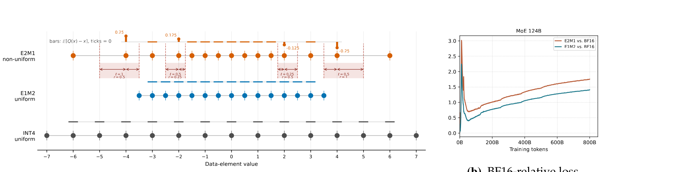

#+title:      刻度不匀，数字缩水
#+subtitle:   Rethinking Shrinkage Bias in LLM FP4 Pretraining: Geometric Origin, Systemic Impact, and UFP4 Recipe
#+date:       [2026-10-10 Sat 02:47]
#+filetags:   :paper:
#+identifier: 20261010T024724
#+source:     arXiv:2606.20381, https://arxiv.org/abs/2606.20381
#+authors:    Qian Zhao, Kunlong Chen, Changxin Tian, Zhonghui Jiang, Haitao Zhang, Chaofan Yu, Peijie Jiang, Mingliang Gong, Jia Liu, Ziqi Liu, Zhiqiang Zhang, Jun Zhou (Ling Team, Ant Group)
#+venue:      arXiv preprint, 2026

* 问题

想象你手里有一把奇怪的尺子。靠近 0 的地方刻度很密，每隔 0.5 就有一道；可是越往大数走，刻度越来越稀——过了 2 之后，下一道刻度要等到 3 才出现，过了 4 之后，下一道要等到 6。这把尺子现在要用来量体重，量出来的是 2.3 公斤，你会把它读成哪一刻度？尺子上没有 2.3 这一道，只有 2 和 3，而且 2 这道刻度离它左边的 1.5 只差 0.25，离右边的 3 却差了整整 1——换句话说，"2" 这个格子天生就是偏心的，左边窄、右边宽。任何落在这个格子里的真实重量，被读成刻度值之后，平均下来都会比真实值偏小一点。

这把怪尺子不是比喻,它就是现在各家 AI 芯片——NVIDIA Blackwell/Rubin、AMD MI350——用来给大模型做 4 比特（FP4）训练的数字格式,行话叫 E2M1,一共只能表示 16 个数,从 0、0.5、1、1.5、2、3、4 一路跳到 6。用这把尺子给训练中的权重、激活值、梯度做"四舍五入",换来的是砍掉一半计算量和显存,代价是模型学得没有用 16 比特(BF16)训练时准——而且不是准一点点,是严重到容易训崩。过去五年,大家一直在想办法把这道损失补回来:先是把精度从 8 比特砍到 4 比特(FP4-All-The-Way),再引入分块缩放让每块数据各配一把更合身的尺子(MXFP4、NVFP4),又加上随机哈达玛变换(RHT)把"离群值"打散、让它们别霸占太多刻度(NVFP4 recipe),还加上随机舍入、无偏梯度估计(Quartet、Quartet II 的 MS-EDEN)来让误差在统计上"平均抵消"。这些做法有一个共同的隐藏假设:量化误差是噪声——有正有负、随机分布、积少了会自己抵消掉。

可是补丁打到后来,工程师们发现一件说不通的事:RHT 这个"打散离群值"的招数,照理说对谁都该有帮助,但在实际训练里,它只被小心翼翼地用在梯度计算的某一条路径上(权重梯度),一旦把它用到前向或另一条反向路径,模型反而学得更差——没有人能说清楚为什么同一个"打散"的操作,有时候帮忙、有时候帮倒忙。这篇论文的作者回头去看那把尺子本身,意识到问题可能从来不在 RHT,而在于误差根本不是噪声,是方向——而 RHT 不但没打散这个方向性问题,反而是把更多数据精准地推进了这把尺子最偏心的那几格。

* 翻译

#+ATTR_ORG: :width 1200

还是那把怪尺子,我们就停在"2"这一格上往里看。它的刻度点是 0、0.5、1、1.5、2、3、4、6——这是 E2M1 的全部家当。"2"这一格的真实边界在哪?按四舍五入(更准确地说是银行家舍入,学名 RTNE)的规则,一个数该读成"2"还是读成别的,取决于它离"2"更近还是离"1.5"或"3"更近。算下来,"2"这一格的左边界是 (1.5+2)/2 = 1.75,右边界是 (2+3)/2 = 2.5。左边宽度是 0.25,右边宽度是 0.5——整整差了一倍。

这时候你会问:这一格偏心,会有什么后果?假设真实数值在 1.75 到 2.5 之间是均匀分布的(这是局部最朴素的假设),把每一个落在这个区间里的真实值都读成"2",平均误差是多少?算出来是负的 0.125——也就是说,只要数值落进这一格,读出来的刻度值系统性地比真实值小 0.125,不是有时候偏大有时候偏小、平均抵消,而是永远偏小。论文把这个现象叫作"收缩偏差"(Shrinkage Bias):非均匀尺子的每一格,只要左右宽度不相等,就天生带着一个固定方向的误差,而且宽的那一边越宽,偏差越大。"4"这一格道理相同,偏差规模翻倍。反过来,如果换一把刻度均匀的尺子——比如 E1M2 或者整数编码 INT4,每一格宽度处处相等——这种"天生偏心"的问题从几何上就不存在,误差才真的是统计学意义上的噪声。

接下来要问的是:一格 0.125 的偏差,对一个几十层的大模型意味着什么?这里论文给出了第二层揭秘。神经网络的核心运算是矩阵乘法:两个量化过的张量相乘,每个张量都带着一个"收缩系数"(小于 1,代表它比真实值整体缩水了多少)。两数相乘,收缩系数也相乘,于是输出进一步缩水。如果这发生在一层,问题不大;可现代大模型有几十上百层,每一层的输出又会被送进下一层继续量化、继续缩水。论文证明,这种缩水是乘性累积的——K 层叠加后,总的衰减大致是指数 exp(-求和),求和项是每一层固定、不消失的那一点点偏差。这和"随机噪声经过大数定律,误差按根号 N 增长"完全是两回事:随机噪声内部会互相抵消,方向一致的偏差只会越滚越大,像利息一样复利式地侵蚀信号——这就是为什么 FP4 训练会出现莫名其妙的"训练不稳"。

现在再看 RHT 为什么有时候帮倒忙。RHT 的本意很直白:很多张量的数值分布里有极少数"离群值"特别大,把本该分散使用的刻度全占用在了尺子最宽松的那头,导致大部分正常数值挤在密集刻度区却用不上额外精度。RHT 用一个保持长度不变的随机旋转,把这些离群值的能量打散到所有坐标上,让每个坐标都分到一点,这样原本"只有少数几格被频繁使用"的情况就变成了"各格都被公平使用"——论文用"有效桶占用率"量化这个效果,实测某个典型张量在 RHT 之后,占用率从 0.56 跳到 0.97,确实打散成功了。可这些被打散出来的数值,落点恰恰集中在中等量级区间——而中等量级区间正是 E2M1 尺子上刻度宽窄跳变最剧烈的地方,也就是收缩偏差最严重的那几格。打散操作本身没有错,错的是它把数据精准地喂进了最偏心的格子:实测同一个张量,RHT 之前 E2M1 的信噪比(21.90 dB)还高于均匀网格 E1M2(19.94 dB),RHT 之后排名整个反转——E1M2 变成 23.19 dB,E2M1 反而掉到 20.00 dB。这解释了那个说不通的现象:不是 RHT 本身时好时坏,是 RHT 配合非均匀尺子时,打散得越彻底,摔得越狠;配合均匀尺子,打散得越彻底,读数反而越准。

看清楚病根之后,解法变得直给:既然问题是尺子本身不均匀,那就换一把均匀的尺子——E1M2 或者 INT4,格数不变、比特数不变,只是把刻度摆均匀。论文把这套方案命名为 UFP4。因为均匀网格天生没有方向性偏差,RHT 打散数值到任何一格都不会撞上"偏心格子",于是过去只敢在一条反向路径(权重梯度 bwd_dw)上偷偷用的 RHT,现在可以放心用到全部三条训练矩阵乘法路径上(前向 fwd_y、输入梯度 bwd_dx、权重梯度 bwd_dw);随机舍入则只保留在输出梯度 dY 这一处,因为这是唯一需要额外统计无偏性兜底的地方,其他地方均匀网格本身已经不偏。

这一换,结局是什么样?在三个真实规模的长程预训练里——15 亿参数稠密模型、79 亿参数混合专家模型(MoE)、1240 亿参数 MoE——UFP4 相对 BF16 的损失误差,分别从 1.2570% 降到 0.9673%,从 2.3596% 降到 1.8469%,从 1.7308% 降到 1.3863%,三个规模上全部收窄。单独拆开看,把 RHT 从"只用在一条路径"扩到"用满三条路径",损失降低 0.01123;再单独给 dY 加上随机舍入,又降低 0.00456,两个设计选择各自都有贡献。论文还做了一个特别反直觉的对照实验:既然 E2M1 的偏差只发生在中高量级那几格,能不能干脆把 E2M1 的量程砍小一点,只留下低量级、间距相对均匀的那几个刻度,人为凑出一把"局部均匀"的尺子?结果是,所有砍量程的变体,表现都比没砍之前的 E2M1 基线还差——砍掉量程换来的"局部均匀",赔掉的是能覆盖大数值的能力,两头不讨好。这说明均匀网格不是靠裁剪非均匀网格能凑出来的,它是一种完全不同的几何,必须原生支持。

* 核心概念

** 收缩偏差(Shrinkage Bias)

它是什么:在四舍五入规则下,一格的左边界到格心的距离如果不等于右边界到格心的距离,这一格的期望误差就不是零,而是固定偏向距离短的那一边。在我们那把怪尺子上,"2"这一格左宽 0.25、右宽 0.5,期望误差是负的 0.125——每次读数都悄悄把真实值往小了读。少了这个概念,RHT 为什么"有时候帮倒忙"就无法解释,因为传统框架里量化误差被默认成零均值噪声,根本不会去问"这一格是不是偏心的"。

** 乘性累积(跨层复利式衰减)

它是什么:两个带收缩系数的量化张量相乘,衰减系数也相乘;一条几十层的网络相当于几十次复利式打折,总衰减近似 exp(-各层偏差之和)。在怪尺子的例子里,这意味着"2"这一格一次性的 0.125 偏差,不会留在一层里就消失,它会顺着前向、反向的张量流一路传下去,层层打折。少了这一层,论文无法解释为什么 FP4 训练的"不稳定"是系统性、跨越长时间训练才显现,而不是随机扰动那种一会儿好一会儿坏的样子——也解释了为什么处在数据流下游、会继续被下一层消费的非叶子张量(前向输出、输入梯度)比只被优化器直接吃掉的叶子梯度更危险。

** 随机哈达玛变换(RHT)的双刃性

它是什么:一个保持数值运算结果不变的随机旋转,把原本集中在少数坐标的离群能量打散到全体坐标上。在怪尺子的例子里,RHT 相当于把本来只砸在尺子某一端的"大石块"砸成碎石,均匀撒到整把尺子上——听起来总是好事,但碎石撒到的恰好是尺子最偏心的那几格,于是"打散"反而把更多数值送进了误差最大的区域。少了这个概念,就看不出为什么同一个数学操作,在均匀尺子上是良药、在非均匀尺子上是毒药——它把论文的核心论点(误差是不是有方向,比误差绝不绝对分散更重要)落到了一个可以实测、可以复现的具体机制上。

** 统一网格(E1M2/INT4)作为设计选择,而非细节调参

它是什么:不是在 E2M1 基础上修修补补(调缩放、调舍入、调裁剪范围),而是整体换成刻度处处等宽的网格——格数、比特数不变,只是把"怪尺子"改造成"普通尺子"。在例子里,这意味着"2"这一格不再是 1.75 到 2.5(宽窄不一),而是变成左右对称的格子,偏差从几何上直接归零。这是整篇论文真正的那一下"转弯":前人所有补丁(更好的缩放、更好的舍入、更无偏的梯度估计)都是在统计层面磨平一个已经歪掉的分布的均值,UFP4 选择的是在几何层面让分布从一开始就不歪——少了这个选择,RHT 全路径使用、随机舍入收窄到 dY,这些具体改动都无从谈起。

* 洞见

量化误差不只是"噪声"这一种东西,它也可以是"方向"——一种统计手段(更好的舍入、无偏估计、随机化)天生治不好的东西,因为统计手段只能磨平方差,磨不平一个本来就不对称的期望。当误差真的有方向时,唯一管用的修法是几何上的:换一个本身对称的格子,而不是在歪格子外面裹一层又一层统计补丁。这句话脱离这篇论文同样成立——任何离散化系统,只要刻度不均匀,就该先问一句"我的误差有没有固定方向",而不是默认"误差大了,平均一下就好"。

* 博导审稿

选题眼光是真的。FP4 训练不稳这件事业内吵了好几年,"RHT 有时候帮倒忙"这种说不清的现象也确实存在,论文找到了一个统一解释,而不是又添一个经验补丁,这一点值钱。

方法成熟度上我想追问两处。第一,整个"收缩偏差 = -0.125"的推导,前提是"落在这一格里的真实值局部均匀分布"——这是个理论上方便、实践上未必成立的假设。真实张量分布大概率是有结构的(比如权重接近某种重尾分布),局部密度不均匀的话,这个干净的解析数字就只是一个方向性的指示,不是精确值,论文没有讨论这个假设的鲁棒性。第二,E2M1 基线的选取(附录 B)用的是逐维度的受控消融(one-factor ablation),而不是联合搜索——这类方法容易漏掉维度之间的交互项,万一真正调得最好的 E2M1 配置恰好需要某种论文没试过的 RHT 范围和舍入范围组合,现在的"E2M1 参考基线"就可能被低估,UFP4 的优势也就被相应高估。这两处都是"论文如果错,最可能错在哪"的位置,作者没有正面回应。

实验诚意总体不错:三个真实规模(15 亿、79 亿、1240 亿)加上从 10M 到 324M 的 scaling law 验证,消融表给出了具体到小数点后五位的数字,不是含糊的"更好"。但要注意,所有数字衡量的都是"离 BF16 更近了多少",三组实验里 UFP4 离 BF16 仍然有 1% 到 1.4% 的残余差距——论文的措辞"consistently achieves lower degradation"容易让人读成"解决了",但准确说法应该是"缩小了,没有消除"。另外实验只报告了语言模型损失,没有任何下游任务准确率的验证,"损失更接近 BF16"是否等价于"下游能力更接近 BF16",论文没有展开。

写作功力上,术语都配了自然语言解释,图表设计也服务于论证链条,属于讲得清楚的那一类。

判决:weak accept——几何视角的解释力是真实的学术贡献,工程验证也做得扎实,但"局部均匀假设"和"基线调优是否充分"这两处隐忧没有被讨论,且最终呈现的仍是"缩小差距"而非"消除差距",这一点需要读者自己留意,不要被摘要的措辞带偏。

* 启发

迁移:任何做离散化或四舍五入的系统——不只是 4 比特训练,还包括 INT8 推理量化、浮点转定点、传感器的模数转换(ADC)、甚至财务系统里的四舍五入记账——都可以拿这篇论文的诊断方法直接用一遍:把自己的"格子宽度"按数值大小画一条曲线,看它是不是单调变宽。如果是,大概率存在同款方向性偏差,可以照着论文的公式(格子左右半宽之差除以二)算出每一格的期望误差,看看是不是真的需要一把更均匀的"尺子",而不是继续往现有方案上加统计补丁。

混搭:论文里那几件诊断工具——期望舍入误差公式、有效桶占用率(桶分布的熵)、变换前后的信噪比差值——是一套可以脱离 FP4 单独使用的"误差诊断包"。拿它去检查别的量化改造方案(不管是不是涉及旋转变换)时,不需要重新发明一套评估指标,直接套用这三件就能回答"这个预处理操作,对我现在用的格子是帮忙还是帮倒忙"。

反转:默认假设里,"离群值打散手段越激进越好"几乎是行业共识——旋转、平滑、分解,这类预处理一般被当成免费的好东西。这篇论文提醒的是,这类手段的收益完全取决于打散之后数值落在哪个格子里,脱离格子形状谈预处理的好坏是没有意义的。往后但凡要上任何"预处理 + 量化"的组合拳,第一步应该是确认预处理之后数据分布落在量化器的哪个区间,而不是默认预处理总归是帮忙的。
