# Rethinking Shrinkage Bias in LLM FP4 Pretraining：几何根源、系统性影响与 UFP4 方案 —— 中文翻译

> 说明：本文是对原论文的**复述式中文翻译**（在作者本人理解基础上用自己的话重新表达段落内容），而不是逐句逐词的字面翻译。这是本仓库的既定翻译惯例，与原论文的版权状态无关（该论文为 CC BY 4.0 许可，字面翻译本身也是允许的，但为保持风格统一仍采用复述方式）。表格、数字和 LaTeX 公式按原文照抄，因为这些内容本身不构成受版权保护的"表达"。

论文：*Rethinking Shrinkage Bias in LLM FP4 Pretraining: Geometric Origin, Systemic Impact, and UFP4 Recipe*，arXiv:2606.20381，Ling Team / Ant Group。

---

## 摘要

FP4 训练对大模型预训练而言能大幅降低显存和算力开销，但目前主流的 FP4 硬件路径和训练方案——包括 NVIDIA Blackwell/Rubin 系列和 AMD MI350 系列 GPU——几乎都围绕 E2M1 这一数据格式展开。本文指出这个默认选择存在一个根本性缺陷：像 E2M1 这样的非均匀格式天生存在 **Shrinkage Bias（收缩偏差）**——由于其可表示数值点（bin）在几何上不对称，舍入到最近偶数（RTNE）时会产生系统性的负向误差。本文证明这种偏差会在多层网络中以乘性方式累积，并且会被 Random Hadamard Transform（RHT，随机 Hadamard 变换）进一步放大，从而为现有基于 E2M1 的 FP4 方案中观察到的训练不稳定现象提供了一个统一的解释。相反，均匀网格（E1M2/INT4）从根本上绕开了这种网格几何误差，能够更好地把 RHT 带来的桶利用率提升转化为更高的量化质量。基于这一发现，本文提出 **UFP4**：一种基于均匀 4-bit 网格的训练方案，将 RHT 应用到全部三个训练 GEMM 上，同时把随机舍入（Stochastic Rounding，SR）限制在只作用于 $`dY`$ 上。在 Dense 1.5B、MoE 7.9B 和 MoE 124B 的长程预训练实验中，UFP4 相比强力的 E2M1 基线方案始终能取得更低的相对 BF16 的 loss 劣化幅度，这一结论得到了 scaling-law 分析和消融实验的支持。本文的结果表明，未来的加速器应当把 E1M2/INT4 这类均匀 4-bit 网格作为与 E2M1 并列的一等训练数据格式来支持。


**图 1**：(a) 红色区间标出 RTNE 的舍入 bin；柱状高度表示每个 bin 内的期望舍入误差。E2M1 的非均匀 bin 表现出系统性的"朝零偏移"（Shrinkage Bias），这源自其几何不对称性；而 E1M2/INT4 的均匀 bin 则不存在该偏差。(b) 这种网格层面的优势会传导到训练质量：在 124B MoE 的长程预训练中，基于 E1M2 的 UFP4 在 BF16 相对 loss 劣化上显著优于基于 E2M1 的基线方案。

---

## 1 引言

大语言模型的持续扩展不断推高了模型能力的上限，但随之而来的训练成本、显存占用和能耗增长，也让更高效的数值格式成为必需。低精度训练因此成为降低训练成本的关键方向之一，FP8 已经在若干大规模训练系统中落地。其基本思路是：在前向和反向传播中都用更低精度表示激活值、权重和梯度，以利用现代加速器上吞吐更高的低精度矩阵乘单元。近期，NVIDIA Blackwell 等加速器已经开放了原生的 FP4 计算路径，为进一步把精度减半、降低训练成本提供了新的机会。

目前的 FP4 训练接口基本都围绕 E2M1 展开——这是一种拥有 2 个指数位、1 个尾数位的 4-bit 浮点格式。例如 MXFP4 和 NVFP4 都为细粒度的张量块维护独立的缩放因子，通过不同的块大小和缩放层级设计在动态范围、精度和硬件效率之间做权衡；相比 MXFP4，NVFP4 通常凭借更小的块和更精细的缩放设计取得更好的训练精度。然而，仅有 16 个可表示值的 FP4，想要做到端到端训练依然很有挑战：如果不加额外稳定化手段，FP4 训练方案会出现严重的收敛问题，相对 BF16 训练存在明显的 loss 劣化。为缓解这些问题，NVFP4 方案引入了 Random Hadamard Transform（RHT）和随机舍入（SR）来应对离群值、稳定梯度更新。后续工作又通过改进缩放设计、舍入或梯度估计方法、离群值控制以及量化感知训练等手段，进一步缩小了 FP4 与 BF16 训练之间的差距。

尽管这些方法都有效，但它们几乎都保留了 E2M1 这一数据元素格式本身不变。本文重新审视了这个默认选择，核心观察有两点：

(1) 像 E2M1 这样的非均匀格式天生存在 Shrinkage Bias——在 Round-to-Nearest-Even（RTNE）舍入规则下，由于其可表示 bin 的几何不对称性而产生的负向期望误差。

(2) 这种偏差会在多层网络中以乘性方式累积，导致系统性的信号衰减。更麻烦的是，RHT 会把张量的能量质量搬移到最不对称的那些 bin 里，从而在 E2M1 下进一步加剧这个问题，损害训练稳定性。与之相对，如图 1(a) 所示，均匀网格（例如 E1M2/INT4）完全绕开了这种网格几何误差，能更好地匹配 RHT 变换后的数据分布，把桶利用率的提升真正转化为量化质量的提升。

基于这一发现，本文提出 **UFP4**：一种建立在 E1M2/INT4 风格均匀网格之上的 4-bit 训练方案。UFP4 把 RHT 应用到线性层全部三个训练 GEMM 的算子上——即前向（FPROP， $`fwd\_y`$ ）、数据梯度（DGRAD， $`bwd\_dx`$ ）和权重梯度（WGRAD， $`bwd\_dw`$ ）——并且只在量化上游梯度 $`dY`$ 时使用随机舍入。这个方案说明：全面应用 RHT 本身并不是问题所在；问题在于 E2M1 与 RHT 变换后的张量分布之间存在根本性的不匹配。换成均匀网格后，RHT 可以扩展到全部三条路径上，同时仍能保持稳定的长程训练收益：在 124B MoE 的长程预训练中，基于 E1M2 的 UFP4 相比强力的 E2M1 基线在 BF16 相对 loss 劣化上有显著优势（图 1(b)）。

本文的主要贡献可以总结为：

- 本文识别并形式化了 **Shrinkage Bias**：一种非均匀网格（如 E2M1）由于其 RTNE 舍入 bin 的几何不对称性而固有的系统性负向舍入误差。
- 本文从理论和实验两方面证明：Shrinkage Bias 会在多层网络中乘性累积，并被 RHT 进一步放大，从而为现有基于 E2M1 的 FP4 方案（例如 NVFP4 方案）中观察到的训练不稳定现象提供了统一的解释。
- 本文提出 **UFP4**：一种基于 E1M2/INT4 风格均匀网格的 4-bit 训练方案，可以在全部三个训练 GEMM 上启用 RHT，同时把随机舍入限制在只作用于 $`dY`$ 。
- 本文在 Dense 1.5B、MoE 7.9B 和 MoE 124B 的长程预训练中验证了 UFP4，并辅以 scaling-law 分析、消融实验和融合算子（fused kernel）的性能评测，证明均匀网格是可以在工业级规模上实际落地的一等 FP4 训练格式。

---

## 2 预备知识

### 2.1 4-bit 格式与分块量化

FP4 格式使用 1 个符号位，剩余位数划分为指数位和尾数位，记作 $`ExMy`$ 。本文考虑两种 FP4 格式——E2M1 和 E1M2——以及一种 INT4 码本（见图 1(a)）。

实践中广泛采用分块量化（blockwise quantization）来提升精度：将张量 $`\mathbf{T}`$ 划分成若干连续的块 $`\lbraceB\rbrace`$ ，在每个块内共享一个缩放因子，把元素映射到所选格式的码本层级上。设 $`G=\lbraceg\rbrace`$ 为某格式归一化后的码本， $`g_{\max}=\max_{g\in G}|g|`$ 为其最大幅值层级， $`\rho_{G}`$ 为舍入规则，则量化过程为：

```math
s_{B}=\frac{\max_{x_{j}\in B}|x_{j}|}{g_{\max}},\qquad q_{i}=\rho_{G}\!\left(\frac{x_{i}}{s_{B}}\right)\in G.
```

记 $`Q_{G}(\mathbf{T})`$ 为量化后的张量；在算式中它代表反量化回来的数值张量。<sup>1</sup>

> 1. MXFP4 使用 $`1{\times}32`$ 的块、配合 E8M0 缩放；NVFP4 使用 $`1{\times}16`$ 的块、配合两级缩放。

舍入规则 $`\rho_{G}`$ 可以是 Round-To-Nearest-Even（RTNE）或随机舍入（SR）。RTNE 以确定性的方式（含并列情况下的平局处理规则）选取 $`G`$ 中最近的层级。当 $`x_{i}/s_{B}`$ 落在相邻层级 $`g_{a}<g_{b}`$ 之间时，SR 按如下概率采样：

```math
\Pr[q_{i}=g_{b}]=\frac{x_{i}/s_{B}-g_{a}}{g_{b}-g_{a}},\qquad\Pr[q_{i}=g_{a}]=\frac{g_{b}-x_{i}/s_{B}}{g_{b}-g_{a}}.
```

SR 在期望意义上保持归一化后的数值不变，而 RTNE 是确定性的。实践中，RTNE 被 NVFP4 方案等先进低精度方法广泛采用。

### 2.2 随机 Hadamard 变换（RHT）

真实的训练张量中常常存在离群坐标，导致大部分码本层级得不到充分利用。随机 Hadamard 变换（RHT）通过施加一个保范数的旋转，在量化之前把离群值的能量分散到所有坐标上，以此应对这个问题。

具体而言，本文使用递归定义的 Sylvester Hadamard 矩阵：

```math
\mathbf{H}_{2n}=\frac{1}{\sqrt{2}}\begin{bmatrix}\mathbf{H}_{n}&\mathbf{H}_{n}\\
\mathbf{H}_{n}&-\mathbf{H}_{n}\end{bmatrix},\qquad\mathbf{H}_{1}=[1],
```

其中当 $`n=2^{k}`$ 时有 $`\mathbf{H}_{n}^{\top}\mathbf{H}_{n}=I_{n}`$ 。RHT 还会在做 Hadamard 变换之前额外乘上一个随机符号矩阵 $`\mathbf{S}_{n}=\mathrm{diag}(\epsilon_{1},\ldots,\epsilon_{n})`$ ，其中 $`\epsilon_{i}\in\lbrace-1,+1\rbrace`$ 。由于 $`\mathbf{H}^{\prime}_{n}=\mathbf{S}_{n}\mathbf{H}_{n}`$ 仍是正交矩阵，只要对共享的 GEMM 维度施加相同的变换，就能保持全精度计算结果不变：

```math
\mathbf{H}^{\prime}_{n}=\mathbf{S}_{n}\mathbf{H}_{n},
```

```math
\mathbf{Y}=\mathbf{X}\mathbf{W}^{\top}=(\mathbf{X}\mathbf{H}^{\prime}_{n})(\mathbf{W}\mathbf{H}^{\prime}_{n})^{\top}.
```

对应的低精度 GEMM 则对旋转后的算子做量化：

```math
\widehat{\mathbf{Y}}=Q_{G}(\mathbf{X}\mathbf{H}^{\prime}_{n})\,Q_{G}(\mathbf{W}\mathbf{H}^{\prime}_{n})^{\top}.
```

RHT 能降低离群值的主导地位、提升码本利用率；但它对量化误差的净影响取决于所用的 FP4 网格，这正是第 3.2 节要分析的内容。对三个训练 GEMM 而言，RHT 是沿着共享的规约维度施加的：对 $`fwd\_y`$ 是输入通道维度，对 $`bwd\_dx`$ 是输出通道维度，对 $`bwd\_dw`$ 是 batch-token 维度。

---

## 3 4-bit 格式网格中的 Shrinkage Bias

本节研究非均匀量化格式（如 E2M1）由于其舍入 bin 的几何不对称性而固有的系统性 Shrinkage Bias。本文说明这种偏差如何在深层网络中以乘性方式累积，并揭示一个容易被忽视的陷阱：像 RHT 这样标准的离群值缓解手段，与非均匀网格搭配使用时反而会无意中加剧这种不稳定性。

### 3.1 几何根源：来自不对称 RTNE bin 的 Shrinkage Bias

考虑一个缩放因子为 $`s>0`$ 的数据块，令 $`t=|x|/s`$ 表示归一化后的幅值。本文把 Shrinkage Bias 定义为归一化幅值空间中 RTNE 的负向期望误差。具体地，对幅值 $`t`$ 的某个分布 $`\mathcal{P}`$ ，设期望误差为 $`b_{G}(\mathcal{P})=\mathbb{E}_{t\sim\mathcal{P}}[\rho_{G}(t)-t]`$ ，其中 $`\rho_{G}(\cdot)`$ 是把 $`t`$ 映射到码本 $`G`$ 的 RTNE 映射。当 $`b_{G}(\mathcal{P})<0`$ 时，就说明存在 Shrinkage Bias。

假设没有截断（即 $`t\leq\max(G)`$ ），只关注该格式的非负归一化层级：

```math
G_{+}=\lbraceq_{0},q_{1},\ldots,q_{n}\rbrace,\qquad 0=q_{0}<q_{1}<\cdots<q_{n}.
```

对于某个内部量化层级 $`q_{i}`$ （ $`i\in\lbrace1,\dots,n-1\rbrace`$ ），它对应的 RTNE 舍入区间的内部为：

```math
\mathcal{B}_{i}=\left(\frac{q_{i-1}+q_{i}}{2},\frac{q_{i}+q_{i+1}}{2}\right),\qquad\ell_{i}=\frac{q_{i}-q_{i-1}}{2},\quad r_{i}=\frac{q_{i+1}-q_{i}}{2},
```

（公式 1）

其中 $`\ell_{i}`$ 和 $`r_{i}`$ 分别是 $`q_{i}`$ 左右两侧的 bin 宽度。对于 $`t\in\mathcal{B}_{i}`$ ，幅值误差为 $`\rho_{G}(t)-t=q_{i}-t`$ 。如果该 bin 内的密度局部均匀，通过变量替换 $`u=t-q_{i}`$ 可以算出条件期望误差：

```math
\mathbb{E}\!\left[\rho_{G}(t)-t\mid t\in\mathcal{B}_{i}\right]=\frac{1}{\ell_{i}+r_{i}}\int_{-\ell_{i}}^{r_{i}}(-u)\,du=\frac{\ell_{i}-r_{i}}{2}=\frac{2q_{i}-q_{i-1}-q_{i+1}}{4}.
```

（公式 2）

由此可见，只要一个 RTNE bin 满足 $`r_{i}>\ell_{i}`$ （即不对称），在局部密度均匀的假设下，它就必然产生负的期望误差。这揭示了一种与"对称 bin 内部由分布形状引起的量化误差"完全不同的、源自网格几何形状本身的幅值收缩来源。

作为先进低精度流水线（如 NVFP4）中主流采用的低精度格式，E2M1 在其间距发生变化的转折点上天然就存在这种不对称 bin。举例来说，给定 E2M1 的非负幅值集合 $`\lbrace0,0.5,1,1.5,2,3,4,6\rbrace`$ ，层级 $`q_{i}=2`$ 的条件偏差为 $`-0.125`$ ，而 $`q_{i}=4`$ 在两倍尺度上表现出同样的不对称性。<sup>2</sup>

> 2. 对 $`q_{i}=2`$ ：对应 bin 为 $`(1.75,2.5)`$ ， $`\ell_{i}=0.25`$ ， $`r_{i}=0.5`$ ；代入公式 (2) 得 $`\mathbb{E}[\rho_{G}(t)-t\mid t\in(1.75,2.5)]=-0.125`$ 。

相比之下，均匀网格（例如 E1M2）对所有 bin 都满足 $`\ell_{i}=r_{i}`$ ，因而从根本上消除了这一偏差来源。图 1(a) 直观对比了 E2M1、E1M2 和 INT4 三种网格，清晰地展示了 Shrinkage Bias 的几何根源及其导致的误差分布。

> **关键发现 1**：非均匀量化格式（如 E2M1）由于其舍入 bin 的几何不对称性，天生存在 Shrinkage Bias；而均匀网格（如 E1M2）则完全绕开了这一根本性的网格几何误差来源。

### 3.2 系统性影响：误差的传播与 RHT 的加剧效应

这种 bin 层面的偏差并非无害的零均值噪声。当它进入矩阵乘法（GEMM）之后，会表现为一种系统性的衰减，并在网络中级联传播。

**通过乘性累积传播。** 上述 bin 层面的偏差之所以关键，是因为它在张量聚合过程中得以保留，并沿着深层路径不断累积。对于一个 GEMM 运算 $`Z=AB^{\top}`$ ，其量化后的算子为 $`\widehat{A}=Q_{G}(A)`$ 和 $`\widehat{B}=Q_{G}(B)`$ ，可以通过把量化后的算子投影回其精确的 BF16 对应量来衡量幅值收缩：

```math
\alpha_{A}=\frac{\langle\widehat{A},A\rangle_{F}}{\|A\|_{F}^{2}},\qquad\widehat{A}=\alpha_{A}A+R_{A},\qquad\langle R_{A},A\rangle_{F}=0,
```

（公式 3）

对 $`\widehat{B}=\alpha_{B}B+R_{B}`$ 同理。缩放因子 $`\alpha_{A}<1`$ 说明与 $`A`$ 对齐的信号分量被削弱了，这正是幅值收缩在张量层面的体现。

把这两个正交分解代入 GEMM 运算，可以得到精确的恒等式：

```math
Z_{q}=\widehat{A}\widehat{B}^{\top}=\underbrace{\alpha_{A}\alpha_{B}AB^{\top}}_{\alpha_{A}\alpha_{B}Z}+\underbrace{\alpha_{A}AR_{B}^{\top}+\alpha_{B}R_{A}B^{\top}+R_{A}R_{B}^{\top}}_{\text{残差噪声}}.
```

（公式 4）

当这些残差项与 $`Z`$ 不相干时，主信号会被一个约为 $`\eta\approx\alpha_{A}\alpha_{B}<1`$ 的因子所衰减。这种衰减会系统性地传播下去：对一串 $`K`$ 个量化 GEMM，设第 $`k`$ 个运算的一致性衰减因子为 $`\eta_{k}\approx\alpha_{A,k}\alpha_{B,k}`$ ，则初始的干净信号会被累计缩放为：

```math
\prod_{k=1}^{K}\eta_{k}=\prod_{k=1}^{K}(1-\delta_{k})\approx\exp\!\left(-\sum_{k=1}^{K}\delta_{k}\right),\qquad\delta_{k}=1-\eta_{k}.
```

（公式 5）

由此可见，不同于会相互抵消的零均值噪声，这种系统性的收缩是以乘性方式累积的（完整推导见附录 C）。值得注意的是： $`bwd\_dw`$ 的量化误差属于叶子梯度，直接被优化器消费；而非叶子输出（ $`fwd\_y`$ 和 $`bwd\_dx`$ ）的量化误差则会级联到后续层中，持续加剧这种系统性衰减。

**RHT 带来的加剧效应。**

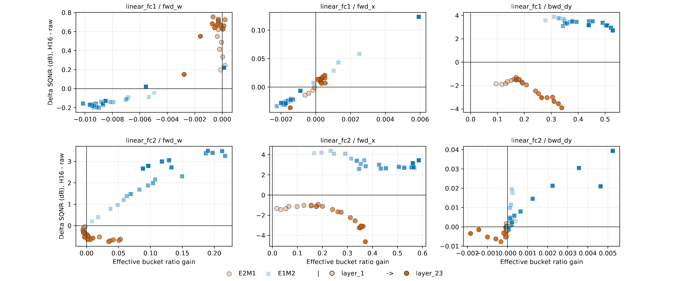

**图 2**：RHT 对有效桶比例和 SQNR 的影响。颜色区分量化格式（E2M1 vs. E1M2），标记点的不透明度随网络深度增加而增大。评测对象为 MLP 块中真实的线性层张量：权重（ $`fwd\_w`$ ）、输入（ $`fwd\_x`$ ）和输出梯度（ $`bwd\_dy`$ ）。

虽然 E2M1 较宽的动态范围一开始看起来很适合缓解离群值密集张量的饱和问题，但 RHT 从根本上改变了这个场景。通过把离群值能量分散到各个坐标上，RHT 把张量从"受限于动态范围"的状态转变为"受限于局部分辨率"的状态。于是，瓶颈从"如何表示极端的离群值"转移到了"如何精确保留典型幅值处的密集概率质量"。

为了形式化这种转变，本文衡量了跨 $`K`$ 个量化幅值桶的利用情况。给定每个桶（含零桶）的经验占比 $`p_{i}`$ ，定义桶熵 $`\mathcal{E}(G,T)`$ 并报告有效桶比例 $`B_{\mathrm{eff}}(G,T)`$ ：

```math
B_{\mathrm{eff}}(G,T)=\frac{\exp(\mathcal{E}(G,T))}{K},\;\;\;\;\ \text{where}\;\;\;\;\mathcal{E}(G,T)=-\sum_{i=1}^{K}p_{i}\log(p_{i}+\epsilon)
```

（公式 6）

其中 $`B_{\mathrm{eff}}\in[1/K,1]`$ ，从"单一桶塌缩"到"均匀利用"均可覆盖。为评估量化质量，本文计算归一化 MSE， $`\mathrm{NMSE}_{A}(G,T)=\|Q_{G}(TA)-TA\|_{F}^{2}/\|TA\|_{F}^{2}`$ 。分别取 $`A=I`$ 和 $`A=\mathbf{H}_{16}`$ ，就能得到原始误差和 RHT 变换后的误差，进而通过信噪量化比（Signal-to-Quantization-Noise Ratio）汇总 RHT 带来的变化：

```math
\Delta\mathrm{SQNR}=10\log_{10}\frac{\mathrm{NMSE}_{I}}{\mathrm{NMSE}_{\mathbf{H}_{16}}},
```

（公式 7）

其中 $`\Delta\mathrm{SQNR}>0`$ 说明旋转提升了张量层面的保真度。

图 2 分析了来自 MLP 块（ $`fwd\_w`$ 、 $`fwd\_x`$ 、 $`bwd\_dy`$ ）的真实训练张量。符合预期的是，RHT 大幅提升了离群值密集张量（例如 $`linear\_fc1/bwd\_dy`$ 和 $`linear\_fc2/fwd\_x`$ ）的 $`B_{\mathrm{eff}}`$ ，这与 SwiGLU 放大离群值的已知行为是一致的。但关键在于：这种利用率的提升所带来的结果，取决于网格的几何形状，呈现出截然不同的走向。RHT 把张量质量从极端尾部搬移到中等幅值区域，这无意中把数据推入了 E2M1 最不对称的那些舍入 bin，反而加剧了量化噪声（ $`\Delta\mathrm{SQNR}<0`$ ）。相反，均匀分布的 E1M2 网格能安全地把这种"被拉平"的分布转化为更高的保真度（ $`\Delta\mathrm{SQNR}>0`$ ）。这揭示了一个隐藏的陷阱：尽管 RHT 确实有效地分散了离群值，但把它应用到非叶子路径（ $`fwd\_y`$ 、 $`bwd\_dx`$ ）上，反而会系统性地损害基于 E2M1 的训练方案。

> **关键发现 2**：Shrinkage Bias 会在网络层间以乘性方式累积，造成系统性的信号衰减。而施加 RHT 会在 E2M1 下进一步加剧这种衰减——因为它把张量质量搬移到了偏差最严重的不对称 bin 中，损害了深层训练的稳定性。

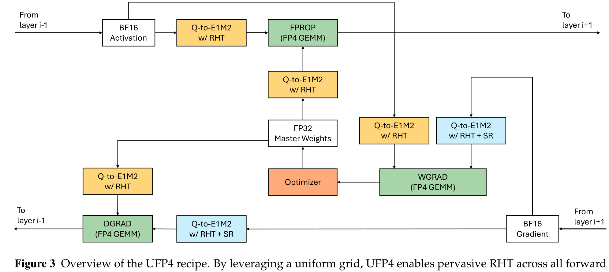

**图 3**：UFP4 方案总览。通过采用均匀网格，UFP4 能够在全部前向和反向 GEMM 上普遍施加 RHT。

---

## 4 UFP4：基于均匀网格的 4-bit 训练方案

现有的大多数 FP4 训练方案都默认采用 E2M1 格式。虽然这种格式对原始的、离群值密集的张量而言一开始颇具吸引力，但目前的缓解手段（例如特殊的舍入规则、缩放设计或张量预处理）本质上只是在治疗 Shrinkage Bias 的"症状"。因为这些方法没有改变 E2M1 本身的网格几何形状，所以它们无法从格式层面根除这一问题的源头。

**UFP4 方案。** 前面的分析给出了一个清晰的设计原则：一旦 RHT 把张量从"受限于动态范围"转变为"受限于局部分辨率"的状态，4-bit 网格就必须优先保证局部幅值的保真度，而不是追求极致的动态范围。因此，本文提出 **UFP4**：一种基于 E1M2/INT4 风格均匀网格的 4-bit 训练方案（见图 3）。对每一个线性层 GEMM，UFP4 都施加 RHT，并把算子量化到这个均匀分布的网格上。关键在于：E2M1 方案通常只把 RHT 限制在权重梯度路径上，以避免叠加几何误差；而由于 UFP4 的无偏特性，本文可以放心地在全部三个 GEMM 上启用 RHT：FPROP（ $`fwd\_y`$ ）、DGRAD（ $`bwd\_dx`$ ）和 WGRAD（ $`bwd\_dw`$ ）。随机舍入（SR）只应用在 $`dY`$ 上，以保持梯度的无偏性。缩放层级的设计与这个格式层面的方案是正交的——可以根据硬件效率选用单级缩放、两级缩放或分块缩放。本文更广泛的建议是：未来的机器学习加速器应当把 E1M2/INT4 风格的均匀网格提升为一等训练数据格式，挑战"E2M1 是唯一可行 FP4 格式"这一现状。

**Table 1：UFP4（基于 E1M2 的方案）与基于 E2M1 的方案对比**

| 配置项 | 基于 E2M1 的方案 | 基于 E1M2 的方案（UFP4） |
|---|---|---|
| 格式 | E2M1 | E1M2/INT4 风格均匀网格 |
| 量化块大小 | $`1{\times}16`$ | $`1{\times}16`$ |
| 缩放层级 | FP32 单级 | FP32 单级 |
| RHT 作用范围 | $`bwd\_dw`$ | $`fwd\_y`$ 、 $`bwd\_dx`$ 、 $`bwd\_dw`$ |
| RHT 块大小 | 16 | 16 |
| SR 作用范围 | $`dY`$ | $`dY`$ |
| 2D 权重缩放 | 否 | 否 |

**与基于 E2M1 方案的对比。** 如表 1 所示，本文让两种方案在辅助配置上保持完全一致，包括块大小、缩放层级和 SR 的作用范围。两者的方法论差异仅体现在两个结构性选择上：UFP4 采用均匀网格来消除几何层面的 Shrinkage Bias，这进而使得 RHT 的覆盖范围得以从单一的 GEMM 路径（ $`bwd\_dw`$ ）扩展到全部三条路径（ $`fwd\_y`$ 、 $`bwd\_dx`$ 、 $`bwd\_dw`$ ）。这样的设计直接把"网格格式"和"RHT 作用范围"这两个因素对训练稳定性的影响隔离出来加以考察。

---

## 5 实验

本文把实验组织为五个问题，依次从局部量化追溯到端到端训练，考察 FP4 网格几何与 RHT 作用范围之间的交互：

- **Q1**：RHT 是否会改变单张量量化和 GEMM 输出两个层面上"更优"的 4-bit 网格选择？
- **Q2**：UFP4 能否缩小相对 BF16 的训练 loss 差距？
- **Q3**：这种优势能否在不同模型规模上保持？
- **Q4**：方案中的哪些组件真正起作用？range-restricted 的 E2M1 能否近似出均匀网格的效果？
- **Q5**：RHT 能否被高效地融合进 FP4 量化算子中？

### 5.1 实验设置

在每一组对比实验内部，参与比较的各个 run 共享相同的数据、架构、优化器、学习率调度、batch 构造、评估节奏和训练时长。对于端到端的 FP4 训练，本文把基于 E1M2 的 UFP4 方案与一个经过受控配置搜索（见附录 B）选出的强 E2M1 参照方案进行比较；表 1 总结了两套方案的最终配置。本文在块大小、缩放层级和 SR 作用范围等辅助选择上尽量保持一致，使比较聚焦于 "FP4 网格选择" 与 "RHT 作用范围" 这两个因素的联合效应。

### 5.2 Q1：RHT 是否会同时改变单张量量化和 GEMM 输出两个层面上偏好的 4-bit 网格？

在进行端到端训练之前，本文先检验 FP4 网格几何与 RHT 的交互关系。使用从真实训练中采集的 MLP 张量，本文在"单张量量化"和"单 GEMM 输出"两个层面上比较了 E2M1 和 E1M2 在有/无分块 RHT 时的表现。

**单张量量化。** 本文报告了 SQNR 和有效桶比例（这是第 3.2 节定义的基于熵的桶利用率指标）。对于表现良好的 $`linear\_fc1/fwd\_x`$ 张量，RHT 的影响几乎是中性的：E1M2 的平均 $`\Delta`$SQNR 为 $`-0.008`$ dB，E2M1 为 $`+0.007`$ dB，有效桶比例的变化也可以忽略不计（分别为 $`-0.0008`$ 和 $`+0.0001`$ ；见图 4）。而对于离群值密集的 $`linear\_fc2/fwd\_x`$ ，RHT 逆转了两种格式的优劣排序：旋转前 E2M1 领先（21.90 对 19.94 dB），旋转后则是 E1M2 领先（23.19 对 20.00 dB），并且平均把有效桶比例从 0.56 提升到了 0.97（见图 5）。由此可见，RHT 并非普遍有益；通过把离群值密集的张量从"受限于动态范围"转变为"受限于局部分辨率"的状态，它会改变此前偏好的 FP4 网格选择。跨 MLP 和注意力层的更多张量级、GEMM 级诊断结果见附录 A。

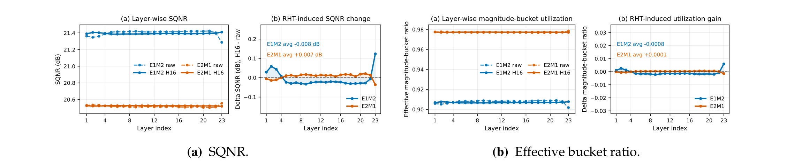

**图 4**：表现良好的 $`linear\_fc1/fwd\_x`$ 张量的单张量量化诊断。每个子图左侧面板展示无 RHT 和有 RHT 的量化结果，右侧面板展示 RHT 带来的变化。

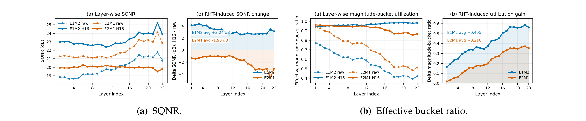

**图 5**：离群值密集的 $`linear\_fc2/fwd\_x`$ 张量的单张量量化诊断。RHT 逆转了 SQNR 的排序：旋转前 E2M1 更优，旋转后 E1M2 更优。

**单 GEMM 输出。** 同样的模式在 GEMM 组合之后依然成立。本文用同样采集的张量测量了 $`fwd\_y`$ 、 $`bwd\_dx`$ 、 $`bwd\_dw`$ 的输出 SQNR。对于 $`linear\_fc1`$ ，RHT 对前向 GEMM 相对温和，但在反向路径上暴露出与格式相关的劣化：E1M2 保持或提升了输出 SQNR，而 E2M1 在旋转后会损失 SQNR（见图 6）。对于 $`linear\_fc2`$ ，这种反转更加明显：E1M2 把旋转后的桶利用率提升转化为了更高的输出 SQNR，而 E2M1 旋转后往往会出现劣化（见图 7）。因此，RHT 引起的格式排序反转并不局限于单张量诊断层面，它会一直延续到训练计算图实际使用的 GEMM 输出中。

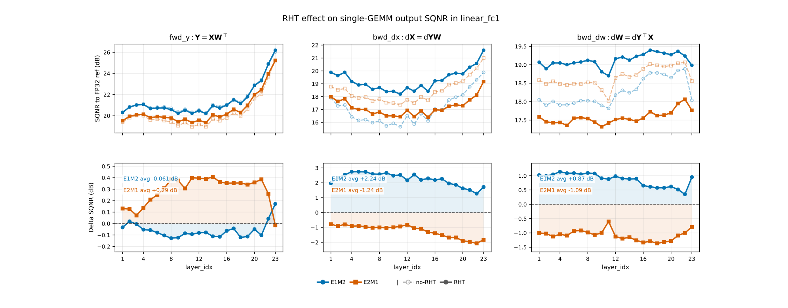

**图 6**： $`linear\_fc1`$ 的单 GEMM 输出 SQNR。下方一行展示了 RHT 引起的 $`\Delta`$SQNR。RHT 与 E1M2 兼容，但会降低 E2M1 在反向 GEMM 上的输出 SQNR。

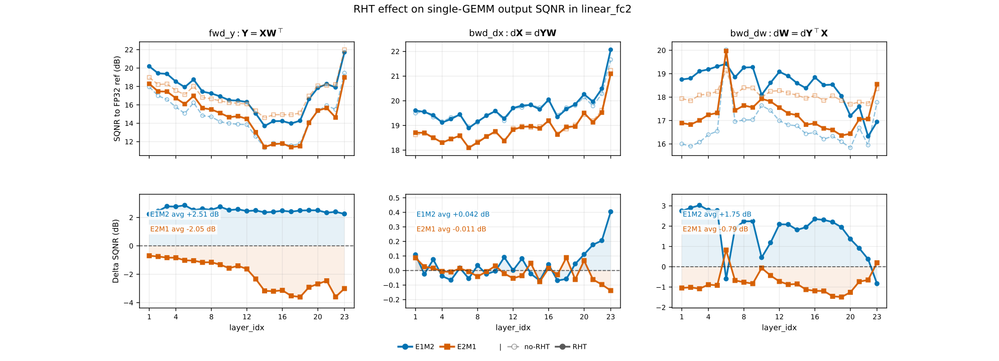

**图 7**： $`linear\_fc2`$ 的单 GEMM 输出 SQNR。这里的格式相关反转比 $`linear\_fc1`$ 更加明显。RHT 在主要路径上提升了 E1M2 的输出 SQNR，但在算子进入 RHT 后的集中分布区域后，往往会降低 E2M1 的输出 SQNR。

### 5.3 Q2：UFP4 能否缩小相对 BF16 的训练 loss 差距？

本文在 Dense 1.5B、MoE 7.9B 和 MoE 124B 的长程预训练上比较了 BF16、E2M1 参照方案和基于 E1M2 的 UFP4 方案，报告的是相对 BF16 的语言模型 loss 误差 $`|\mathcal{L}_{r}-\mathcal{L}_{\mathrm{BF16}}|/\mathcal{L}_{\mathrm{BF16}}`$ 。在全部三种设置下，UFP4 都更贴近 BF16（见图 8）：最后 1000 步的相对误差在 Dense 1.5B 上从 1.2570% 降到 0.9673%，在 MoE 7.9B 上从 2.3596% 降到 1.8469%，在 MoE 124B 上从 1.7308% 降到 1.3863%。由此可见，Q1 中观察到的"FP4 网格几何与 RHT 作用范围"之间的局部交互，在长程训练中依然成立，不过两种 FP4 方案相对 BF16 仍存在可观测的差距。

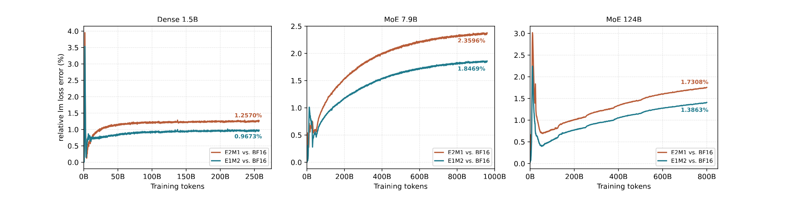

**图 8**：基于 E1M2 的 UFP4 方案在长程训练中始终更贴近 BF16。每个面板报告的是相对 BF16 的语言模型 loss 误差 $`|\mathcal{L}_{r}-\mathcal{L}_{\mathrm{BF16}}|/\mathcal{L}_{\mathrm{BF16}}`$ ，其中 $`r\in\lbrace\mathrm{E2M1},\mathrm{E1M2}\rbrace`$ 。数值越低越好。

### 5.4 Q3：这种优势能否在不同模型规模上保持？

遵循 Ling 的 scaling-law 实验协议，本文在匹配的数据、优化和算力预算下训练了 10M–324M 规模的 MoE 模型，并把 loss 拟合为训练算力的函数。在实测范围以及拟合外推的范围内，E1M2 曲线始终位于 E2M1 参照曲线之下（见图 9），说明这一优势并不局限于最小的模型规模。拟合出的 FP4-to-BF16 差距还会随着算力增加而缩小，这说明 FP4 的性能代价在整个 scaling 扫描范围内并没有随规模扩大，不过与 BF16 之间仍然存在残余差距。

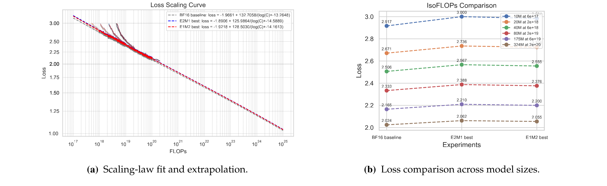

**图 9**：E1M2 方案（UFP4）相对 E2M1 参照方案的 scaling-law 验证。拟合曲线总结了整个 scaling 扫描范围内的趋势，loss 对比图则展示了在实测模型规模下观察到的差距。

### 5.5 Q4：方案中的哪些组件真正起作用？E2M1 能否近似出均匀网格的效果？

**RHT 作用范围与随机舍入。** 本文在 Dense 1.5B、基于 E1M2 的 FP4 run（训练超过 100B token）上对 RHT 作用范围和 SR 做了消融实验（见表 2）。全面施加 RHT 的效果最好：相对于不使用 RHT，仅对 $`bwd\_dw`$ 施加 RHT 可以把 loss 降低 0.00481，对 $`fwd\_y+bwd\_dw`$ 施加可以降低 0.00644，对 $`bwd\_dx+bwd\_dw`$ 施加可以降低 0.00290，而全面施加 RHT 则可以降低 0.01123。在固定全面 RHT 的前提下，再对 $`dY`$ 施加 SR 还能额外降低 0.00456。可见全面 RHT 和 SR 都各自有贡献。这个结果值得注意，因为此前的 NVFP4 方案通常会避免旋转 $`fwd\_y`$ 、 $`bwd\_dx`$ 这类非叶子 GEMM 输出，原因是在 E2M1 风格的网格下 RHT 可能是有害的；本文的消融实验支持了这背后的机制：一旦 RHT 变换后的区间被均匀网格所表示，全面施加 RHT 就会在这种设置下变得有益。

**Table 2：FP4 E1M2 训练下 RHT 作用范围与 SR 的消融实验**（对 RHT 消融块， $`\Delta`$ 相对于"启用 SR、不使用 RHT"衡量；对 SR 消融块， $`\Delta`$ 相对于"全面 RHT、不使用 SR"衡量）

| 设置 | SR | $`fwd\_y`$ | $`bwd\_dx`$ | $`bwd\_dw`$ | 平均 LM loss | $`\Delta`$ loss |
|---|---|---|---|---|---|---|
| **RHT 作用范围消融** | | | | | | |
| 不使用 RHT | ✓ | – | – | – | 1.89202 | 0.00000 |
| RHT 作用于 $`bwd\_dw`$ | ✓ | – | – | ✓ | 1.88721 | -0.00481 |
| RHT 作用于 $`bwd\_dx`$ 、 $`bwd\_dw`$ | ✓ | – | ✓ | ✓ | 1.88912 | -0.00290 |
| RHT 作用于 $`fwd\_y`$ 、 $`bwd\_dw`$ | ✓ | ✓ | – | ✓ | 1.88558 | -0.00644 |
| **全面 RHT + SR（UFP4）** | ✓ | ✓ | ✓ | ✓ | **1.88079** | **-0.01123** |
| **全面 RHT 下的 SR 消融** | | | | | | |
| 全面 RHT，不使用 SR | – | ✓ | ✓ | ✓ | 1.88535 | 0.00000 |
| **全面 RHT + SR（UFP4）** | ✓ | ✓ | ✓ | ✓ | **1.88079** | **-0.00456** |

**range-restricted 的 E2M1 能否模拟均匀网格？** 目前的 FP4 硬件路径可能与 E2M1/NVFP4 风格的数据元素绑定，因此本文测试了"限制数值范围的 E2M1"能否模拟均匀网格的行为。E2M1 参照方案使用 $`\mathrm{max\_fpx}=6`$ ，且 RHT 只作用于 $`bwd\_dw`$ ；而全面 RHT 的变体则缩小了 $`\mathrm{max\_fpx}`$ ，例如 $`\mathrm{max\_fpx}=2.0`$ 时只保留 $`\lbrace0,0.5,1.0,1.5,2.0\rbrace`$ 。虽然这样可以避开高幅值处的不对称 bin，但也牺牲了动态范围和桶利用率：在 Dense 1.5B 和 MoE 7.9B 上，所有测试过的 range-restricted 变体都不如 E2M1 参照方案（见图 10）。在本文测试的这些方案中，缩小 E2M1 的数值范围因此并不能令人满意地替代原生的 E1M2/INT4 支持。

近期的 HiFloat4 工作采用了一种均匀的 S1P2 数据元素，这让未来的 Ascend 960 系统成为了原生实现 UFP4 的一个有潜力的平台。本文的建议比较克制：E2M1 应当继续保留用于原始的、离群值密集的张量以及推理负载，但训练硬件应当把 E1M2/INT4 风格的均匀网格作为一等 FP4 训练数据元素来支持。

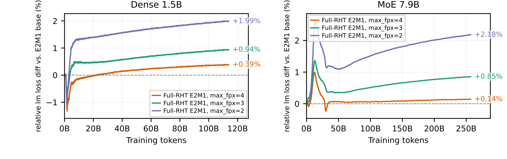

**图 10**：全面 RHT 下的 E2M1 变体相对 E2M1 参照方案的相对 LM loss。

### 5.6 Q5：RHT 能否被高效地融合进 FP4 量化算子？

全面施加 RHT 只是在 FP4 量化之前增加了一个小的分块 Hadamard 变换。当 Hadamard 块与量化块大小一致时，这个变换可以被融合到缩放因子估计和打包之前完成，从而避免产生一个中间的旋转后张量。对于块大小 16，在 SM90 和 SM100 上测试的 BF16 矩阵形状中，融合后的 RHT+量化延迟分别约为独立量化延迟的 $`1.06\times`$ 和 $`1.07\times`$ ；而未融合的 RHT+量化延迟则分别是融合版本的 $`1.62\times`$ 和 $`1.41\times`$ 。由此可见，全面 RHT 量化的融合算子开销很小，尽管端到端训练的实际开销仍取决于全系统的集成情况。

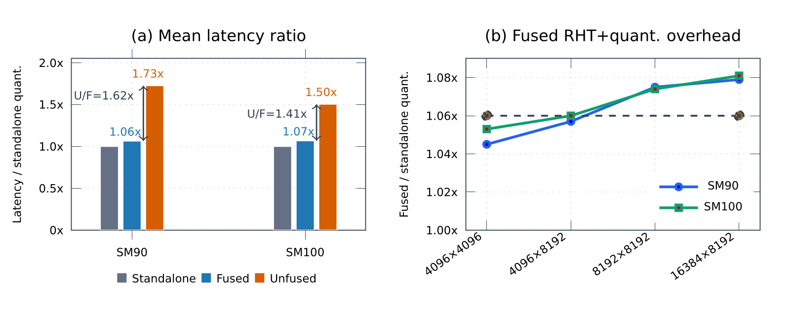

**图 11**：RHT+量化的相对延迟。左图：相对独立量化的平均延迟比率；柱高和标签均以独立量化为基准归一化，灰色箭头标注了 U/F（未融合 vs. 融合）比率。右图：各矩阵形状下融合 RHT+量化的具体开销。

---

## 6 相关工作

**FP4 格式、分块缩放与缩放层级。** 第一类 FP4 训练工作通过改进数据格式、块大小和缩放层级设计来提升量化质量。MXFP4 和 NVFP4 都采用细粒度的分块缩放，NVFP4 进一步使用更小的块和两级缩放层级来提升 E2M1 的训练精度。近期研究表明这种设计思路并不局限于固定的 E2M1 路径：HiFloat4 在 Ascend NPU 上采用了带有层级化缩放的均匀 S1P2 数据元素；MixFP4 在与 NVFP4 兼容的缩放层级内按块自适应选择 E2M1 或 E1M2；Four Over Six 通过评估替代的分块缩放方式来更好地表示接近最大值的数值，从而改进了 NVFP4。INT 与 FP 的对比研究进一步表明，一旦考虑了块大小和离群值缓解手段，细粒度的 INT 格式完全可以与 FP 格式相竞争。综合来看，这些工作说明缩放层级、块大小和数据格式设计对实用化的 FP4 训练都至关重要。UFP4 研究的是一个互补的维度：在块大小和缩放层级都保持一致的前提下，考察 RHT 变换后的张量究竟应该量化到非均匀的 E2M1，还是量化到 E1M2/INT4 风格的均匀网格上。

**量化器侧和训练感知的方法。** 第二类工作改进量化器本身或训练估计器，让 FP4 训练更稳定。Microsoft FP4 引入了一个可微的量化估计器以及离群值钳位/补偿策略，以防止激活值崩溃；Quartet II 通过一种基于 microscaling 的 EDEN 流程改进了无偏梯度估计；FAAR 显式地考虑了非均匀的 E2M1 网格，学习了一种格式感知的自适应舍入决策；TetraJet-v2 则为 NVFP4 训练增加了反向对齐、随机舍入改动、振荡抑制和离群值控制。这些方法分别降低了估计器偏差、舍入误差、方差或优化不稳定性，与 UFP4 是互补的：改进的估计器、自适应舍入规则或稳定化手段都可以与均匀网格结合使用。

**张量侧的预处理。** 另一类工作通过数学等价的改写，在量化之前对张量进行变换。以 RHT、QuaRot、SpinQuant、FlatQuant 为代表的基于旋转的方法会在量化前分散离群值能量。张量分解类方法则通过在量化前对张量做分解来降低低比特误差，相关方法包括 mean–SVD 风格的分解、离群值通道分离以及平滑类方法。这些方法作用在量化器的上游：它们改变了呈现给格式网格的数据分布。本文说明，即便张量经过 RHT 处理，如果仍被量化到非均匀的 E2M1 上，依然可能遭受 Shrinkage Bias——这一限制是由格式网格本身所施加的。因此，在 E1M2/INT4 风格的均匀格式下，同样的张量侧预处理方法应该能够更好地把改进后的张量分布转化为量化质量的提升。

---

## 7 结论

本文重新审视了"在基于 RHT 的离群值缓解场景下，默认使用 E2M1 做 FP4 训练"这一常规做法。本文的分析表明，RHT 会把量化场景从"受限于动态范围"转变为"受限于局部分辨率"，而在这种新场景下，E2M1 不对称的 RTNE bin 会引入 Shrinkage Bias。这个效应在真实张量和 GEMM 诊断中清晰可见，并且同样的格式相关模式在长程的 dense 和 MoE 训练中持续存在。通过采用 E1M2/INT4 风格的均匀网格、把 RHT 施加到全部三个训练 GEMM 上、并把随机舍入只用在 $`dY`$ 上，UFP4 相比 E2M1 参照方案能够持续降低相对 BF16 的 FP4 loss 误差。

本文的结论比较克制但具有可操作性：E2M1 应当继续保留用于范围受限的工作负载，但它不应是唯一的一等 FP4 训练格式。未来的训练加速器应当支持 E1M2/INT4 风格的均匀 4-bit 网格作为一等训练数据元素，使得像 UFP4 这样的方案能够把 RHT 变换后的数值稳定性，与原生 4-bit 矩阵吞吐能力结合起来。

---

## 附录 A：张量和 GEMM 输出中 RHT 引起的 SQNR 变化

正文使用逐层的 MLP 采样数据来解释 RHT 如何改变偏好的 FP4 网格。本附录在 MLP 和注意力层族上汇总了同样的 $`\Delta`$SQNR 诊断指标，同时覆盖单张量量化和单 GEMM 输出两个层面。

图 12 给出了两个要点。第一，RHT 的效果是格式相关的：E1M2 在对旋转敏感的张量上（例如 $`linear\_fc2/fwd\_x`$ ）取得了较大的增益，在已经表现良好的张量上（例如 $`linear\_fc1/fwd\_x`$ ）则基本保持中性；而 E2M1 在这些对旋转敏感的张量上往往会损失 SQNR。这正是 shrinkage-bias 机制所预期的经验信号：RHT 之后，局部分辨率比过剩的动态范围更重要。

第二，同样的格式排序反转出现在若干 GEMM 输出中，并延伸到了注意力模块。这并不是说 RHT 在 E2M1 下全面失败：部分 E2M1 的 FPROP 输出（例如 $`linear\_fc1`$ 和 $`linear\_qkv`$ ）确实有小幅的 SQNR 提升。确切地说，E2M1 的劣化主要集中在对旋转敏感的路径上，包括 $`linear\_fc2`$ 的 FPROP（ $`fwd\_y`$ ）以及注意力的反向 GEMM；而 E1M2 在主要的旋转敏感路径上都取得了正的 $`\Delta`$SQNR，这支持了 UFP4 中全面施加 RHT 的合理性。

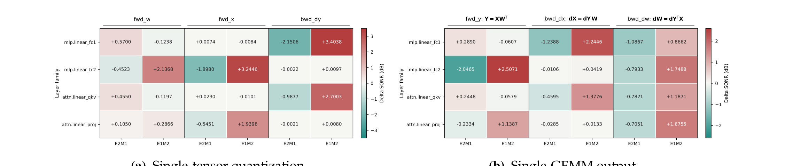

**图 12**：张量量化和 GEMM 输出上平均的 RHT 引起的 $`\Delta`$SQNR。每行在 23 个层上取平均；正值/负值分别表示 RHT 之后 SQNR 的提升/损失。

---

## 附录 B：受控的 E2M1 参照方案选择

为了避免使用一个调优不充分的 E2M1 基线，本文通过对表 3 中各个维度做受控的单因素消融实验来调优其训练配置。每个候选 run 都在相同的数据、架构、优化器、学习率调度以及所有未被消融的方案设置下，训练 Dense 1.5B 模型 200B token。在每一组消融实验内部，本文选择在最后 1000 步窗口内平均 LM loss 最低的那个设置。随后，选出的 E2M1 配置会被冻结，用于后续的长程训练、scaling 和组件消融实验。

最终选出的 E2M1 结构是：仅对 WGRAD（ $`bwd\_dw`$ ）施加 RHT，并且只对 $`dY`$ 做 SR。在 E2M1 下，对 FPROP 施加 RHT（ $`fwd\_y`$ ）始终是有害的；对 DGRAD 施加 RHT（ $`bwd\_dx`$ ）初期表现中性，但在训练后期会导致更高的 LM loss；因此最终选定的 RHT 作用范围是 $`bwd\_dw`$ 。在随机舍入方面，仅对 $`dY`$ 做 SR 取得了最低的 LM loss；而在本文的 E2M1 设置下，把 SR 额外施加到反向 GEMM 算子 $`X_{\mathrm{WGRAD}}`$ 和 $`W_{\mathrm{DGRAD}}`$ 上会略微增加 LM loss。这一观察与 TetraJet-v2 在 NVFP4 场景下的研究结论不同——该工作报告说，把 SR 扩展到 $`dY`$ 之外的更多反向 GEMM 算子上可以改善训练效果。因此，本文采用这些消融实验中观察到的最优 E2M1 设置，作为参照配置。

**Table 3：用于选择 E2M1 参照方案的受控单因素消融空间**（对集合 $`\mathcal{S}`$ ， $`2^{\mathcal{S}}`$ 表示其幂集，即由 $`\mathcal{S}`$ 中元素组成的所有组合，包含空组合）

| 维度 | 搜索空间 | 选定设置 | 备注 |
|---|---|---|---|
| RHT 作用范围 | $`2^{\lbracefwd\_y,\ bwd\_dx,\ bwd\_dw\rbrace}`$ | $`bwd\_dw`$ | 选定仅 WGRAD；FPROP 的 RHT 有害，DGRAD 的 RHT 在训练后期会提高 LM loss。 |
| RHT 块大小 | 16 / 32 / 64 / 128 | 16 | LM loss 相近；16 与量化块对齐，便于融合 RHT+量化。 |
| SR 作用范围 | $`2^{\lbracedY,\ X_{\mathrm{FPROP}},\ W_{\mathrm{FPROP}},\ X_{\mathrm{WGRAD}},\ W_{\mathrm{DGRAD}}\rbrace}`$ | $`dY`$ | 选定仅对 $`dY`$ 做 SR；对反向的 $`X_{\mathrm{WGRAD}}`$ 、 $`W_{\mathrm{DGRAD}}`$ 做 SR 会略微增加 LM loss。 |
| 2D 权重缩放 | 是/否 | 否 | 关闭。 |
| max_fpx | 4 / 6 | 6 | FP4 的最大幅值；取 6 能保留 E2M1 的完整数值范围，并使 LM loss 最小。 |

---

## 附录 C：乘性累积的指数近似

本附录为公式 (5) 中使用的指数近似提供推导依据。设 $`\delta_{k}=1-\eta_{k}`$ 表示第 $`k`$ 个 GEMM 的乘性损耗，于是累计的乘性因子为：

```math
\prod_{k=1}^{K}\eta_{k}=\prod_{k=1}^{K}(1-\delta_{k}).
```

（公式 8）

对该乘积取对数可得：

```math
\prod_{k=1}^{K}(1-\delta_{k})
=\exp\!\left(\log\prod_{k=1}^{K}(1-\delta_{k})\right)
```

（公式 9）

```math
=\exp\!\left(\sum_{k=1}^{K}\log(1-\delta_{k})\right)
\approx\exp\!\left(-\sum_{k=1}^{K}\delta_{k}\right).
```

对于较小的单 GEMM 乘性损耗，对数项存在如下泰勒展开：

```math
\log(1-\delta_{k})=-\delta_{k}+O\!\left(\delta_{k}^{2}\right),\qquad|\delta_{k}|\ll 1.
```

（公式 10）

把这个展开式代入公式 (9) 可得：

```math
\prod_{k=1}^{K}(1-\delta_{k})=\exp\!\left(-\sum_{k=1}^{K}\delta_{k}+O\!\left(\sum_{k=1}^{K}\delta_{k}^{2}\right)\right).
```

（公式 11）

当二阶项 $`O(\sum_{k}\delta_{k}^{2})`$ 相对一阶累积量很小时，就可以得到如下近似：

```math
\prod_{k=1}^{K}(1-\delta_{k})\approx\exp\!\left(-\sum_{k=1}^{K}\delta_{k}\right).
```

（公式 12）

这说明：即便每个 GEMM 的乘性损耗都很小，它们也会在指数上累加起来。因此，一个微弱但持续为正的 $`\delta_{k}`$ ，经过很长的计算路径后，也能产生明显的累积衰减。
